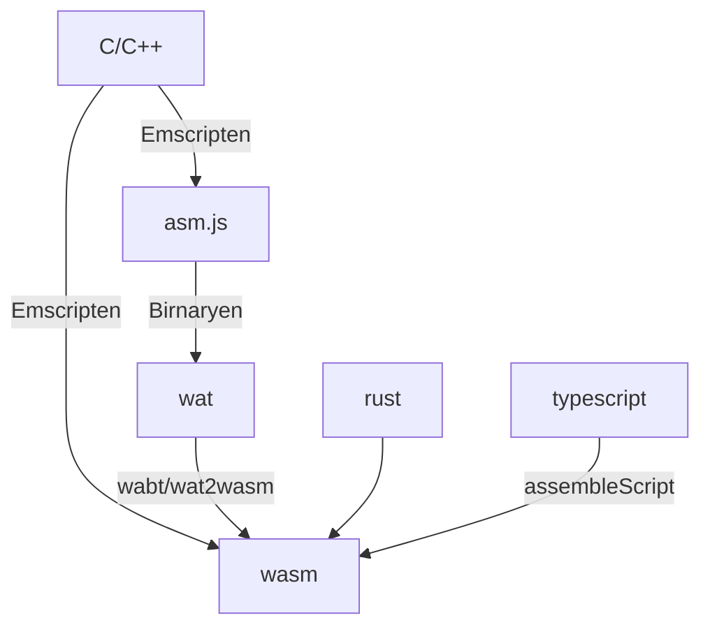
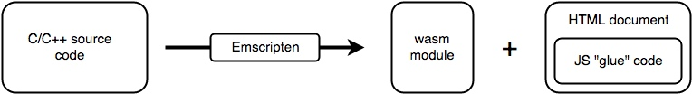
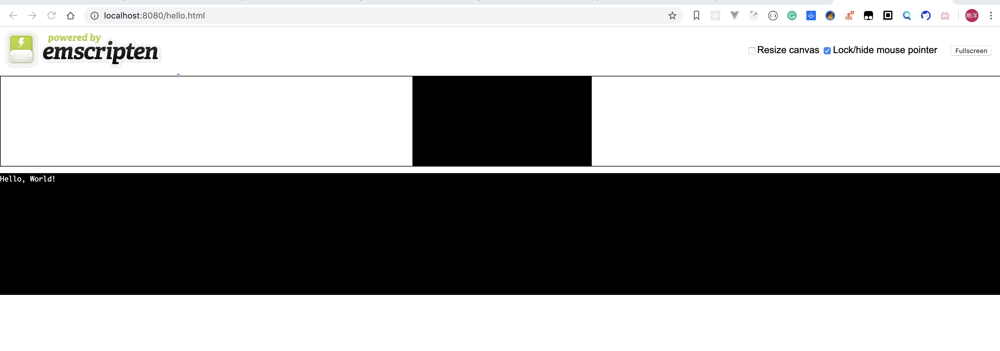

# WebAssembly 踩坑记录(1)
mdn请看英文，中文部分已经滞后约1年了
## 基本概念
webAssembly 包含以下四个关键概念
1. **模块** <br>
表示一个已经被浏览器编译为可执行机器码的WebAssembly二进制代码。一个模块是无状态的，并且像一个二进制大对象（Blob）一样能够被缓存到IndexedDB中或者在windows和workers之间进行共享（通过postMessage()函数）。一个模块能够像一个ES2015的模块一样声明导入和导出。
2. **内存 memory** <br>
    ArrayBuffer，大小可变。本质上是连续的字节数组，   WebAssembly的低级内存存取指令可以对它进行读写操作。
3. **表格 table** <br> 带类型数组，大小可变。表格中的项存储了不能作为原始字节存储在内存里的对象的引用（为了安全和可移植性的原因）
4. **实例** <br> 一个模块及其在运行时使用的所有状态，包括内存、表格和一系列导入值。一个实例就像一个已经被加载到一个拥有一组特定导入的特定的全局变量的ES2015模块

在未来，wasm可以通过ES-module的方法直接调用
```html
<script type='module'>
```

## 历史
曾经有一种历史js格式称为asm.js
这种格式在WebAssembly之前诞生，用了一些特定类型标注来提高运行时效率。是一种IR(intermidiate representation) 中间表示层语法.
asm.js 可以通过c/C++编译而成，当然本身也是作为编译目标生成的。一般不用手写. 
## 基本使用过程

1. 编写C/C++/Rust代码
2. 编译如上代码到wat代码，或者直接手写wat代码，或者编译出asm.js，或者直接编译到wasm
    - 代码
    
    ```scheme
    ;; demo.wat
    (module
        (import "js" "import1" (func $i1))
        (import "js" "import2" (func $i2))
        (func $main (call $i1))
        (start $main)
        (func (export "f") (call $i2))
    )
    ```
1. 如果中间表示结果为wat, 则编译wat到wasm汇编代码, 比如 wat2wasm 工具
    - 使用
     
    ```bash
    wat2wasm simple.wat -o simple.wasm
    ```
    
    - 或者asm.js 直接编译到wasm
    
4. 在js中通过api调用wasm
    - 调用
    
    ```javascript
    var importObj = {js: {
        import1: () => console.log("hello,"),
        import2: () => console.log("world!")
    }};
    fetch('demo.wasm').then(response =>
        // 将wasm转化成二进制buffer
        // <00 61 73 6d ...>
        response.arrayBuffer()
    ).then(buffer =>
        // 将wasm实例化为js模块
        WebAssembly.instantiate(buffer, importObj)
    ).then(({module, instance}) =>
        instance.exports.f()
    );
    ```
 - 或者
 
 ```javascript
 var wasmModule = new WebAssembly.Module(wasmCode);
 // instance 是同步调用，其他时候应该异步调用
 // 因为大型模块的实例化比较昂贵, 
 // 开发人员应该只在同步实例化是必须时,才使用Instance(); 
 // 绝大多数情况应该使用异步方法WebAssembly.instantiate() .
var wasmInstance = new WebAssembly.Instance(wasmModule, wasmImports);
wasmInstance.exports.main();
 ```
 
 - 或者使用更好的流读取，而不是fetch
 
 ```javascript
WebAssembly.instantiateStreaming(wasmCode, wasmImports).then(obj => {
    obj.instance.exports.main();
})
```
 

## S-表达式语法 XX.wat
### 基本概念
wasm实际上是二进制格式的文件，是不可读的，如果要阅读该文件，实际上需要将其转码成wat格式，这是wasm的可读模式。
`WebAssembly text format`
在不同浏览器的实现中，最终wasm会被转成汇编格式
```arm
wasm-function[0]:
  sub rsp, 8                            ; 0x000000 48 83 ec 08
  mov eax, 3                            ; 0x000004 b8 03 00 00 00
  nop                                   ; 0x000009 66 90
  add rsp, 8                            ; 0x00000b 48 83 c4 08
  ret                                   ; 0x00000f c3

wasm-function[1]:
  sub rsp, 8                            ; 0x000000 48 83 ec 08
  mov ecx, esi                          ; 0x000004 8b ce
  mov eax, ecx                          ; 0x000006 8b c1
  add eax, edi                          ; 0x000008 03 c7
  nop                                   ; 0x00000a 66 90
  add rsp, 8                            ; 0x00000c 48 83 c4 08
  ret                                   ; 0x000010 c3
```
#### 函数的伪代码
```html
( func <signature> <locals> <body> )
```
- 签名.       声明函数需要的参数以及函数的返回值。
- 局部变量    像JavaScript中的变量，但是显式的声明了类型。
- 函数体      是一个低级指令的线性列表。

#### 前缀表达式的栈求值方式
如下的c语言代码会编译成S-表达式， 或者直接用S-表达式写
s-表达式一般就是描述lisp语系的，在这里也可以发现, s-表达式通常也对应着波兰表达式
求值方法通常是：
1. 读取操作符号，并且新建一个栈，向栈中推参数
2. 如果下一个不是参数类型，而是操作数，就将栈中的元素，根据前面操作符号定义的运算符进行计算，返回一个新值，进入上一步操作数检查
3. 比如 `+ A * B - C D * E F`，扫描到`- C D`时，会计算`C - D =C'`
4. 表达式变成：`- + A * B C' * E F `
5. 继续扫描到` * B C'`,计算`B * C'= B'`,表达式变成:`- + A B' * E F`,继续`+ A B'`
6. 依此类推...

#### 编译实例
##### 1. 最基本的例子
---
编译前
```c
#include <math.h>
int main(int argc, char** argv) { 
  return hello(1, 2);
}

int hello(int a, int b) {
  return a+b;
}
```
---
编译后
```scheme
(module
 (table 0 anyfunc) 
```

<span id="memory_prev">定义一块内存，对js表现为arrayBuffer，1表示该内存连续块占据至少1页，即64kb
当然也可以从外界传入js创建的memory对象
并且指定(data (<类型> <offset>) 实际值) 来以数据段格式使用memory</span>
```scheme
// 紧接着上面的代码段
 (memory $0 1)
 (export "memory" (memory $0))
;; 定义的函数需要导出才能使用
 (export "main" (func $main))
 (export "hello" (func $hello))
 (func $main (; 0 ;) (param $0 i32) (param $1 i32) (result i32)
```

这里定义一个函数 (为任意函数，变量，返回值指定别名，都需要加$符号)
- 名字为$main
- 参数0为i32(argc = argumentCount, 命令行参数个数)
- 参数1也为i32(argv = argument Vector, 命令行参数序列 char**指针是int)
- 返回值为i32常量3 (因为已经在hello中被计算出来了)

```scheme
 ;; 紧接着上面的代码段
  ...
  (i32.const 3)
 )
 ;; 对hello的定义同理
 (func $hello (; 1 ;) (param $0 i32) (param $1 i32) (result i32)
 ;; 调用add方法， 通过local.get n/$x 拿到第n个或者是以$开头的别名的param/local参数
 ;; 如果是以纯数字的话， params在local 前会拿到第一个第二个参数，并返回相加的值
 ;; 这里使用别名，效果是一样的
  (i32.add
   (local.get $1)
   (local.get $0)
  )
 )
)
```

##### 2. 进阶操作：使用导入的函数，或者是对象，结合内存进行除i32以外的参数操作
---
思考一个例子，传递一个console.log函数和一个参数到wasm中，并且将输出打印出来
一个简单的例子如下:
- log.wasm

```scheme
;; 使用call函数来调用传入的函数，使用import 指明唯一key和传入的类型
(module
  (import "console" "log" (func $log (param i32)))
  (func (export "logIt")
    i32.const 13
    call $log))
```
- main.js

```javascript
var importObject = {
  console: {
    log: function(arg) {
      console.log(arg);
    }
  }
};

WebAssembly.instantiateStreaming(fetch('logger.wasm'), importObject)
  .then(obj => {
    obj.instance.exports.logIt(); // 打印出13
  });
```

但是，**正常情况下wasm只能操作i32类型**。如果想要让console.log打印出字符串，需要借助Memory获取内存数据并转换。在上面的[注释中](#memory_prev)我们已经知道内存可以由wasm自己创建，也可以从外部送入，下面是一个从外面送进去的例子。
- log.js

```js
// wasm中的数据都是i32为源数据的，意味着即使wasm中是字符串
// 传出来还是arraybuffer，也不能直接console
// 所以需要使用这个函数，以utf8格式读取buffer，并使用TextDecoder来进行转换，最后打印
function consoleLogString(offset, length) {
  var bytes = new Uint8Array(memory.buffer, offset, length);
  var string = new TextDecoder('utf8').decode(bytes);
  console.log(string);
}
```
- log2.wat

```scheme
(module
  ;; 加载console对象的log 函数 和一段内存 
  (import "console" "log" (func $log (param i32 i32)))
  (import "js" "mem" (memory 1))
  ;; 创建一个数据段，从偏移量0开始，写入”Hi“字符串，这个data直接被写入memory中
  (data (i32.const 0) "Hi")
  ;; log函数需要输入offset和length，传入这两个对象，由于memory直接被写入，这里不需要显示指明
  (func (export "writeHi")
    i32.const 0  ;; pass offset 0 to log
    i32.const 2  ;; pass length 2 to log
    call $log))
```

- main.js

```js
// 初始化一个至少具有1页大小的内存
var memory = new WebAssembly.Memory({initial:1});

// 创建送入的对象
var importObject = { console: { log: consoleLogString }, js: { mem: memory } };

// 加载并实例化wasm, 传入内部实现和内存数据段,
WebAssembly.instantiateStreaming(fetch('logger2.wasm'), importObject)
  .then(obj => {
    obj.instance.exports.writeHi();
  });
```

##### 3. 进阶操作：使用全局变量
---
在这里通过global制定了一个全局变量，可以跨模块传递，而不会被销毁
```javascript
(module
   (global $g (import "js" "global") (mut i32))
   (func (export "getGlobal") (result i32)
        (global.get $g))
   (func (export "incGlobal")
        (global.set $g
            (i32.add (global.get $g) (i32.const 1))))
)
```
在js中也可以使用如下api创建
```javascript
const global = new WebAssembly.Global({value: "i32", mutable: true}, 0);
```

##### 4. 进阶操作，使用table传递运行时值
之前已经知道，使用Memory时，可以操作线性的内存数据，i32数组。
那么需要table干啥呢，我们知道以前在module内使用函数时，通过`call`方法调用即可
```javascript
(module
  (import "console" "log" (func $log (param i32)))
  (func (export "logIt")
    i32.const 13
    call $log))
```
- 现在，思考如下场景：我们获得的值在运行时中才能确定，而非静态使用，比如一个根据索引返回不同函数的函数，如何做到?
- webassembly对应`call`, 设计了`call_indirect`方法来调用非静态值。然而，正如前面所述，wasm目前只能操作 i32/i64/f32/f64 类型的数据，我们不能直接使用如下代码

```js
(func $outFunc (param $0 i32.const)(result (func (param i32))(这里面是函数体))
(call_indirect $outFunc((local.get $0)))
```

在解决问题前，首先回到更基础的定义上。
在js中，函数是一等公民，在c中可以使用指针，在c++中则是使用虚函数
> 啥是虚函数
> 在c++中，给成员变量函数加上virtual，便于实现多态 
> 在c++虚函数中，实际上虚函数就是建立一个表，虚函数签名仅仅在表中建立一个索引，
> 对应关联的就是不同子类的实现

从虚函数的定义中我们大概知道s-表达式中的table是用来干啥的了。
他就是就是用来建立运行时值标记-运行时值对应的可变内存的数据结构。
下面直接来分析一段代码解析

```scheme
(module
  ;; 建立一个table，可以存放两个引用，引用类型为funcref（原先为anyFunc, 因为安全问题被替代)
  (table 2 funcref)
  ;; 定义两个内部函数，一个返回42，一个返回13
  (func $f1 (result i32)
    i32.const 42)
  (func $f2 (result i32)
    i32.const 13)
  ;; 将table所划分的引用位置塞入内部函数
  ;; 从偏移量0开始，这里和data数据段使用方法差不多
  (elem (i32.const 0) $f1 $f2)
  ;; 对被调用的函数进行类型检查，如果返回值不是一个返回i32的对象，会抛出错误
  (type $return_i32 (func (result i32)))
  ;; 定义实际导出的静态函数
  (func (export "callByIndex") (param $i i32) (result i32)
  ;; call_indirect 默认会获取local.get 获取的参数
  ;; 并从table中call读取这个引用返回
  ;; 目前一个模块只能关联一个table
    local.get $i
    call_indirect (type $return_i32))
)
```

创建表也可以使用js
```JS
var tbl = new WebAssembly.Table({initial:2, element:"funcref"});
```

实际调用 main.js
```js
WebAssembly.instantiateStreaming(fetch('wasm-table.wasm'))
  .then(obj => {
    console.log(obj.instance.exports.callByIndex(0)); // returns 42
    console.log(obj.instance.exports.callByIndex(1)); // returns 13
    console.log(obj.instance.exports.callByIndex(2)); // returns an error, because there is no index position 2 in the table
  });
```

##### 5.进阶操作：变化table，动态链接模块 
如文章开头所述，不同于不可变的memory，table本身是可变的数据段，我们可以在js中用对应api来进行变更。由此，table可以用来干动态链接库一样的事情，下面是一个例子
share0.wat
```scheme
(module
  ;; 引入公用内存
  (import "js" "memory" (memory 1))
  ;; 引入公用table
  (import "js" "table" (table 1 funcref))
  ;; 向公用table中塞入函数
  (elem (i32.const 0) $shared0func)
  ;; 公用函数加载memory的index-0上的数据并返回
  (func $shared0func (result i32)
   i32.const 0
   i32.load)
)
```

share1.wat
```scheme
(module
    ;; 引入公用内存
  ;; 引入公用table
  (import "js" "memory" (memory 1))
  (import "js" "table" (table 1 funcref))
  ;; 检验函数为一个返回i32的函数
  (type $void_to_i32 (func (result i32)))
  (func (export "doIt") (result i32)
    ;; 向memory第0位中装入常量42
   i32.const 0
   i32.const 42
   i32.store  ;; store 42 at address 0
   ;; 从table第0位index非直接调用其中的函数，也就是之前的shared0func
   i32.const 0
   call_indirect (type $void_to_i32))
)
```
main.js
```js
var importObj = {
  js: {
    memory : new WebAssembly.Memory({ initial: 1 }),
    table : new WebAssembly.Table({ initial: 1, element: "funcref" })
  }
};

Promise.all([
  WebAssembly.instantiateStreaming(fetch('shared0.wasm'), importObj),
  WebAssembly.instantiateStreaming(fetch('shared1.wasm'), importObj)
]).then(function(results) {
  console.log(results[1].instance.exports.doIt());  // prints 42
});
```


## wasm 的获取方法
1. 使用Emscripten移植C/C++到asm.js
    - 在线编译器
        - https://wasdk.github.io/WasmFiddle/
        - https://mbebenita.github.io/WasmExplorer/
    - 使用Emscripten sdk自行编译
2. 直接在汇编层编写/生成wasm代码
3. 直接编写rust，以wasm为输出
4. 编写js，通过Binaryen转化为wat，再通过wabt转换成wasm
5. 编写严格类型的ts，通过assembleScript转换成wasm

### 使用Emscripten 编译


Emscripten工具能够将一段C/C++代码，编译出：

- 一个.wasm模块
- 用来加载和运行该模块的JavaScript”胶水“代码
- 一个用来展示代码运行结果的HTML文档

```bash
$ git clone https://github.com/emscripten-core/emsdk.git
$ cd emsdk
$ ./emsdk install latest
$ ./emsdk activate latest
$ source ./emsdk.sh
## 准备一个c文件，比如hello.c
## 指定WASM=1 可以避免只输出asm.js
$ emcc hello.c -s WASM=1 -o hello.html
## 通过emrun 来启动一个服务器
$ emrun --no_browser --port 8080 .
## 打开localhost:8080, 选择编译出来的html，结果如下
```


### 使用wat2wasm

```bash
wat2wasm test.wat -o test.wasm
```

### 使用Bineryen转化asm.js到wat

```bash
asm2wasm math.js -o math.wast
```

### typescript 通过 assembleScript 编译到wasm
```ts
export function fib(n: i32): i32 {
  var a = 0, b = 1
  for (let i = 0; i < n; i++) {
    let t = a + b; a = b; b = t
  }
  return b
}
```

```bash
$> asc fib.ts -b fib.wasm -O3
```

后续应该要专门学习一下，今天就到这里，Byebye！