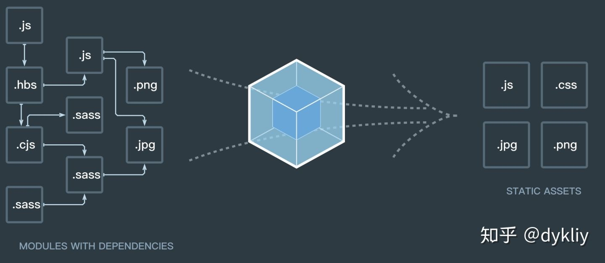

# 深入理解Webpack
## webpack的本质
1. 一切皆为模块
2. 分析模块，形成依赖关系图
3. 根据依赖关系进行打包

根据上面这个图，我们知道，在支持ES module 或者cjs 的开发环境下，我们的代码是分散在各个文件中的，他们彼此之间有错综复杂的依赖关系。webpack做的，就是把具有依赖关系的资源集中在一起，并且按照用户的配置将其打包到一个或多个bundle中
## webpack的核心思路
1. 代码编译交给babel，和我无关
2. 
