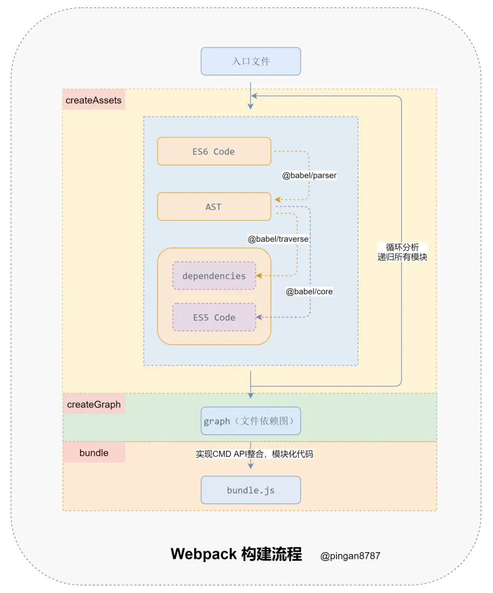

# 深入理解Webpack
## webpack的本质
1. 一切皆为模块
2. 分析模块，形成依赖关系图
3. 根据依赖关系进行打包

根据上面这个图，我们知道，在支持ES module 或者cjs 的开发环境下，我们的代码是分散在各个文件中的，他们彼此之间有错综复杂的依赖关系。webpack做的，就是把具有依赖关系的资源集中在一起，并且按照用户的配置将其打包到一个或多个bundle中

## webpack的核心思路
来源：https://juejin.im/post/5e802e41e51d4546b659b31b?utm_source=gold_browser_extension#heading-8

从启动构建到输出结果一系列过程：

- 「初始化参数」
解析 Webpack 配置参数，合并 Shell 传入和 webpack.config.js 文件配置的参数，形成最后的配置结果。

- 「开始编译」
上一步得到的参数初始化 compiler 对象，注册所有配置的插件，插件监听 Webpack 构建生命周期的事件节点，做出相应的反应，执行对象的 run 方法开始执行编译。

- 「确定入口」
从配置的 entry 入口，开始解析文件构建 AST 语法树，找出依赖，递归下去。

- 「编译模块」
递归中根据「文件类型」和 「loader 配置」，调用所有配置的 loader 对文件进行转换，再找出该模块依赖的模块，再递归本步骤直到所有入口依赖的文件都经过了本步骤的处理。

- 「完成模块编译并输出」
递归完事后，得到每个文件结果，包含每个模块以及他们之间的依赖关系，根据 entry 配置生成代码块 chunk 。

- 「输出完成」
输出所有的 chunk 到文件系统。
注意：在构建生命周期中有一系列插件在做合适的时机做合适事情，比如 UglifyPlugin 会在 loader 转换递归完对结果使用 UglifyJs 压缩覆盖之前的结果。

## 一个最简单的webpack编译过程
### 我们假设现在有三个文件
```js
// entry.js
import message from './message.js';
console.log(message);

// message.js
import {name} from './name.js';
export default `hello ${name}!`;

// name.js
export const name = 'world';
```
我们的bundler文件主要需要三个方法：
1. createAsset 方法传入entry文件，得到类似
    ```js
    ```
2. 
3. 


## 一个简单的webpack编译结果
```js
// a.js
export let number = 42;
export function incr() {
    number++;
}
```
```js
// test.js
import { number } from "./a";
console.log(number);
```
经过webpack 打包后
```js
// 定义了个运行时，这里会处理链接送入的模块id和对应实体的引用
(function(modules) {
// This is the module runtime.
// It's only included once per compilation.
// Other chunks share the same runtime.
  var installedModules = {};
  // The require function
  function __webpack_require__(moduleId) {
   // ...
  }
  // ... 实现省略的部分
  // Load entry module and return exports
  return __webpack_require__(__webpack_require__.s = 1);
})([
  // 模块作为数组被传入，并且拥有各自的模块id
  // An array that maps module ids to functions
  // a.js as module id 0
  // 将文件整个封装在函数里，作为模块，并且将webpack定义的export和require函数送进去
  // 这里跟 nodejs 实际的模块做法比较像
  function (module, __webpack_exports__, __webpack_require__) {
    "use strict";
    // 为模块的导出定义属性，修改只会对"a"做变化，而不会是number
    Object.defineProperty(__webpack_exports__, "a", {
      configurable: false,
      enumerable: true,
      get: () => number
    });

    // 模块内部的local 变量
    let number = 42;

    // 模块内部的方法，没有被使用，所以没有被挂到导出变量
    function incr() {
      number++;
    }
  },
  // test.js as module id 1
  function (module, __webpack_exports__, __webpack_require__) {
    "use strict";
    // import id-0， means module a.js
    var __WEBPACK_IMPORTED_MODULE_0__a__ = __webpack_require__(0);

    // Object reference as "live binding"
    console.log(__WEBPACK_IMPORTED_MODULE_0__a__["a" /* number */]);
  }
]);
```
要看详细的require的实现过程，可以看mini-webpack相关的文章