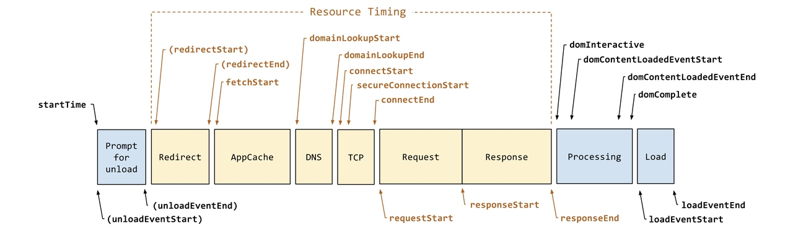
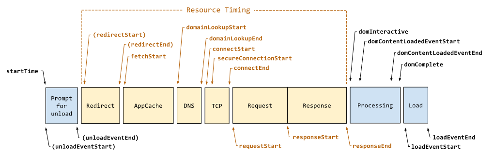

# 性能指标概览
这篇文章更多的是一个知识总结记录，而不是一篇用来学习的文章。
## 大纲
1. 一些先修知识
2. 以用户为中心的前端监控产生的背景
3. RAIL 指导原则
4. RUM 监控和 SYN 监控
5. 页面加载全貌

## 先修知识
#### Performance API
Performace API是一系列用于衡量页面性能的工具、接口、属性、方法，它支持了DOMHighResTimeStamp 这种高精度时间。同时也支持用户利用它（performance.mark）来做高精度的自定义性能计算。具体细节请直接看MDN。

--
#### PerformanceEntry
PerformanceEntry 接口是 Performance Timeline API 的一部分。
每一个PerformanceEntry 对象都包含了一个performance timeline 中的单个metric的数据，比如FP、FCP等，他们表现为
```ts
{
    name: string,
    entryType: string, // 'first-paint' 等等
    startTime: DOMHighResTimeStamp, // 此为 metric 上报时的时间, 高精度时间格式
    duration: DOMHighResTimeStamp // 上报耗时
}
```
在加载js，css等文件时，Entry对象会被动产生，也可以通过用户主动mark来产生对应的Entry对象，但Entry对象是只读的。
通常，有这么几种entry的type
- navigation
- resource
- first-paint
- first-contentful-paint

通过使用如下方法
```JS
performance.getEntries();
```
可以获取所有记录的metrics
或者通过
```JS
performance.getEntriesByType(type);
```
获取想要的metrics类型

--
#### PerformanceObserver
PerformanceObserver 用于监测性能度量事件，在浏览器的性能时间轴记录下一个新的 performance entries  的时候将会被通知。
**但是目前它在浏览器端的支持还不够完善**
它包含以下三个方法
```JS
// 创建并返回一个新的 PerformanceObserver 对象.
PerformanceObserver()
// 指定监测的 entry types 的集合。 
// 当 performance entry 被记录并且是指定的 entryTypes 之一的时候
// 性能观察者对象的回调函数会被调用。
PerformanceObserver.observe()
// 停止监听
PerformanceObserver.disconnect()
```


使用实例
```JS
function perf_observer(list, observer) { 
    // 处理 "measure" 事件 
} 
var observer2 = new PerformanceObserver(perf_observer); 
observer2.observe({entryTypes: ["measure"]});
```

--
#### Long Task API
一个实验性API，他可以直观的告诉我们哪些任务执行耗费了50ms或者更多的时间。这个50ms的阈值来自于RAIL模型。用法
```JS
var observer = new PerformanceObserver(function(list) {
    var perfEntries = list.getEntries();
    for (var i = 0; i < perfEntries.length; i++) {
        // Process long task notifications:
        // report back for analytics and monitoring
        // ...
    }
});
// register observer for long task notifications
observer.observe({entryTypes: ["longtask"]});
// Long script execution after this will result in queueing
// and receiving "longtask" entries in the observer.
```
 
--
#### MutationObserver
MutationObserver接口提供了监视对DOM树所做更改的能力。它被设计为旧的Mutation Events功能的替代品，该功能是DOM3 Events规范的一部分。各个浏览器为其提供了良好的支持。


## 背景
以前，我们对首屏性能的判断，是机械性的基于`onload`和`DOMContentLoaded`来计算的，但是，系统得出的页面完全加载时间和用户体验的页面加载时间并不完全等同。用户看到页面产生变化的时间，产生良好心里反馈的时间往往会比load完全结束要优先，因此，站在用户体验的角度，就有了以下几种以用户为中心性能检测指标
### FP&FCP 
- **fp (First Paint)** 为首次渲染的时间点，在性能统计指标中，从用户开始访问 Web 页面的时间点到 fp 的时间点这段时间可以被视为用户感知的“白屏时间”。
- **fcp (First contentful Paint)** 为首次有内容渲染的时间点。也就是浏览器首次加载字体、非白色canvas或svg、图像时。
  从用户开始访问 Web 页面到fcp的时间点这段时间可以被用户视为“白屏时间”，并且比FP，它的感知性要更高一些。用来判断应该更准确。
- FP 和 FCP 在某些（大部分）情况下可能是相等的，比如这个页面没有iframe时、白色canvas和svg等fcp不计算的渲染元素时。

##### 获取方式
1. W3C规范指定 PerformancePaint Timing API来提供FP和FCP指标
而在浏览器实现中，我们通过
```
performance.getEntriesByType('paint')
```
来获取

1. 在对 performancePaint Timing API支持不好的浏览器下，可以使用performance.timing返回的数据来手动计算。具体用`domloading`-`navigationStart`

1. 手动mark

--
### LCP
LCP (Largest Contentful Paint) 最大内容渲染
代表在viewport中最大的页面元素加载的时间. LCP的数据会通过PerformanceEntry对象记录, 每次出现更大的内容渲染, 则会产生一个新的PerformanceEntry对象
##### 获取方式
目前，浏览器还没有对Largest Contentful Paint API 提供良好支持。

```JS
// Create a variable to hold the latest LCP value (since it can change).
let lcp;

// Create the PerformanceObserver instance.
const po = new PerformanceObserver((entryList) => {
  const entries = entryList.getEntries();
  const lastEntry = entries[entries.length - 1];

  // Update `lcp` to the latest value, using `renderTime` if it's available,
  // otherwise using `loadTime`. (Note: `renderTime` may not be available if
  // the element is an image and it's loaded cross-origin without the
  // `Timing-Allow-Origin` header.)
  lcp = lastEntry.renderTime || lastEntry.loadTime;
});

// Observe entries of type `largest-contentful-paint`, including buffered
// entries, i.e. entries that occurred before calling `observe()`.
// BUFFERED 意味着在observe调用之前的也会被计入
po.observe({type: 'largest-contentful-paint', buffered: true});

// Send the latest LCP value to your analytics server once the user
// leaves the tab.
addEventListener('visibilitychange', function fn() {
  if (lcp && document.visibilityState === 'hidden') {
    console.log('LCP:', lcp);
    removeEventListener('visibilitychange', fn, true);
  }
}, true);
```

--

### FMP
FMP（First Meaningful Paint，FMP）首次有意义渲染耗时
代表页面主体元素首次出现的时间，相较于FP、FCP它更强调用户的主观感受，也就是我们通常看到的”页面加载出来”的状态。因此，**这个的计算也是比较困难的**，因为用户的感知是一件主观的事情。
##### 获取方式
通常，通过记录LCP之后的那个绘制paint来作为FMP时间，这个的依据是，通常最大的dom元素承载了最多的信息，从而最可能吸引用户的注意力。从而在最大的元素（被称为Hero元素）出现后认为用户已经能够感知到页面加载。实现这个算法的策略有两种.这些方案都不一定完全准确，只能说作为参考，到达一个接近的状态，
1. 通过PerformanceObserver 获取LCP
2. 通过MutationObserver 递归检测页面中dom元素激烈变动的程度并计分已经当时的耗时，最后将最高分的那一次变动的计时当做FMP。

--
### TTI
TTI (Time to Interactive) 可交互时间

它用于标记应用已进行视觉渲染并能可靠响应用户输入的时间点.
TTI 指标可识别页面初始 JavaScript 已加载且主线程处于空闲状态（没有耗时较长的任务）的时间点。根据图上的例子，如果主线程在执行一系列初始化操作后进入了较长的空闲时间，那么进入空闲时间的这个点就可以被看作TTI指标的位置。
##### 获取方式
**和FMP一样，TTI的计算比较难以规范化**
chrome实现了一个polyfill来辅助支持long task api的浏览器计算TTI，但是不一定对所有的WebApp都适用。

```js
import ttiPolyfill from './path/to/tti-polyfill.js';

ttiPolyfill.getFirstConsistentlyInteractive().then((tti) => {
  // 可以用PerformanceEntry 打一个标签
});
```
它内部的算法是
  1. 从FMP时间开始，向前搜索一个不小于5s的静默窗口期。静默窗口期定义：窗口所对应的时间内没有long task，且在进行中的网络请求数不超过2个。
  2. 找到静默窗口期后，从静默窗口期向后搜索到最近的一个long task，long task的结束时间即为TTI。
  3. 如果没有找到long task，以FMP作为TTI。
  4. 如果b、c步骤得到的TTI < DOMContentLoadedEventEnd，以DOMContentLoadedEventEnd作为TTI。

--
### FID
FID (First Input Delay) 首次输入延迟，**这是一个时间段，而非一个时间点**
FID衡量的是从用户首次与网站进行交互（即当他们单击链接，点击按钮或使用自定义的JavaScript驱动的控件）到浏览器实际上能够响应该交互之间的时间。
通常，由于浏览器的主线程正忙于执行其他操作（加载或执行其他js代码），所以发生输入延迟（也称为输入延迟），因此它（尚未）响应用户。从而导致FID时间较长。

根据图像可以看出，FID是属于TTI和FCP时间点中间的子集，因为TTI时间是对任何交互都能正常响应，而FID时间是用户在TTI没有达到之前就开始进行交互后，系统能够做出响应的时间点。
##### 获取方式
**FID 数据只能通过线上测量**
通过Event Timing API 进行测量：创建PerformanceObserver对象，监听first-input事件，监听到first-input事件后，利用Event Timing API，通过事件的开始处理时间，减去事件的发生时间，即为FID。
```JS
// Create the Performance Observer instance.
const observer = new PerformanceObserver((list) => {
  for (const entry of list.getEntries()) {
    const fid = entry.processingStart - entry.startTime;
    console.log('FID:', fid);
  }
});

// Start observing first-input entries.
observer.observe({
  type: 'first-input',
  buffered: true,
});
```

--
### MPFID
Max Potential FID (Max Potential FID)
**线下情况下，无法获取真实且准确的用户首次操作行为**，因此一般使用指标Max Potential FID代替。
##### 获取方式
常用的计算方法为：从FCP开始，寻找耗时最长的task，这个task的耗时即为潜在最大的首次输入延迟。

--
###LOAD：页面加载总耗时。
顾名思义，这就是只整个页面完全加载的耗时
##### 获取方式
LOAD = loadEventStart - fetchStart



--
### TBT (Total Blocking Time) 页面阻塞总时长
TBT汇总所有加载过程中阻塞用户操作的时长，在FCP和TTI之间任何long task中阻塞部分（超过50ms的时间长度）都会被汇总.
##### 获取方式
TBT是应该在线下测量的指标。
衡量TBT的最佳方法是在站点上运行Lighthouse性能审核。

--
### SI (Speed Index)
Speed Index 用于衡量衡量页面内容填充的速度（越低越好）。它特别适用于比较不同页面之间的差别
##### 获取方式


对于两个站点A.B, 它们的加载完整情况如下

他们的speed index 表现为如下图像


Speed Index是“曲线上方的面积”，以毫秒为单位，在视觉内使用0.0-1.0作为完整范围。
计算将查看每个0.1s间隔，并计算IntervalScore = Interval *（1.0-（Completeness / 100）），其中完整性是该帧在视觉上完成的百分比，间隔是该视频帧的经过时间（以毫秒为单位）（在这种情况下为100）。
总体得分只是各个时间间隔的总和：SUM（IntervalScore）

## RAIL 指导原则

**以用户为中心；最终目标不是让您的网站在任何特定设备上都能运行很快，而是使用户满意。**
- Respone: 立即响应用户；在 100 毫秒以内确认用户输入。
- Animation: 设置动画或滚动时，在 10 毫秒以内生成帧。
    - 每一帧的绘制都需要完成如下工作
    
        - Javascript 执行js代码
        - Style 根据匹配选择器进行样式计算，得到compute style
        - Layout 计算布局
        - Paint 绘制，进行渲染和项目填充
        - Composite 合成，根据正确的顺序绘制layer到屏幕
        
    - 在dom操作中或修改css使得大小改变的过程中，layout这一步必然会进行，导致重排Reflow同时执行redraw
    - 如果只是修改paint only属性（background，文字颜色、阴影），则不会导致reflow，只导致redraw.
    - 如果都不触发，则跳过layout和paint，直接进入composite
    - 从纯粹的数学角度而言，每帧的预算约为 16 毫秒（1000 毫秒 / 60 帧 = 16.66 毫秒/帧）。 但因为浏览器需要花费时间将新帧绘制到屏幕上，只有 10 毫秒来执行代码。
    - 如果在访问dom元素属性的同时立即修改css
    ```ts
    box.classList.add('big');
    const width = box.offsetWidth;
    ```
    会导致FSL（Force sync layout 强制同步布局），也就是说，为了获取被修改样式后元素的大小，必须在js执行阶段就去执行style，layout的操作，而这一步通常是很消耗空间的。js执行后又得重新执行一遍。（但是，FSL并不是一无是处，它本身的存在是有理由的，比如，在渲染之前通过这个方式强制获得准确的DOM位置，从而用来帮助执行FLIP动画）
    合理的方法是
    ```js
    const width = box.offsetWidth;
    box.classList.add('big');
    ```
    这样可以读取上一帧可访问的布局属性，而不触发fsl

- Idle： 最大程度增加主线程的空闲时间。
    - 要实现小于 100 毫秒的响应，应用必须在每 50 毫秒内将控制返回给主线程，这样应用就可以执行其像素管道、对用户输入作出反应，等等。
- Load:  持续吸引用户；在 1000 毫秒以内呈现交互内容。

## RUM 与 SYN 性能监控
- **合成监控（Synthetic Monitoring，SYN）**指在一个模拟场景里，去提交一个需要做性能审计的页面，通过一系列的工具、规则去运行你的页面，提取一些性能指标，得出一个审计报告。也可以称为’test in lab‘，如lighthouse，pageSpeed。
    - 优势：不影响真实用户的访问性能，实现相对简单，可以采集到瀑布图等高级数据
    - 对登录等场景支持不好，量小，单词运行数据不稳定，覆盖不完全。无法还原完全的使用场景。
- **真实用户监控（Real User Monitoring，RUM）**在线上环境中，通过收集数据，过滤清洗加工，最后得到需要的数据结果。
    - 优势 SYN 的劣势反过来
    - 劣势 无法生成瀑布图火焰图等可视化页面加载过程，无法采集硬件指标，影响用户的性能和流量。

## DCL
DomContentLoad

### FCI
First CPU idle

## 页面加载全貌
#### 原来的版本

#### 新的规范，但还没有被广泛支持

如图所示，新的规范将原来粗暴的performanceTiming 接口拆成了两段`PerformanceNavigationTiming`以及`Resource Timing `
其中naviagtion部分是外围蓝色
```TS
interface PerformanceNavigationTiming : PerformanceResourceTiming {
    readonly    attribute DOMHighResTimeStamp unloadEventStart;
    readonly    attribute DOMHighResTimeStamp unloadEventEnd;
    readonly    attribute DOMHighResTimeStamp domInteractive;
    readonly    attribute DOMHighResTimeStamp domContentLoadedEventStart;
    readonly    attribute DOMHighResTimeStamp domContentLoadedEventEnd;
    readonly    attribute DOMHighResTimeStamp domComplete;
    readonly    attribute DOMHighResTimeStamp loadEventStart;
    readonly    attribute DOMHighResTimeStamp loadEventEnd;
    readonly    attribute NavigationType      type;
    readonly    attribute unsigned short      redirectCount;
    [Default] object toJSON();
};
```
resources 是内部黄色
```TS
interface PerformanceResourceTiming : PerformanceEntry {
    readonly        attribute DOMString           initiatorType;
    readonly        attribute DOMString           nextHopProtocol;
    readonly        attribute DOMHighResTimeStamp workerStart;
    readonly        attribute DOMHighResTimeStamp redirectStart;
    readonly        attribute DOMHighResTimeStamp redirectEnd;
    readonly        attribute DOMHighResTimeStamp fetchStart;
    readonly        attribute DOMHighResTimeStamp domainLookupStart;
    readonly        attribute DOMHighResTimeStamp domainLookupEnd;
    readonly        attribute DOMHighResTimeStamp connectStart;
    readonly        attribute DOMHighResTimeStamp connectEnd;
    readonly        attribute DOMHighResTimeStamp secureConnectionStart;
    readonly        attribute DOMHighResTimeStamp requestStart;
    readonly        attribute DOMHighResTimeStamp responseStart;
    readonly        attribute DOMHighResTimeStamp responseEnd;
    readonly        attribute unsigned long long  transferSize;
    readonly        attribute unsigned long long  encodedBodySize;
    readonly        attribute unsigned long long  decodedBodySize;
    [Default] object toJSON();
};
```
具体解释可以在[w3c官网](https://w3c.github.io/resource-timing/#dom-performanceresourcetiming-redirectstart)看

这其中，不是所有的阶段都会进行的，比如进行过DNS缓存的页面，就不会执行`domainLookupstart`这样的操作了。
变化比较大的部分就是
`navigationStart`，
`domeLoading`，
`domContentLoaded`不再作为标准，
而增加了
`domContentLoadedEventStart`, 
`domContentLoadedEventEnd`事件。