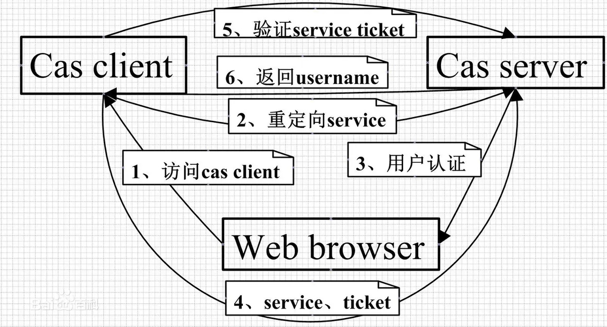

# CAS & OAuth2 区别
1. CAS 指的是 用户能否访问 我CAS客户端 掌管的服务，比如公司内网的权限系统，授权方是CAS服务端。思考一下如图的过程和内网的SSO的运作过程，也就是
   C -> B1
   B1 -> KEY -> C
   C -> key -> B2 

1. OAuth 指的是 OAuth 客户端能否获取我 OAuth 服务端 所具有的资源，比如豆瓣用QQ账号登录，获取你的头像，昵称等资源。授权方除了OAuth服务端还要经过用户授权。也就是
   B1->C->B2
