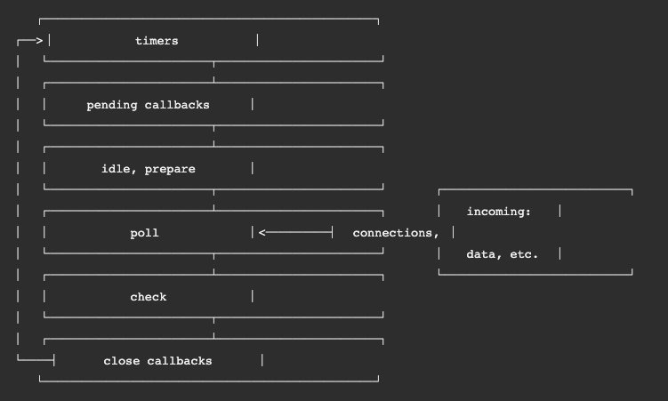
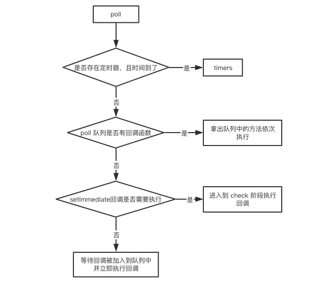

# Nodejs 的事件循环
## 循环概览


整个循环阶段分为
1. timers 计时器，处理setTimeout() 和 setInterval()的回调
2. pending callbacks 待定回调 处理上一个事件处理周期下被推迟执行的回调
3. idle，prepare 空闲准备期  内核处理的部分
4. poll 事件轮询期  正常的事件轮询，查询新到来的IO事件，执行与IO相关的回调
5. check 检测期 在此处执行setImmediate() 的回调
6. close callback 一些准备关闭的回调函数，类似 socket.on("close")

实际上的循环顺序 
输入数据阶段(incoming data)->
轮询阶段(poll)->
检查阶段(check)->
关闭事件回调阶段(close callback)->
定时器检测阶段(timers)->
I/O事件回调阶段(I/O callbacks)->
闲置阶段(idle, prepare)->
轮询阶段...

## Poll阶段的过程



nodejs的异步调用是libuv帮忙做的
- 在*nix系统上使用线程池
- 而在windows系统上使用IOCP

一个这样的循环就是一个tick

nextTick 方法允许把一个回调放在下一次事件轮询队列tick的头上，**会比setTimeout更先执行，同时也比微任务更新执行**


## nodejs 11版本带来的变化
### 总体来说
原来的宏任务和微任务阶段的执行，是一个阶段的宏任务都被执行光了，再去执行微任务。而新版本node对于timer和check阶段的宏任务执行完毕后，也要去检查微任务队列并执行。
对于poll阶段，除了遇到存在已经到时间的定时器和immediate会返回到timer和check阶段，其他状况下和以前不变。
### Timers 阶段
此阶段一个宏任务（setTimeout,setInterval和setImmediate）被执行后，就立即执行对应的微任务队列。即使是在回调中被新增加的

```js
setTimeout(()=>{
    console.log('timer1')
    Promise.resolve().then(function() {
        console.log('promise1')
    })
}, 0)
setTimeout(()=>{
    console.log('timer2')
    Promise.resolve().then(function() {
        console.log('promise2')
    })
}, 0)
// node 11后 timer1=>promise1=>timer2=>promise2
// node 11前 timer1=>timer2=>promise1=>promise2
```
### check 阶段
此阶段SetImmediate被执行后，也会马上执行微任务队列
```js
setImmediate(() => console.log('immediate1'));
setImmediate(() => {
    console.log('immediate2')
    Promise.resolve().then(() => console.log('promise resolve'))
});
setImmediate(() => console.log('immediate3'));
setImmediate(() => console.log('immediate4'));
// node11 后  immediate1=>immediate2=>promise resolve=>immediate3=>immediate4
// node11 前 immediate1=>immediate2=>immediate3=>immediate4=>promise resolve
```

### nextTick 使用
```js
setImmediate(() => console.log('timeout1'));
setImmediate(() => {
    console.log('timeout2')
    process.nextTick(() => console.log('next tick'))
});
setImmediate(() => console.log('timeout3'));
setImmediate(() => console.log('timeout4'));
// node11 后 timeout1=>timeout2=>next tick=>timeout3=>timeout4
// node11 前 timeout1=>timeout2=>timeout3=>timeout4=>next tick
```

## node 和 浏览器 eventLoop的主要区别
两者最主要的区别在于浏览器中的微任务是在每个相应的宏任务中执行的，而nodejs中的微任务是在不同阶段之间执行的。


