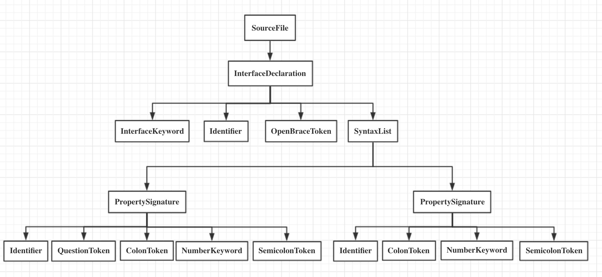

# 编写TS transform 工具
## 啥是 Transform工具
书接上文（TS的编译过程），我们知道，transform阶段就是checker到emitter之间，对代码进行转换的阶段，在通常，这个阶段其实只会进行translate过程，也就是原样把ts转化成js，但如果这中间，对代码进行了一些转化过程，对ast进行了一些增删过程。那么这个过程就是transform，执行这个的东西就是transformer，也就是transform 工具。
## 参考文章
[TypeScript中利用transformer获取interface keys](https://nullcc.github.io/2019/07/18/TypeScript%E4%B8%AD%E5%88%A9%E7%94%A8transformer%E8%8E%B7%E5%8F%96interface%20keys/)
## 思路过程
现在我们想写一个从interface中抽取key的transformer，也就是元编程能力，直接操作本应该只存在在编译过程中的代码。并且获得产出。这个transformer的目的生成可以用来验证请求的参数的工具等等...
一个AST大概长这样


### 如何实现
首先我们知道，正常情况下，checker结束后会产出ts.Program，这个对象里面可以用ts compiler API来创建sourceFile从而获取AST，然后我们可以对AST做处理。
所以，一个transformer的基础框架是：
```ts
import * as ts from 'typescript';
import * as path from 'path';

/**
 *   一个transformer的常规结构，获取一个Program编译程序
 *   返回一个Transformer工厂， 这样才符合ts.CustomTransformer
 *   接口的需求
 **/
export default (program: ts.Program): ts.TransformerFactory<ts.SourceFile> => {
  return (ctx: ts.TransformationContext) => (
    sourceFile: ts.SourceFile
  ): ts.SourceFile => {
    const visitor = (node: ts.Node): ts.Node => {
      return ts.visitEachChild(visitNode(node, program), visitor, ctx);
    };
    return <ts.SourceFile>(
      ts.visitEachChild(visitNode(sourceFile, program), visitor, ctx)
    );
  };
};
/**
 * 遍历方法一般由自己实现
 * 这里用的是visitEachChild，他的特点是会返回新的Node来替换掉原始的
 * 如果用 forEach Node就只会遍历，不会替换
 * */
const visitNode = (node: ts.Node, program: ts.Program): ts.Node => {
  const typeChecker = program.getTypeChecker();
  // 判断是不是目标替换的语法类型
  if (!isKeysCallExpression(node, typeChecker)) {
    return node;
  }
  // 暂时用一个占位符搞搞
  return ts.createStringLiteral('will be replaced by interface keys later');
};

const indexTs = path.join(__dirname, './index.ts');

/**
 *  找到是 调用我们定义的特殊方法 keys<T>() 这个类型的节点
 *  keys<A>(); 是一个callExpression
 *  keys 是 identifier
 **/
const isKeysCallExpression = (
  node: ts.Node,
  typeChecker: ts.TypeChecker
): node is ts.CallExpression => {
  // 首先得是方法调用
  if (!ts.isCallExpression(node)) {
    return false;
  }
  // 获得解析后的节点签名，判断其调用是否合法
  // 这里的签名其实就会关联到上面 declare的 keys方法那里去
  const signature = typeChecker.getResolvedSignature(node);
  if (typeof signature === 'undefined') {
    return false;
  }

  // 如果合法，获取其声明，检查identifier是不是"keys"
  const { declaration } = signature;
  return (
    !!declaration &&
    !ts.isJSDocSignature(declaration) &&
    // 判断调用的位置在当前文件中
    path.join(declaration.getSourceFile().fileName) === indexTs &&
    // 声明的名字就是 keys
    !!declaration.name &&
    declaration.name.getText() === 'keys'
  );
};

```

我们要知道，transformer要生效，必须是经过ts编译过程，除了直接倒出Transformer从而在ttypescript或者ttsc，ts-loader中使用，还可以自己编写一个compile程序来手动编译。基本用例如下
```ts
ts.createProgram([entryFile], {
    // 采用严格模式
    strict: true,
    // 编译目标： Latest
    target: ts.ScriptTarget.Latest,
    // 模块解析策略 -> NodeJS
    moduleResolution: ts.ModuleResolutionKind.NodeJs,
    skipLibCheck: true,
    // 允许合成默认导出，也就是允许将 import * as A from B 写成 import A from B；
    allowSyntheticDefaultImports: true
  })

```

由于我们需要用到自定义的transformer，需要扩充编译程序如下
```ts
**
 * 一个transformer 要起作用，一定要过ts的编译过程，可以使用ts-loader，或者使用ttypescript
 * 在这里，为了测试目标transformer，我们要自己构建一个编译过程，而不是直接使用tsc
 * 这个compile的使用方法是
 * 1. tsc 编译 compile.ts
 * 2. 用compile 来重新构建ts编译过程
 * 3. 在编译过程中的emit阶段，引入的transformer生效，同时使用构造的program编译
 * 4. 使用jest 执行编译后的测试(test.js)，因为这个时候test.ts中的keys<T>() 已经被transformer替换掉了，测试会顺利通过
 * (原本的test.ts是无法正常执行的，即使使用tsc编译也不行，需要使用我们的特殊编译程序编译)
 * @param filePaths
 * @param writeFileCallback
 */
export default function compile(filePaths: string[], writeFileCallback?: ts.WriteFileCallback) {
  const program = ts.createProgram(filePaths, {
    strict: true,
    noEmitOnError: true,
    suppressImplicitAnyIndexErrors: true,
    target: ts.ScriptTarget.ES5,
  });

  const transformers: ts.CustomTransformers = {
    before: [transformer(program)],
    after: [],
  };

  const { emitSkipped, diagnostics } = program.emit(undefined, writeFileCallback, undefined, false, transformers);

  if (emitSkipped) {
    throw new Error(diagnostics.map(diagnostic => diagnostic.messageText).join('\n'));
  }
}
```

接下来，需要手动调用compile，以及入口文件来进行工作
```js
const path = require('path');
const compile = require('./compile').default;

compile([path.join(__dirname, './test/transformer.test.ts')]);
```

最后，node执行该文件，就可以发现内容被成功替换了。

### AST 分析
1. 对于AST的每个node，按道理来讲都有四个对应属性
    1. Node。    常见的AST节点
    2. Type。    当前节点的类型
    3. Symbol。   涉及到元素实体，一般包括名字，声明，和member用于表示子Symbol（实体中还有实体）
    4. Signature 涉及到函数节点的定义和引用