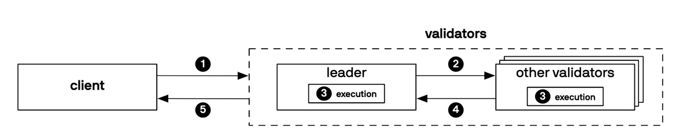
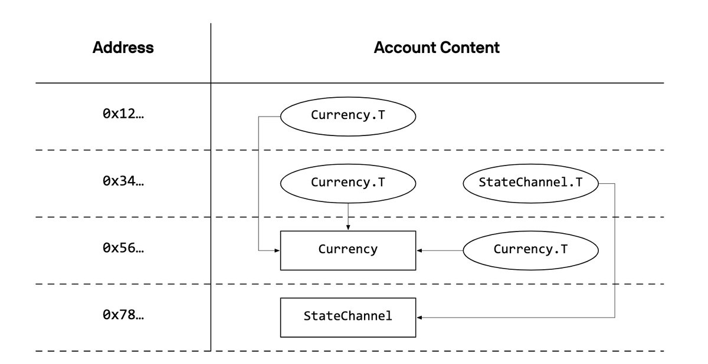
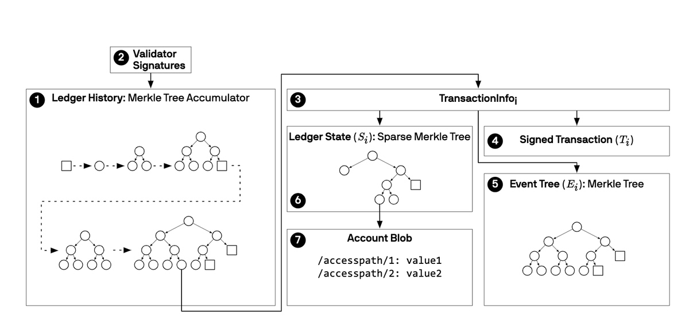
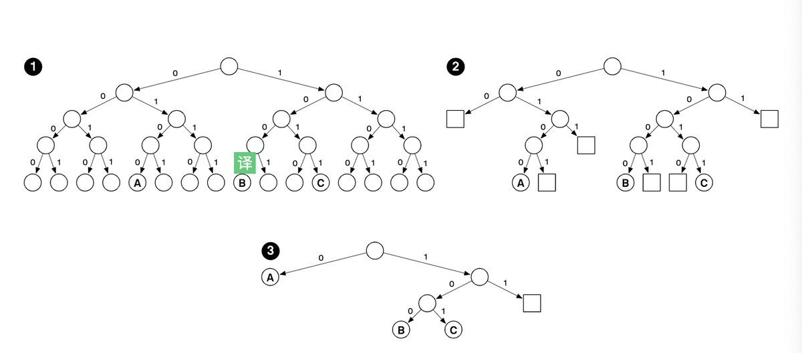

# Libra 区块链
本文翻译自  https://developers.libra.org/docs/assets/papers/the-libra-blockchain.pdf
## 建议了解的概念:
1. PBFT/Raft/Pow/Pos/DPOS/Ripple
2. FLP/CAP/DLS
3. Merkle树
## 摘要
Libra Blockchain是一个分布式可编程数据库，旨在支持能够成为全球数十亿人的有效交换媒介的低波动性加密货币。我们提出了Libra协议的提案，该协议实现了Libra区块链，旨在创建一个可以促进创新，降低进入门槛和改善金融服务获取的金融基础设施。为了验证Libra协议的设计，我们构建了一个开源原型实现 —— Libra Core，期待全球协作努力推进这个新的生态系统。
 Libra协议允许来自不同机构的一组副本（称为验证器）共同维护可编程资源的数据库。这些资源由通过公钥加密认证的不同用户帐户拥有，并遵守这些资源的开发人员指定的自定义规则。验证器处理事务并相互交互以达成对数据库状态的共识。交易基于预定义且将在未来的版本中由用户定义的采用名为Move的新编程语言编写的智能合约。我们使用Move来定义区块链的核心机制，例如货币和验证成员资格。这些核心机制可以创建一种独特的治理机制，该机制建立在早期现有机构的稳定性和声誉的基础上，但随着时间的推移，将会过渡到一个完全开放的系统。

## 一、引言
互联网的普及以及由此产生的数字化产品和服务提高了效率，降低了进入门槛，减少了大多数行业的经营成本。 这种连通性使更多人能进入金融生态系统，从而推动经济赋权。 尽管取得了这些进展，但对于那些最需要金融服务的人来说，受成本，可靠性和无缝汇款能力的影响。获得金融服务的机会仍然有限。本文提出了Libra协议的提案，该协议用于支持新成立的Libra生态系统，该生态系统旨在应对这些挑战，扩大用户获取资本服务的能力，并作为创新金融服务的平台。这个生态系统将提供一种新的全球货币 - Libra Coin - 它将锚定一篮子银行存款和高质量中央银行的国债的支持。所有这些货币的通货膨胀率都相对较低，因此Libra Coin自然也继承了这一特性以及地理多元化资产组合的优势。 
Libra协议必须具有扩展能力并进行扩展，以支持该货币发展成为全球金融基础设施所需的交易量，并为实施支持其运营的经济和治理政策提供灵活性。 Libra协议结合了新颖的方法和易于理解的技术，建立在现有项目和研究的学习上，它的设计将从根本上全面满足这些要求。
金融服务的健康竞争和创新的关键先决条件是能够依靠通用基础设施来处理交易，维护账户以及确保跨服务和组织的互通性。通过降低进入门槛和转移成本(客户终止与某企业的客户关系，转而与其它企业建立客户关系时所发生的成本)，Libra协议将使初创公司和现有企业能够在公平环境中竞争，并尝试新型商业模式和财务应用。区块链技术很适合解决这些问题，因为它可以用来确保没有任何一个实体可以控制生态系统，或者单方面地将其发展塑造成自身优势。Libra区块链将是分布式的，由一组验证器组成，它们协同工作以处理事务并维护区块链的状态。这些验证者也构成了Libra协会的成员，该协会将为网络治理和支持Libra Coin的储备提供框架。最初，validator将由地理上分布和多样化的创始成员组成。这些成员是根据客观参与标准选择的组织，包括他们在引导Libra生态系统和为其成功投入资源方面的利害关系。随着时间的推移，成员资格将转变为完全开放，只要持有libra就会成为成员。
本文是构建支持Libra生态系统的技术基础设施的第一步。我们正在发布这份早期报告，以寻求社区对初始设计，系统发展计划以及目前尚未解决的研究挑战的反馈。因此，协会建立了一个开源社区[6]，用于讨论和开发该项目。
### Libra协议
Libra Blockchain是使用Libra协议维护的加密认证数据库。这个数据库用于存储可编程资源的账本，例如Libra coins(理解为token)。这些资源遵循其声明模块指定的自定义规则(理解为智能合约)，该模块也存储在数据库中。资源由使用公钥加密进行身份验证的帐户拥有。帐户可以代表系统的直接最终用户以及代表其用户行为(例如托管钱包)的实体。帐户所有者可以签署对帐户中保留的资源进行操作的交易。
下图展示了在libra协议中交互的客户端和验证者两种实体。客户端提交对该分布式数据库的查询或提交交易来更改该数据库，验证者维护和验证该数据库，
            
图1
验证器维护数据库并处理客户端提交的事务以纳入数据库(1)。验证器使用分布式共识协议来就已经提交到数据库的不断增长的交易列表以及执行这些交易的结果达成一致。即使在少数验证者存在恶意或错误行为的情况下，该共识协议也必须是可靠的。
（在这个阶段，libra是一种联盟链）
验证者轮流推动接受交易的过程。
当验证者充当leader时，它负责提交交易给其他验证者， 包括将客户直接提交给他们的交易和通过其他验证人间接提交的交易(2)。
所有验证器都执行对交易的确认(3)并形成包含新账本历史记录的经过身份验证的数据结构。
作为共识协议的一部分，验证者对该数据结构的验证者进行投票(4)。
作为提交交易版本的一部分, 共识协议在版本的整个状态(包括其整个历史记录)上输出签名，以验证对来自客户端的查询的响应(5)。客户端可以向验证程序发出查询以从数据库中读取数据。由于数据库经过身份验证，因此可以确保客户端对其查询的响应准确性。
作为对读取查询的响应的一部分，验证器返回验证器已知的最新版数据库的签名验证器。
此外，客户端可以选择通过同步验证器的交易历史记录来创建整个数据库的副本。在创建副本时，客户端可以验证验证程序是否正确执行了交易，这增加了系统的责任性和透明度。其他客户端可以从保存副本的客户端读取，其方式与从验证器读取的方式相同，以验证响应的真实性。为简单起见，本文的其余部分假定客户端直接查询验证程序而不是其他客户端维护的副本。

## 二、逻辑数据模型
Libra Blockchain中的所有数据都存储在单一的版本化数据库中。版本号是无符号的64位整数，对应于系统执行的交易数。在每个版本中，数据库包含表示交易`（Ti）`，交易输出`（Oi）`和账本状态`（Si）`的元组`(Ti，Oi，Si)`, 给定一个确定性的执行函数Apply. 该元祖的含义为: 执行交易`Ti`, 针对状态`Si-1`产生交易输出Oi和新的交易状态`Si`. 表示为公式 `Apply(Si-1, Ti) -> <Oi, Si>`
Libra协议使用Move语言来实现执行功能的确定性。 在本节中，我们将重点介绍版本化数据库，它允许验证程序：
1. 在最新版本处针对 账本状态(ledger state) 执行交易。
2. 在当前版本和先前版本中响应有关 账本历史记录(ledger history) 的客户端查询。

我们首先解释存储在单个版本中的账本状态的结构，然后讨论版本化账本历史视图的用途。

### 1. 账本状态（ledger state）-> 类比于 以太坊的 世界状态
账本状态代表了Libra生态系统的基本事实，包括每个用户在给定版本中持有的Libra数量。 每个验证器必须知道最新版本的账本状态才能执行新的事务。
 Libra协议使用基于帐户的数据模型来编码账本状态。 状态被构造为键值存储，它将**帐户地址(Account address)**键映射到**帐户值(account values)**。 账本状态中的帐户值是已发布的**Move资源(resources)**(libra Coin或自己定义的其他token)和**模块(modules)**(合约)的集合。 Move资源存储数据值和模块存储代码。 初始账户集及其状态在起源账本状态(genesis ledger state)中指定。
  1. 账户地址 (account address)
一个账户地址是一个256位数值，为了创建新帐户，用户首先为签名方案生成新的验证/签名密钥对（vk，sk），并使用公共验证密钥vk的加密散列作为帐户地址,即a = H(vk)。当从现有帐户发送的交易调用create_account(a) Move指令时，将在账本状态中创建新帐户。 这通常发生在交易尝试将Libra发送到尚未创建的地址的帐户时。
在a创建新帐户后，用户可以使用私人签名密钥sk签署要从该帐户发送的交易。用户还可以旋转用于从账户签署交易的密钥而不改变其地址。Libra协议不会将帐户与真实身份相关联。 用户可以通过生成多个密钥对来自由创建多个帐户。 由同一用户控制的帐户彼此之间没有固有联系。 该方案遵循比特币和以太坊的例子，从而它为用户提供了假名。
  2. 资源值 (resource)
资源值resource是将命名字段绑定到简单值（例如整数）或复合值（例如嵌入在此资源中的其他资源）的记录。
下图展现了一个拥有四个账户和相应账户值的示例账本。在下图中，椭圆代表资源resource， 长方形代表modules(模块)。模块和资源的直接连线（边）代表资源是由这个模块声明的。下图中，0x56拥有currency模块，它声明了一种资源currency.T， 这种资源被账户0x12, 0x34也同时拥有。stateChannel同理。

图2
每个资源都有一个模块声明的类型。资源类型是由类型名称以及资源的声明模块的名称和地址组成的名义类型。例如，对于图中的资源Currency.T的类型为 0x56.Currency.T。这里，0x56是存储Currency模块的地址，Currency是模块的名称，Currency.T是资源的名称。
要在帐户地址0x12下检索资源0x56.Currency.T，客户端会去请求0x12 / resources / 0x56.Currency.T。此设计的目的是让模块为顶级帐户值定义可预测的模式 - 也就是说，每个帐户会在同一路径下存储其0x56.Currency.T资源。因此，每个帐户可以存储给定类型的最多一个资源(否则数据库会出现同名而不知道该去拿哪个值)。然而，这种限制不是强制性的，因为程序员可以定义以自定义方式组织资源的包装器资源（例如，资源TwoCoin {c1：0x56.Currency.T，c2：0x56.Currency.T}）。
用于变更，删除和发布资源的规则在创建资源并声明其类型的模块中进行编码。 Move的安全性和验证规则会阻止其他代码对资源进行篡改。
  3. 模块值 （Module Value）
模块值或模块包含声明资源类型和过程的Move字节码。 与资源类型一样，模块由声明模块的帐户的地址标识。 例如，上图中Currency模块的标识符是0x56.Currency。
模块必须在帐户中唯一命名 - 每个帐户最多可以声明一个具有给定名称的模块。 例如，上图中地址0x56处的帐户无法声明另一个名为Currency的模块。 另一方面，地址0x34处的帐户可以声明一个名为Currency的模块。 该模块的标识符为0x34.Currency。 请注意，0x56.Currency.T和0x34.Currency.T是不同的类型，不能互换使用。
在当前版本的Libra协议中，模块是不可变的。 一旦模块在帐户地址下声明，除非通过硬分叉，否则无法修改或删除该模块。 我们正在研究一种方案的选项，以便在未来版本中实现安全模块更新。
2. 交易 （transaction）
Libra Blockchain的客户通过提交交易来更新账本状态。 就顶层而言，交易包括交易脚本（以Move字节码编写）和交易脚本的参数（例如，收件人帐户地址或要发送的Libra的数量）。 验证程序通过运行脚本及其参数和当前账本状态(ledger state)作为输入来执行事务，以生成完全确定的交易输出。 通过商定对交易输出的约束性承诺，在共识期间提交交易之前，账本状态不会改变。 
  1. 交易输出
执行交易Ti会产生新的账本状态Si以及执行的状态码，gas usage和事件列表（在输出Oi中聚合）。执行状态码用于记录执行交易的结果（例如，成功，因错误而退出，耗尽gas等）, gas usage记录执行交易时使用的gas单位数。
  2. 事件
事件列表是通过执行交易产生的一组副作用。Move代码可以通过事件结构触发事件发射。每个事件都与唯一key相关联，该唯一key标识发出事件的结构，以及payload，它提供有关事件的详细信息。一旦共识协议提交了交易，交易产生的事件就会被添加到商定的账本历史(ledger history)记录中，并提供成功执行交易产生特定效果的证据。例如，支付交易发出一个事件，允许收件人确认已收到付款并确认付款金额。
乍一看，事件似乎是多余的。客户端可以询问交易Ti是否已包含在区块链中，而不是查询事务Ti发出的事件。然而，这容易出错，因为包含Ti并不意味着成功执行（例如，它可能在耗尽gas后中断）。在交易可能失败的系统中，事件不仅提供了特定交易已执行的证据，而且提供了已成功完成预期效果的证据。
交易只能生成而不能读取事件。此设计允许交易执行仅属于当前状态的函数事件，而不是历史信息，例如先前生成的事件。
3. 账本历史 （ledger history）
        账本历史记录存储已提交和已执行事务的序列以及它们发出的关联事件。它的目的是记录最新账本状态是如何被计算的。
账本交易历史中没有“块”的概念。共识协议将事务批处理为块作为一种优化用以驱动共识协议。但是，在逻辑数据模型中，事务按顺序发生，而不区分每个交易包含在哪个块中。虽然验证器不需要知道账本历史记录来执行新事务，但客户端可以对账本历史记录执行经过身份验证的查询，并使用分类帐历史记录来审计事务执行。
    - 响应客户端查询。
        - 验证器可以使用账本历史记录来回答有关先前账本状态，交易和交易输出的客户端查询。
        - 例如，客户可能询问特定版本的账本状态（例如，“版本30处地址x处帐户中的余额是多少？”）或某种类型的事件历史记录（例如，“地址y帐户在过去20分钟内收到了哪些款项？“）。
    -  审计交易执行。
        - 客户端可以通过重新执行历史记录中的每个交易Ti并将计算的账本状态与版本化数据库中的相应分类帐状态Si和事务输出Oi进行比较来检查账本状态是否正确。
        - 此机制允许客户端审核验证程序以确保正确执行交易。

    
## 三、 执行交易
在Libra协议中，唯一改变区块链状态分方法是执行一个交易，这一章为执行交易所需要求列出了大纲，并定义了交易结构，解释了Move 虚拟机是如何执行一个交易的，此外，本章还描述了Move语言的一些关键概念。
在最初版本的Libra协议中，Move语言的功能只有受限的一部分子集可为用户所用，当Move在被用作定义核心的系统概念，例如libra货币的时候，用户无法利用Move来定义他们自己的资源。该手段是为了让Move语言和相关的工具链在实现核心的Libra系统概念的探索经验中逐渐成熟后再暴露给用户。同时，它也推迟了通用智能合约平台在执行交易和数据存储方面的所固有的扩展性挑战。当然，我们正在致力于逐渐为用户暴露出Move完整的编程特性。
### 执行要求
#####1. **已知的初始状态** 
所有Validators必须就系统的初始状态(也就是类似于以太坊中的创世区块genesis)的初始账本状态达成一致。因为区块链的核心组件，例如账户逻辑，交易验证，Validator的选择和Libra Coin的概念都是被定义为Move 模块的。 初始状态还必须对于这些核心的组件进行充分的实体化已便可以处理交易。（例如，至少有一个账户必须能够为第一笔交易支付费用，一个初始的Validator集合必须备定义以至于有足够符合条件的人可以就第一笔交易达成共识）。
    为了简化系统的设计，系统的初始状态被标示为空状态，创世状态将会经由一个用于定义将要被创建的特殊模块和资源特殊的交易T0所创造。而非通过正常的交易过程所获得。客户端和Validators会被配置为只接受以这个特殊的T0交易（被加密的哈希标识出来）作为账本历史开头的历史。这些特殊交易无法通过共识协议添加到账本历史记录中，只能通过配置添加。
#####2. **确定性** 
交易的执行必须是具有 确定性 和 隔离性 的. 这意味着交易输出是完全可预测并且只基于包括在交易和现有状态的基础上。交易的执行没有外部作用(比如打印到控制台或者和网络发生交互)。确定和隔离的执行过程可以确保多个Validators可以就同一个序列交易产生的状态达成一致，即使这些交易是由每个Validator独立执行的。这也意味着区块链的交易历史是可以从创世区块开始重新执行直到产生当前的账本状态。
#####3. **测量** 
为了承担对于计算能力的需求, Libra协议会收取基于Libra币计价的交易手续费。这遵循由以太坊推广的Gas模型。其实我们采取的方法是选择具有足够能力的Validator来满足Libra生态系统的需求。该手续费的唯一目的只是在系统处在比正常情况下更高的负载时能够减少对于系统的需求(例如，由于拒绝服务攻击导致的)。这套系统的设在系统具有充足容量和计算能力的时候要求较低的费率。同现有的其他区块链不同，因为现有区块链的服务提供者的能力没有Libra这种联盟链形式强，处理能力也较差，因此，他们有时面临处理交易的需求大于吞吐量的情况，在这些系统中，交易手续费在高需求期间激增——这代表了Validator的收入来源，但对用户来说将是一笔不小的成本。
- 交易手续费的大小由两个因素决定: gas price 和 gas cost. Libra中的每个交易都会指定一个提交交易者愿意支付给交易打包者的每单位gas的价格。交易会通过gas cost的形式的表示动态交易执行过程中的算力消耗。validator会优先处理那些支付更高gas Price的交易，而在系统出现一定堵塞情况时搁置支付费用更低的交易，从而减少高负载下对于交易的需求。
-   除此之外，一个交易还包括了最大提供的gas数量，它指定用户在给定单价下为此交易愿意支付的最大gas。在执行过程中，虚拟机会追踪gas的消耗情况。如果最大gas数小于当前执行过程中的gas消耗。虚拟机执行就会立即停止。交易执行过程中产生的部分变更将不会提交到新状态。但是由于validtaor还是做了苦工，因此交易历史中将存在这笔交易， 但这笔手续费会被从发起人那里收取。
- 正如我们在本节中讨论的那样，区块链核心逻辑的许多部分都是使用Move定义的，包括扣除gas fee。为了避免循环，VM在执行这些核心组件期间禁用对gas的测量。这些核心组件必须在创世状态（genesis）下就被定义，并且必须以防御性方式编写，以防止恶意交易触发执行这类高消耗的代码（而不付钱）。执行该逻辑的成本可以包括在交易的基本费用中。
  4. 资产语义 正如我们在2.1章解释的那样，账本状态会直接编码具有真实价值的数字资产。交易执行必须确保在未经授权的情况下，libra coin等资产无法进行复制，丢弃或者转移。Libra协议使用了Move虚拟机来安全的实现具有这些属性的交易和自定义资产。
2. 交易结构
- 一个交易是包含以下数据的一段签名信息
  - Sender address 发送者地址 交易发起者的账户地址, 虚拟机读取序列数，验证密钥(authentication key)以及存储在这个地址下的libraAccount.T Resource的余额。
  - Sender public key 发送者的公钥：与用于签署交易的私钥对应的公钥。此公钥的哈希值必须与存储在对应sender的 LibraAccount.T resource下的身份验证密钥(authentication key)匹配。
  - Program 程序 一段要执行的move字节码交易脚本，一个可选的对该脚本的输入列表，以及一个可选的要发布的Move字节码模块(Module)的列表。
  - Gas Price 发送者愿意为执行此交易付出每单位gas支付的Libra coin的数量。
  - Maximum gas amount 指定Gas Price下用户愿意支付的最大gas单位数量
  - Sequence number 序列号 一个必须和发送者的LibraAccount.T Resource的序列号相等的无符号整数(防止双花)。在交易执行后，序列号会增加1，因为只能为给定的序列号提交一次交易，这样可以避免重放攻击。
3.  执行交易
交易执行会通过VM内部的六个步骤进行。交易的执行与账本状态的更新是分开的。首先，交易作为就其交易顺序达成一致的尝试的一部分被执行(绝大部分节点交易的顺序都是一致的，如果某个节点的顺序和大部分的不同，这个交易执行和产生的状态会被丢弃，转而采用共识之后的)。由于执行是密闭的，因此可以在没有引起外部副作用的情况下完成。随后，如果达成共识，则将其输出写入账本历史记录。交易执行包括以下六个步骤:
1. 检查签名 交易上的签名必须与sender的公钥和该交易data匹配。此步骤仅是交易本身的功能 - 它不需要从sender的帐户中读取任何数据。
2. 运行prologue(序幕，预操作)。 预操作会验证交易的发起人, 确保其拥有足够的libra coin来支付其在交易中指定的最大gas数。并且检查该交易不是一次重放交易。所有的这些检查都是通过Move通过LibraAccount module下的prologue程序实现的，Gas测量在prologue的执行过程中被禁用。具体而言，prologue做了以下工作:
  1. 检查发送者的公钥哈希是否和其账户下的Authentication key相同。如果没有这个检查，Vm可能会错误的接受一个即使与该账户关联的密钥没有对应关系的加密意义上有效的交易（别人花你的钱）。
  2. 检查 gas_price * max_gas_amount <= sender_account_balance 如果没有这个检查，VM会错误的执行在epilogue过程中由于无法支付gas而失败的交易。（但这一步不会检查实际执行过程中的gas损耗是否大于max_gas_amount）
  3. 确保交易序列号等于用户账户下存储的序列号，没有这个检查，攻击者就可以重放旧的交易。
3. 验证交易脚本和模块 一旦交易prologue成功的结束, VM就会执行使用move字节码验证器对交易脚本和模块执行格式检查。在实际运行和发布任何move代码之前，字节码验证器会检查类似类型安全性，引用安全性（例如，没有悬空引用），资源安全性（例如，资源没有重复，重用或无意中被破坏）等关键属性。
4. 发布模块 交易程序字段中的每个模块都在交易发起人的帐户下发布。重复的模块名称是被禁止的 - 例如，如果事务尝试将名为M的模块发布到已包含一个名为M的module的帐户，则该步骤将失败。
5. 运行交易脚本 VM将交易参数绑定到交易脚本的形参上并执行它。如果此脚本执行成功完成，则脚本执行的写入操作和脚本发出的事件将提交给global state。如果脚本执行失败（例如，由于耗尽gas或运行时执行失败），则不会将脚本的更改提交到全局状态。
6. 运行终章 epilogue 最后，VM运行交易epilogue，向用户收取使用的gas费用并增加发起人的帐户序列号。与prologue一样，交易结尾是Move语言中 LibraAccount 模块的一个程序，并且在禁用测量gas的情况下运行。如果执行超出步骤（2），包括步骤（3), (4) 或（5）失败的情况，都会运行epilogue程序。prologue和epilogue共同确保账本历史中接受的所有交易都要收取gas。未超出步骤（2）的交易不会附加到账本历史记录中。这些交易被考虑执行的事实从未被记录下来。如果交易向前推进超过步骤（2），则prologue确保账户有足够的Libra coins以支付交易允许的最大gas单位数。即使交易耗尽了gas，epilogue也能够以maximum amount收取费用。
4. 编程语言 Move
正如我们所看到的，交易是对move字节码程序的经过验证的包装，move是在libra协议设计期间创建的一种新的编程语言。move在系统中有三个重要角色：
    1. 通过交易脚本允许灵活交易；
    2. 允许用户定义代码和数据类型，包括通过模块来定义“智能合约”.
    3. 支持Libra协议的配置和可扩展性（见第9节）。
Move的关键特性是能够定义自定义资源类型，这些类型的语义受线性逻辑的启发。资源类型用于对行为类似于顺序程序值的可编程资产进行编码：资源可以存储在数据结构中，作为参数传递给过程，等等。然而，move类型系统为资源提供了特殊的安全保障。资源永远不能被复制，只能被移动。此外，资源类型只能由声明该类型的模块创建或销毁。这些保障是由move vm静态强制执行的。这使得我们能够将Libra币作为Move语言中的一种资源类型（与以太币和比特币不同，它们在各自的语言中具有特殊的地位）。
我们已经发布了一份关于Move设计的单独、更详细的报告[。在本节的其余部分中，我们将简要概述交易执行的关键move概念：开发move交易脚本和模块，以及使用虚拟机执行move字节码。
编写Move 程序 Move程序有三种不同的表示形式：源代码，中间表示（IR）和字节码。我们目前正在设计Move源语言，这将是一种符合人体工程学的语言，旨在使编写和验证安全代码变得容易。与此同时，程序员可以在Move IR中开发模块和交易脚本。Move IR足够高级使得可以编写人类可读的代码，但也足够低级从而可以被直接转换为Move字节码。未来的Move源语言和Move IR都被编译为Move字节码，这是Libra协议使用的格式。
我们使用可验证的字节码作为Move的可执行表示，原因有两个：
- 上文提及的各项安全保证必须适用于所有的Move程序。仅仅在编译器中执行这些保护是不够的。攻击者总是可以选择通过使用字节码直接编写恶意代码来绕过编译器（运行编译器作为交易执行的一部分会使执行变得更慢更复杂，并且需要验证者信任完整编译器代码库的正确性）。因此，协议通过字节码验证强制执行Move的所有安全保证：类型安全，参考安全和资源安全，而不是相信编译器。
- Move的基于堆栈的字节码比更高级别的源语言具有更少的指令。此外，每条指令都有简单的语义，可以通过更小的原子步骤来表示。这减少了Libra协议的规范占用空间，并且更容易暴露实现层面的错误。

**交易脚本** 交易脚本是Libra协议的主要步骤。交易脚本使得交易更灵活，因为脚本是一个任意的Move字节码程序。一个脚本可以调用发布在当前账本状态下的多个模块程序，使用条件逻辑，并执行本地计算。这意味着脚本可以执行表示性的一次性操作，比如对一组特定的接收者进行支付。
我们期望大多数交易脚本将执行包含通用功能的单个过程调用。例如LibraAccount.pay_from_sender（recipient_address，amount）程序封装了用于执行点对点支付的逻辑。一个使用recipient_address和amount作为参数并调用此程序的交易脚本与以太坊中的Ether转账交易过程相同。
模块 Modules 模块是在账本状态下发布的代码单元。模块同时声明结构类型和过程。结构值包含可能包含原始值的数据字段，例如整数或其他结构值。
每个结构体都必须被标记为非限制的（非-resource）。不受限制的结构体不受到上面move语言对于数据的种种限制，例如复制，移动或者销毁。然后，不受限的结构不可以包含resource结构（直接的或者是传递的都不行），也不可以在处在账本状态下的账户处发布。
从高层次来讲，模块/结构/过程关系类似于面向对象编程中的类/对象/方法关系。但是，也有重要的区别。模块可以声明多个结构类型（或零个结构类型）。在声明模块之外不能访问任何数据字段（即没有公共字段）。模块的过程是静态过程，而不是实例方法；过程中没有this或self的概念。move模块类似于没有高阶函数的ml（meta language）语言风格模块的受限版本。
Move modules与以太坊和其他区块链平台中的“智能合约”概念相关，但并不相同。以太坊智能合约包含在账本状态下发布的代码和数据。在libra中，模块Modules包含代码值，而资源Resource才包含数据值。在面向对象的术语中，以太坊智能合约就像是在单一账户地址下发布的单例对象。一个模块Module是创建资源的配方，但它可以创建任意数量的资源Resource，这些资源Resource可以在不同的帐户地址下发布。（资源才是实体，而对于智能合约，资源是处在实体的智能合约管控下的，绑定在一起）。
**Move 虚拟机** Move虚拟机实现了Move字节码的一个验证器和一个解释器。字节码通过过程本地操作堆栈和寄存器实现了基于堆栈的虚拟机，而对非结构化控制流则通过goto和labels进行编码。
开发人员在move中间代码中编写一个交易脚本或模块，然后编译成move字节码。编译过程将结构化控制流构造（如条件、循环）转换为非结构化控制流，并将复杂表达式转换为少量操作操作数栈的字节码指令。move vm通过验证并运行此字节码来执行交易。move vm支持少量类型和值：布尔值、无符号64位整数、256位地址、固定大小字节数组、结构体（包括资源）和引用。结构体字段不可以是引用类型，以此阻止在账本状态下存储引用。
move虚拟机没有堆——本地数据在栈上分配，并在分配过程返回时释放。所有持久性数据必须存储在账本状态中。

## 四、受认证的数据结构和存储
在执行一个交易后，验证器将对逻辑数据模型的更改转换为一个新的经过身份验证的数据结构，该数据结构用于表示数据库。此精简验证器是对账本历史记录的绑定提交，其中包括新执行的交易。
与交易执行一样，此数据结构的生成形式也是确定的。共识协议使用这个验证器来商定交易的顺序及其结果的执行。作为提交交易块的一部分，验证器将简短验证结构集体签名到结果数据库的新版本。
通过使用此集体签名，客户端可以信任数据库版本对数据库账本历史的完整、有效和不可逆状态的表示。客户端可以查询任何validators（或数据库的第三方副本）来读取特定的数据库值，并使用验证器和简短的证明来验证结果。因此，客户机不需要信任执行查询的对象也可以确保结果读取正确。
Libra协议中的数据结构基于Merkle树，并受到其他区块链的启发；然而，在一些情况下，我们做出了稍微不同的决定，我们在下面重点介绍。首先，我们简要讨论了创建身份验证器的merkle树的方法。然后，我们从数据结构的根开始描述经过身份验证的数据结构，然后讨论其中的子结构。
1. 可认证数据结构的背景
一个受认证的数据结构允许验证者 V 拥有一个短验证器 a, 由此建立一个对于一个更大的数据结构 D 的绑定承诺（也就是说，类似于某种摘要保证某个数据结构没有被篡改）。一个不受信任的拥有数据结构 D 的提供者 B, 通过计算 f(D) -> r 并返回 r (对于f(D)计算过程的结果)和 π ，(对于正确计算结果的证明)给验证者。 V 可以通过运行 Verify(a, f, r, π), 这个验证共识只有在 f(D) = r 时返回true。在Libra区块链的环境中，提供验证者通常是Validators，而验证者是执行读取查询的客户端。但是，客户端（甚至那些只有数据库的部分副本的客户端）也可以充当提供证明者，并为其他客户端执行受认证的的读取查询。

- 在上图中, (1)账本历史结构的根哈希是对于整个系统完整状态的验证器. 该状态是被符合条件的(2)validtors签名的。一旦交易被添加到数据库，提交到账本历史记录的验证器将增长（用虚线箭头表示）。账本历史的每个叶子结点都会被提交到（3）TransactionInfo 结构中。这个结构包括（4）被签名的交易(Ti) ， （5）在交易期间生成的事件列表(Ei)，以及（6）该交易执行后的状态（si），这个状态是一颗稀疏的merkle树。每一个叶子结点(7)都是一个账户，以及相应的资源。
Merkle树是认证数据结构的一种通用形式, 用于存储整数和字符串值的映射。对于一个有2^k大小的merkle树, 数据结构D映射每一个整数key i ∈ [0, 2^k) 到一个字符串值si, 身份验证器由从字符串创建的完整二叉树的根构成，在此标记叶子为h（i||si），内部节点为h（left||right），其中h是加密哈希函数。
而提供证明者要想被认证的函数f，用于证明键值对（k-v）在数据结构D中。
提供证明者P通过返回由节点i的每个祖先的同级标签组成的证明π，让证明者对项i的查找进行身份验证。下图显示了在大小为4的Merkle树中对项3的查找。第3项的节点用虚线显示，其中包含的节点用虚线显示。通过提供h3, h2,h4 就可以验证h3 在不在merkle树中了。

2. 账本历史
大多数区块链，从比特币开始，使用包含单一祖先散列的区块，维护按照共识协议达成的每个交易区块的链接列表。这种结构导致客户端验证效率的低下。例如，一个信任某个区块B的客户想要验证一个祖先区块B'中的信息需要获取和处理所有中间祖先。
Libra协议使用单一Merkle树为账本历史提供一个经过认证的数据结构。Libra数据库的基础是包含 TransactionInfo(i) 结构的账本历史记录，后者又包含有关数据库状态、事件和帐户的信息。账本历史记录表示为merkle树，映射顺序数据库版本号到一个 TransactionInfo(i) 结构。每个TransactionInfo(i) 包含一个已签名交易（TI）、执行TI后状态的（SI）和由TI生成的事件（EI）的验证器。与其他merkle树一样，状态历史支持为对包含n个交易的情况下提供最大 O(logn) 大小的证明，用于验证特定交易的查找。当客户端希望查询版本i 或者一个在版本i中生成的事件的状态时，它使用包含状态或事件列表的验证器（merkle树）执行交易的验证查询。
具体来说，账本历史记录使用提供高效追加操作的merkle树累加器来形成merkle树。此操作非常有用，因为可以通过将新交易记录附加到旧的账本历史记录来增量计算账本历史记录。由此，Mekle树累加器可以产生有效的证明，假定验证器a提交交易i之前的账本信息，那么若存在另一个验证器a'，将要提交到事务j， 其中j > i，则账本信息中关于交易i之前的历史记录应该会是相同的。换句话说，这样可以用于证明a是a'的前缀。这些证据允许有效地验证一个账本历史记录的提交是另一个的延续。
**修剪存储** 账本历史merkle树累加器的根哈希是系统完整状态的验证器。它提交系统每个现有版本的状态、发送的每个交易以及生成的每个事件。虽然账本状态存储允许有效存储多个版本的账本状态，但验证器可能希望减少以前版本所占用的空间。验证器可以自由修剪旧状态，因为它们对于处理新交易是不必要的。merkle树累加器支持历史数据的修剪，只需要0(logn)大小的存储就可以追加新记录。
系统的任何副本都可以自由地保留整个状态，并且可以追踪数据验证直至由共识协议签名的根哈希。副本比验证器更易于扩展。副本不需要被保护，因为它们不参与共识，并且可以创建多个副本来并行处理读取查询。
3. 账本状态
账本状态si将版本i中所有帐户的状态表示为键值对的映射。密钥基于256位帐户地址，其对应值是帐户的验证器。通过类似下图的表示法，将映射表示为大小为256的merkle树。

虽然大小为2^256 的树是一个难处理的表示形式，但可以应用优化来形成一个稀疏的Merkle树。上图显示了两个优化手段，它们被用于将一个朴素的实现（1）转换为一个有效的实现。首先，将完全由空节点组成的子树替换为证书透明系统中使用的占位符值（2）。这种优化实现了可处理的树大小的表示手段，而基本上没有改变Merkle树的证明生成。但是，叶子始终存储在树的底层，这意味着该结构需要在每次叶子修改时都要计算256个散列。第二种优化方法是将仅由一个叶子组成的子树替换为一个节点（3）。预期中，任何给定元素的深度为 O(logn)，其中n为树中的元素数。这种优化减少了在映射中上执行操作时要计算的哈希数。
高效的实现，例如libra core，可以优化它们的磁盘布局和节点的批处理层，以避免在lookup期间查找。
当稀疏merkle树在交易执行后更新时，新树将重用以前版本的未更改部分，形成持久的数据结构。如果一个交易修改了系统中n个帐户中的m个帐户，则在与以前版本不同的新账本状态树中平均会创建O(mlogn) 个新分支和叶。这种方法允许验证器有效地存储账本状态的多个版本。此功能还允许在处理交易后高效重新计算账本状态验证器。
我们曾考虑过基于AVL的树，它比稀疏Merkle树提供了更优的最坏情况下的proof长度。但是，稀疏merkle树方法允许实现者进行优化，例如跨服务器分片存储和并行化根哈希计算。
4. 账户
在逻辑层面, 账户是账户地址下存储的资源和模块的集合。在物理层面，帐户被视为访问路径到字节数组值的有序映射。访问路径 是类似于文件系统中路径的分隔字符串。
在协议的第一次迭代中，我们将一个账户序列化为访问路径和按访问路径排序的值的列表。帐户的验证器 是此序列化表示形式的哈希值。请注意，此表示形式需要在对帐户进行任何修改后重新计算完整帐户上的验证器。此操作的开销为 o(n) ，其中n是完整帐户的字节表示的长度。此外，从客户端读取需要完整的帐户信息来验证其中的任何特定值。
我们在帐户中存储数据的策略与以太坊等其他系统不同，我们的方法允许move语言通过将帐户表示为访问路径到值的有序映射来提供更好的编程抽象。此表示允许通过vm有效地管理资源节约。move鼓励每个用户在自己的帐户中保存资源。在Libra的最初版本中，我们针对小客户进行了优化。在将来的版本中，我们可能会考虑支持更有效的结构来表示更大的帐户，例如merkle—avl树（修复深度不平衡问题）
账户逐出和重计算 我们预计，随着系统的使用，最终与帐户相关的存储增长可能会成为一个问题。正如gas鼓励负责任地使用计算资源（见第3.1节）一样，我们预计存储可能需要类似的基于租金的机制。我们正在评估一个最适合生态系统的基于租金的机制的各种方法。我们讨论了一个选项，它可以应用于任何确定过期时间的策略，在过期时间之后，数据可以被逐出。
在影响帐户的每个交易执行之后，VM计算可分配给帐户的存储的逻辑到期时间。vm可以自由地应用任何确定的方法来确定到期时间。这种政策的一个例子是，根据账户的存储时间和大小，收取以libra币计价的费用。帐户的authenticator表示为 H(H(AccountBlob)||ExpirationTime)，它对帐户的到期时间进行编码。过期后，vm拒绝访问该帐户，从而引发错误。由于accountblob不可访问，Validator可以在过期后自由删除此数据。但是，validator允许通过进行交易在过期后通过重计算其内容来重新激活帐户。该交易必须包含accountblob的预备镜像，并支付交易费，用于支付进一步存储的成本。通过重新计算和检查与帐户相关联的哈希值（该值不会被删除），可以确保重新计算的内容的真实性。这种实现租金的方法是对现有帐户逐出方案的改进，该方案要求第三方发送交易以删除帐户的存储。
5. 事件
Ei 是在执行交易 Ti 时发送的事件列表，每个事件都作为叶子存储在Merkle树中，该叶子形成了对 Ei 的Authenticator验证器。 事件被序列化为形式( A, p, c )的元组，表示发出事件( A )的事件结构的访问路径，数据有效负载( p )和计数器值( c )。这些元组按照在 Ti 执行期间发出事件的顺序进行索引。
根据惯例，我们将事件 j->( A, p, c ) 作为 (j, (a, p, c)) 包含在 Ei 中，形式化标示为(j, (a, p, c)) ∈ Ei。Ei的Authenticator包含在 TransactionInfoi 中。因此，验证器可以构造一个包含证明: 在第i个交易中第j个事件是( A, p, c )。
包含在每个事件中的计数器C在允许客户端检索给定访问路径A的事件列表时发挥特殊作用。客户端还可以确信列表是完整的。在move语言中，表示访问路径为A的事件的事件结构为它发出的事件总数维护一个计数器c。此计数器存储在账本状态中，并在每次交易执行在访问路径A上发出事件后递增。
客户端可以持有针对最近的账本状态的Authenticator，查询与访问路径A相关联的事件结构的计数器，并检索事件总数C。然后客户端可以查询不可信的服务来访问访问路径A上的事件列表。查询结果包含了一个元组的集合(i, j, A, p, c)—每个事件都对应一个该元组—其中i是发出事件的交易的序列号，j是该交易中事件发出的顺序。可以为每个事件提供 (j, (a, p, c))∈  Ei 的相关包含证明。由于客户端知道访问路径A发出的事件总数，因此它们可以确保不受信任的服务提供了这些不同事件的数量，并按其序列号 0≤c<C 对其排序。从而使客户端确信为A返回的事件列表是完整的。
此方案允许客户端持有对访问路径A上事件的进行验证订阅。客户端可以周期性地为事件访问路径A查询总计数器C，以确定订阅是否是最新的。例如，客户端可以使用它来保持对正在观测的地址的传入支付交易的订阅。不受信任的第三方服务可以为访问路径索引的事件提供提要，客户端可以有效地验证返回的结果。

## 五、拜占庭容错共识
共识协议允许一组validtors创建单个数据库的逻辑外貌。 共识协议在validators之间复制提交的交易，对当前数据库执行潜在的交易，然后就对交易排序和结果执行的绑定提交达成一致。 结果，所有验证器都可以按照状态机复制范例为给定的版本号维护相同的数据库。Libra区块链使用HotStuff共识协议的一种变体，称为LibraBFT。它在部分同步模型(partial synchrony model )中提供了传统的DLS和PBFT中的safety以及较新的Casper和Tendermint中的liveniess。本节概述了LibraBFT中的关键决策。 有关LibraBFT的完整报告(论文3)涵盖了更详细的分析，包括safety和liveness的证明。
validator之间必须就数据库状态达成一致，即使存在拜占庭式错误。拜占庭失败模型允许一些validtors在没有约束的情况下任意偏离协议，除了在计算上有界（因此无法打破密码假设）。拜占庭错误是最坏情况下的错误，validators串通并恶意地试图破坏系统行为。一个能够容忍恶意或黑客验证程序导致的拜占庭错误的一致性协议也可以减轻任意硬件和软件故障。
LibraBFT假定一组 3f+1票分配在一组可能是诚实的或拜占庭式的验证者中。LibraBFT在当最多f票由拜占庭验证者控制时依然保持安全，可以防止诸如双花或分叉的攻击。只要存在全球稳定时间（GST），LibraBFT就会保持活动状态（从客户端提交交易），此后，诚实验证者之间的所有消息都会在最大网络延迟δ内传递给其他诚实验证者（这是在2000年引入的部分同步模型)）。除了传统的保证，LibraBFT还能在validators崩溃并重新启动时保持安全性，即使所有validators同时重新启动也是如此。
1. LibraBFT概述 
validator从client接收交易，并通过共享的mempool协议将它们彼此共享。然后，LibraBFT协议按一系列回合进行。在每个回合中，validator将扮演领导者的角色，并提出一个交易区块，以扩展包含完整的先前交易历史记录的经验证的区块序列（下文提到的QC）。validator收到提议的区块并检查其投票规则，以确定是否应投票证明该区块。这些简单的规则可确保LibraBFT的安全性，并且可以清晰地分离和审核其实施。这些简单的规则确保了安全性的实现，并且它们的实现可以干净地分离和审核。如果验证器打算投票给这个块，它将推测性地执行块的事务，而不会产生外部影响。这导致了对数据库执行的authenticator的计算，该authenticator是由块的执行产生的。然后，validator将对块的签名表决和数据库authenticator发送给领导者。领导者收集这些票以形成法定证书 `quorum certificate（QC)`，该证书为该区块提供2f + 1票的证明，并将QC广播给所有validator。
当连续三个链提交满足规则时，一个块会被提交。也就是说，如果在第k轮得到一个QC, 并且在k+1, k+2 轮又对这个QC进行了确认，则在第K轮的这个块会被提交。提交规则最终允许诚实的验证者提交块。LibraBFT保证所有诚实的验证者最终都会提交该块（以及与之链接的块的顺序）。一旦提交了一系列块，执行其交易所产生的状态就可以保留并形成一个数据库副本。
2. HotStuff 模式的优势。
我们针对性能，可靠性，安全性，易于实施的易用性以及validators的运营开销的维度对几种基于BFT的协议进行了评估。我们的目标是选择一种协议，该协议最初至少支持100个validators，并且能够随着时间的推移而发展以支持500-1,000个validators。选择HotStuff协议作为LibraBFT的基础有三个原因：
（1）安全论证的简单性和模块化；
（2）易于将共识与执行整合在一起的能力；
（3）在早期实验中表现良好。
HotStuff协议分解为safety（投票和提交规则）和liveness（起搏器，心跳机制）模块。这种解耦提供了独立开发和实验以及并行处理其他模块的能力。由于投票和提交规则简单，协议安全性易于实现和验证。将执行作为共识的一部分进行集成是很直接的，以避免在基于领导者的协议中分叉因不确定性执行而引起的问题。最后，我们早期的原型证实了HotStuff中独立测量的高吞吐量和低事务延迟。由于性能差，能源（和环境）成本高，我们没有考虑基于工作量证明的协议。
3. HotStuff扩展和修改。
在LibraBFT中，为了更好地支持Libra生态系统的目标，我们以几种方式扩展和调整了核心的HotStuff协议和实现。我们还实现了许多附加功能。首先，我们通过让validators共同签署一个区块的结果状态，而不只是交易顺序，使该协议对非确定性错误更具抵抗力。这也允许客户端使用QC对来自数据库的读取进行身份验证。其次，我们设计了一个发出明显超时的起搏器，验证器依靠其中的固定次数进入下一轮-而无需同步时钟。第三，我们设计了一种不可预测的领导者选举机制，其中每回合的领导者是使用可验证的随机函数由最新提交的区块的提议者确定的。这种机制限制了对手可以向领导者发起有效的拒绝服务攻击的时间范围。第四，我们使用聚集签名来保留对QC进行签名的身份验证者。这使我们能够激励对质量控制做出贡献的验证者。它也不需要复杂的阈值键设置。
4. Validator 管理
Libra协议使用Move模块管理validators，这在共识系统和加密经济系统之间建立了清晰的隔离，从而定义了一组可信的validators。通过这种方式抽象Validators的管理是通过定义核心区块链原子语从而保证灵活性的一个例子。
validators组的每次更改都会定义一个新epoch。如果某个交易导致validators管理模块更改validators集合，则该交易将是当前epoch提交的最后一个交易，该epoch或该epoch以后的块中的任何后续交易都将被忽略。交易提交后，新的validators集可以开始共识协议的下一个epoch。
在一个epoch内，客户端不需要同步每个QC。由于已提交的QC包含对所有先前状态的有约束力的承诺（如同前面merkle树所提到的），因此客户端仅需要同步到其当前epoch中最新的可用QC。如果此QC是其epoch的最后一个，则客户可以看到新的validators set，更新其epoch，并再次同步到最新的QC。如果validators选择按第4.2节中所述修剪历史记录，则它需要保留至少足够的数据以向客户端提供validators set更改的证明。
验证程序管理契约必须提供满足一致性协议所需安全属性的validators集。不超过f的投票权可以由拜占庭validators控制。投票权必须在epoch期间以及epoch之后的一段时间内保持诚实，以便允许客户端同步到新配置。脱机时间超过此时间段的客户端需要使用某些外部受信源重新同步，以获取他们信任的检查点（例如，从用于接收更新软件的源）。此外，验证程序集不能频繁地旋转进入下一epoch，因为旋转会干扰系统的性能，或导致客户端下载QCs以获得过多的epochs。我们计划研究最佳epoch时长，但预计不到一天。
## 六、网络
Libra协议和其他分散的系统一样，需要一个网络基础来实现成员之间的通信。验证程序之间的共识和共享mempool协议都需要通过internet进行通信，分别如第5节和第7节所述。
网络层被设计成通用的，并从libp2p项目中得到了启发。它目前提供两个主要接口：
（1）远程过程调用（rpc）
（2）直接发送（direct send）
这两个接口实现了向单个接收器发送射后不理风格的消息。
validators间的网络被实现为p2p系统，使用多地址方案进行p2p寻址，TCP用于可靠传输，Noise用于身份验证和完全端到端加密，YAMUX用于在单个连接上多路复用子流，推送式gossip用于p2p发现。每个新的子流都分配了一个发送方和接收方都支持的协议。每个rpc和直接发送类型对应于一个这样的协议。
网络系统使用与共识系统相同的validator set管理智能合约作为当前validator set的可信来源。该条约持有每个validator的网络公钥和共识公钥。validator通过观察此智能合约中的更改来检测validators set中的更改。要加入内部validator网络，validator必须使用合同定义的最新validator set中的网络公钥进行身份验证。启动一个validator需要一个种子peers列表，该列表首先验证加入的validator是否为内部validator网络的合格成员，然后与新peer共享其状态。
Libra协议中的每个validators都维护一套系统的完整成员资格视图，并直接连接到需要与之通信的任何validators。不能直接连接到的validators被认为在系统允许的拜占庭错误的范围内。使用周期性的活动性探测来确定的validators的健康信息，不会在validators之间共享；相反，每个validators直接监视其对等方的活动性。我们希望在需要部分成员视图、复杂的故障检测器或通信中继之前，这种方法可以扩展到几百个validators。
## 七、Libra核心实现
为了验证Libra协议，我们建立了一个开源原型实现Libra Core。该实现是用Rust编写的。我们之所以选择Rust，是因为Rust致力于实现安全的编码实践，对系统编程的支持以及高性能。我们已将系统的内部组件拆分为gRPC 服务。模块化允许更好的安全性；例如，共识安全组件可以在单独的进程中运行，甚至可以在另一台机器上运行。
Libra区块链的安全性取决于validators，Move程序和Move VM的正确实现。在Libra Core中解决这些问题仍在进行中。它涉及隔离在共识期间有助于validators签署交易块的代码部分，并采取措施以增强对这些组件的正确性的保证（例如，广泛的测试，正式规范和正式验证）。开发还涉及确保代码依赖项的安全性（例如，代码审查过程，源代码控制，开源库依赖项，构建系统和发布管理）。

              
            
1. 写请求的生命周期
上图展示了Libra Core内交易的生命周期，它支持对于去中心化数据库的写操作。本节深入研究交易如何在validator的内部组件流动。
当客户希望向数据库提交交易时，请求开始。目前，我们假设客户使用带外机制来查找要向其提交交易的validators的地址-该机制的最终版本尚待设计。
准入控制（Admission Control .AC） 在接收到交易时，验证器的AC根据表单进行初始语法检查（1），以丢弃永远不会执行的格式错误的交易。尽早执行这些检查可避免将资源花费在垃圾交易上。AC可以访问vm（2），它使用Storage来执行检查，如确保账户有足够的余额来支付交易所需的gas。AC组件被设计为使验证器可以运行组件的多个实例。此设计允许Validators扩展传入交易的处理并减轻拒绝服务攻击。
内存池 (mempool)  通过AC检查的交易被发送到validator的mempool，mempool保存等待在内存缓冲区（3）中执行的交易。mempool可以保存从同一地址发送的多个交易。因为MemPool 可以一次处理多个交易，它可以执行检查，例如同一地址上的操作序列是否都可以支付的起gas消耗，这是AC不能做到的。使用共享mempool协议（4），validator与其他validators共享其mempool中的交易，并将从其他validators接收到的交易放置在自己的mempool中。
共识 consensus。validators通过从其mempool中选择一系列交易来创建块。当validator充当共识协议的领导者时，它从其mempool（5）中形成一个交易块。它将此交易块作为建议发送给其他validator（6）。共识组件负责协调所有validator之间关于这些交易块的序列及其使用librabft协议执行结果的协议（第5节）。
执行交易。作为达成共识的一部分，交易块被传递给执行器组件（7），后者管理vm（8）中事务的执行（第3节）。在交易达成一致之前，这种执行是推测性的。这种早期执行是安全的，因为交易是确定性的，没有外部影响。在执行块中的交易之后，执行组件将生成一个附加了这些交易的账本历史记录（第4.2节）。分类帐历史验证程序将返回到共识组件（9）。然后，领导试图通过形成一系列QC（第5节）就validators达成共识，每个QC都由一组至少有2f+1票的validators签名。
提交交易块 一旦共识达成一致，任何诚实的validator都可以确保所有其他的诚实的validator最终会提交一致的账本历史。validator从执行组件中的缓存读取块执行的结果，并更新其本地数据库存储（10）。
2. 读请求的生命周期
client可以向validators提交读请求，以获取去中心化数据库中帐户的内容。读取请求不会改变状态，可以在不经过共识的情况下在本地进行处理。读取请求被提交到validator的许可控制组件。AC执行初步检查，从storage中读取数据，然后将结果发送回客户端。响应附带一个包含根哈希（在第4节中描述）的QC（在第5节中描述）。QC允许客户端验证对查询的响应。客户机使用与vm相同的技术，使用逻辑数据模型解释帐户的原始字节。例如，为了读取地址a处的帐户余额，客户端解码嵌入帐户原始字节中的 libracoin.t 资源。
## 八、性能
 Libra协议的任务是支持全球金融基础设施。性能是满足这一需要的一个组成部分。我们讨论区块链性能的三个组成部分：
1.吞吐量：区块链每秒可以处理的事务数。
2.延迟：客户向区块链提交交易与另一方看到交易已提交之间的时间。
3.容量：区块链存储大量账户的能力。
Libra协议还处于原型阶段，我们还没有具体的性能指标报告，我们预计Libra协议的初始启动将支持每秒1000个支付事务，在提交和提交事务之间有10秒的最终时间。随着时间的推移，我们希望能够增加系统的吞吐量，以满足网络的需要。我们预计，许多支付交易将发生链外，例如，与保管钱包或使用支付渠道。因此，我们相信在区块链上支持每秒1000笔交易将满足生态系统的初始需求。Libra协议旨在通过几种方式实现这些目标。
协议设计。Libra协议的许多元素部分是根据性能来选择的。例如，LibraBFT算法在三轮网络通信中达成共识，并且不需要任何实时延迟即可对块进行提议或投票。这允许提交等待时间仅受validator之间的网络等待时间限制。我们还选择了协议中要考虑并行化和分片的元素。稀疏的Merkle树计算authenticator方法允许跨多台机器分片数据库（这会增加容量）或并行处理更新（这会增加吞吐量）。初始交易验证（包括计算上昂贵的签名验证）也可以并行化。
validator选择。与大多数服务一样，Libra区块链的性能取决于操作它的底层validator的性能。权力下放与绩效之间存在权衡。需要资源非常充足的验证器限制了可以执行该角色的实体的数量。然而，资源极度不足的验证器会限制整个系统的性能。我们通过以可在许多实体可以购买的商品硬件上运行的节点为目标来支持这些方法之间的平衡性。但是，我们确实假定节点在服务器级硬件上以及连接良好的数据中心内运行。我们使用近似分析来表明该系统很可能能够满足每秒1000个交易的需求。

•带宽：如果我们假设每个交易需要5 KB的流量（包括通过mempool接收交易、重新广播交易、从leader接收数据块和复制到客户端的成本），那么验证器需要40 Mbps的Internet连接来支持1000个事务。而这种带宽的获取是广泛可用的。
•CPU：签名验证是与支付交易相关的一项重大计算成本。我们设计的协议允许对事务签名进行并行验证。现代签名方案在一个普通的cpu上支持每秒1000次以上的验证。
•磁盘：主要服务器供应商提供16 TB固态硬盘存储的服务器。由于当前状态是验证程序处理事务所需的唯一信息，因此我们估计，如果帐户大约为4KB（包括所有形式的开销），则这允许验证程序存储40亿个帐户。我们预计，磁盘存储、将validator扩展到多个碎片以及经济激励措施等方面的发展将使该系统能够继续供商品系统访问。
历史数据可能超出单个服务器所能处理的量。validator可以随意丢弃处理新交易不需要的历史数据（请参阅第4.2节）；但是，希望查询过去交易中事件的客户可能会对这些数据感兴趣。由于验证器保留了对该数据的绑定承诺，客户端可以自由使用任何系统来访问数据，而无需信任传递数据的系统。我们希望这种类型的读取通信量能够很容易地通过并行来扩展。
## 九、通过Move实现Libra生态系统的政策
Libra区块链是一个独特的系统，它在传统金融网络的稳定性与受密码经济手段支配的系统的开放性之间取得平衡。正如我们在第1节中讨论的那样，Libra协议旨在支持Libra生态系统实施新颖的经济和治理政策。该协议指定了一个灵活的框架，该框架在关键系统组件（如本地货币，验证器管理和交易验证）中是参数化的。在本节中，我们将讨论Libra区块链如何使用Move编程语言来自定义这些组件。我们的讨论着重于调整网络参与者和验证者激励措施的挑战，以及支持Libra生态系统的运营，治理和发展的挑战。
1. Libra币 
许多加密货币没有现实资产的支持。结果，投资和投机已经成为主要的用例。投资者出于通常会假设这些货币会大幅升值并随后可以更高的价格出售来获取这些货币。这些货币的长期价值观念的波动导致价格出现相应的波动，有时会导致价值大幅波动。
为了推动广泛采用Libra，Libra被设计成一种货币，任何用户都会知道Libra今天的价值将接近其明天和未来的价值。储备是实现价值保值的关键机制。通过外汇储备，每一枚libra币都有一系列稳定的流动资产作后盾。有了与储备接轨的流动性提供者组成的竞争集团，用户可以相信，他们持有的任何硬币都可以以高于或低于基础资产价值的窄幅价差出售给法定货币。这使得硬币从一开始就具有内在价值，并有助于抵御现有加密货币所经历的投机波动。
储备资产是低波动性资产的集合，包括来自稳定和信誉良好的央行的现金和政府证券。由于Libra的价值与一篮子法定货币有效挂钩，从任何特定货币的角度来看，天秤座的价值都会出现波动。准备金的构成旨在减轻这些波动的可能性和严重性，特别是在消极方向（例如，即使在经济危机中）。为此，该篮子的结构考虑到了资本保全和流动性。
准备金由Libra协会管理（见第9.2节），该协会公布了准备金运营的详细报告。用户不直接与准备金交互。取而代之的是，为了支持更高的效率，有授权经销商，他们是协会授权的唯一实体，可以在储备中进出大量法定货币和Libra。这些授权经销商整合到交易所和其他机构，买卖加密货币，并为希望从现金转换到Libra并再次转换的用户提供流动性。
为了实施这一计划，Libra coin合约允许协会在需求增加时铸造新硬币，在需求减少时销毁它们。该协会没有制定货币政策。它只能根据授权经销商的需求来铸造和销毁硬币。用户不必担心将通货膨胀引入系统或贬值货币：为了铸造新硬币，在储备中必须有相应的法定存款。
使用move定制libra coin契约的能力允许在不修改底层协议或实现它的软件的情况下定义此方案。可以创建额外的功能，例如需要多个签名来造币，并创建有限数量的密钥来增加安全性。
2. Validators 的管理与治理
共识算法依赖于验证validator set management Move模块来维护当前的validator 集，并管理validator 之间的投票分配。该协议负责维护一个validator 集，其中3f+1总票数中最多f票由拜占庭验证器控制。最初，Libra区块链只向创始成员授予投票权，这些实体：
    - 满足一组预定义的创始成员资格标准；
    - 向项目中投入一定金额。这些规则有助于确保安全和实时验证程序集的安全性要求。

使用创始成员资格标准可确保创始成员是具有既定声誉的组织，因此他们不太可能恶意行事，并显示出他们会勤奋工作以保护validator免受外部攻击。
虽然这种评估validator合格性的方法是对传统许可区块链（通常形成一组封闭的业务关系）的改进，但我们希望使Libra区块链成为完全无许可的。为了做到这一点，我们计划逐步过渡到一个股权制度，在那里，验证者被分配与他们持有的Libra 币数量成比例的投票权。
这将把生态系统的治理转移到用户身上，同时通过要求validator持有稀缺资源并将其激励机制与健康的系统操作相一致来防止Sybil攻击。这一转移要求
（1）生态系统足够大，以防止单个坏参与者不会造成破坏；
（2）对于不想成为验证者的用户来说，存在一个竞争性的、可靠的授权市场；
（3）解决libra币股权市场的技术和可用性挑战。
libra生态系统治理的另一个独特方面是validators组成了一个现实世界的实体，非盈利的libra协会，由validators委员会管理。协会理事会的成员代表每个validator。成员在理事会中的投票权与共识协议中validator的投票权相同。
该协会执行诸如管理保留、评估validator合格标准和指导Libra协议的开源开发等任务。
Move可以将验证器管理和治理规则编码为模块。Move通过将coin包装在防止访问基础资产的资源中来存储coin，存储资源可用于计算验证者的投票权。合同可以配置更改生效的时间间隔，以减少验证程序集的流失速度。
libra协会的运作也得益于Move。由于该协会是储备的运营商，因此可以创建Move模块，这些模块将授权铸造和燃烧硬币的权限委派给与授权转售商进行交互的操作部门。该业务部门还可以评估潜在的创始成员是否符合资格标准。Move允许灵活的治理机制，例如允许理事会行使职权并通过表决收回其授权。
协会已发布了详细的文件，概述了其拟议的结构。协会中的所有治理均来自验证者委员会-该委员会拥有最终权利来主张对协会的任何授权.
3.  验证者的安全性和激励措施
在最初的设置中，使用创始成员作为validator，我们认为每个validator的机构声誉和财务动机足以确保拜占庭验证人控制的票数不超过f。但是，在将来，基于硬币所有权表示的开放系统将需要完全不同的市场设计。
我们已经开始了解基于利益相关者和对钱包和其他代表的消费者信心的区块链系统的治理和均衡结构。在此过程中，我们确定了libra使用的方法与更成熟的方法（例如工作量证明）之间的新市场设计权衡。但是，需要更多的研究来确定如何最好地维持生态系统中的长期竞争同时确保网络的安全性和效率。此外，由于基于股权的治理引入了影响力的路径依赖，因此有必要探索保护较小的利益相关者和服务提供商的机制。通过Move，可以灵活地定义相关的激励机制，例如gas price或股权。
可以在Move中实现的一种广泛被讨论的机制方法是锁定股权一段时间，并在验证者违反LibraBFT算法规则的情况下以影响安全性的方式自动对其进行惩罚。同样，当验证者在LibraBFT算法中投票时，这些投票可以记录在数据库中。此记录允许“move”模块根据对算法的参与来分配奖励，从而激励验证者上线。linra储备中产生的利息和gas支付也可以用作激励手段。这两个源均由Move模块管理，这增加了它们的分配灵活性。尽管需要更多的研究来设计一种支持Libra生态系统发展的方法，但是Move的灵活性确保了可以对Libra协议进行很少（如果有的话）更改就能实现所需的方法。

## 十、Libra的下一步
我们提出了一个Libra协议的草案，它允许一组validator为追踪可编程资源提供分布式数据库。我们讨论了libra协议的开源原型libra core，并展示了针对智能合约的move编程语言的引入如何允许该协议实现libra生态系统的独特设计。本文所描述的协议和实现目前都处于原型阶段。我们希望从新成立的libra协会以及广大社区收集反馈意见，将这些想法转变为开放的金融基础设施。我们目前正在运行测试网，以使得社区得以试用此系统。
我们正在努力实现系统的初始启动，并将其保持在可控范围内，我们计划在第一个版本中进行几个简化。在该体系建立初期，使用一组外部认可的创始成员减少了对共识激励体系的需求，并允许更快的更新速度。我们期望只对系统定义的模块使用move，而不是让用户定义自己的模块，这允许libra生态系统在move语言完全成型之前启动。这也允许在不影响使用move定义核心系统行为的灵活性的情况下进行破坏性更改。但是，我们打算在libra协议的未来版本中提供对move语言的开放访问。最后，我们目前正在Libra协会的框架内开展工作，以启动这个新生态系统背后的技术基础设施。
我们已经发表了大约50篇文章，我们计划为支持这次启动做出贡献。libra协会的首要目标之一是将libra的生态系统迁移到一个没有许可的系统。我们已经记录了进行这种迁移所涉及的技术挑战。协会的开源社区提供了关于如何开始使用libra testnet、尝试move语言以及如何为libra生态系统做出贡献的信息。
