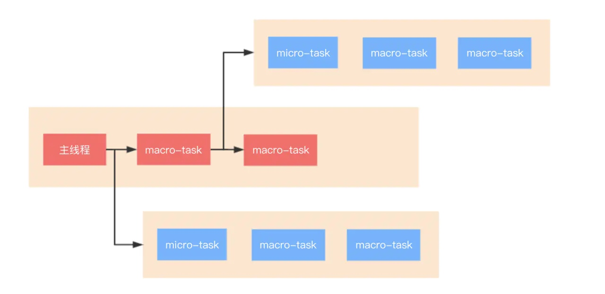

# 浏览器的事件循环
## 微任务和宏任务
1. macro-task大概包括：
    - script(整体代码)
    - setTimeout // 意味着回调会在本轮微任务之后进行
    - setInterval
    - setImmediate
    - I/O
    - UI render

1. micro-task大概包括:
    - process.nextTick
    - Promise
    - Async/Await(实际就是promise)
    - MutationObserver(html5新特性)
    
3. 执行顺序
执行宏任务，然后执行该宏任务产生的微任务，若微任务在执行过程中产生了新的微任务，则继续执行微任务，微任务执行完毕后，再回到宏任务中进行下一轮循环

## async 的特点
我们知道async隐式返回 Promise 作为结果的函数,那么可以简单理解为，await后面的函数执行完毕时，await会产生一个微任务(Promise.then是微任务)。但是我们要注意这个微任务产生的时机，它是执行完await之后**，直接跳出async函数，执行其他代码(此处就是协程的运作，A暂停执行，控制权交给B)**。其他代码(微任务)执行完毕后，再回到async函数去执行剩下的代码，然后**把await后面的代码注册到微任务队列当中**。
因此，await并不会阻塞整个线程，而只是将当前所在的任务临时中断，先去处理别的。只要没有在用做渲染相关的函数里，都是不会造成卡顿的。

```js
console.log('script start')

async function async1() {
    await async2() // 执行完该函数后，产生micro task，函数跳出，不执行console，等待产生的这个微任务执行完毕再接着执行
    console.log('async1 end') // 会被注册到微任务
}

async function async2() {
    console.log('async2 end') // 执行完后返回promise
}

async1()

setTimeout(function() {
    console.log('setTimeout')
}, 0)

new Promise(resolve => {
    console.log('Promise')
    resolve()
}).then(function() {
    console.log('promise1')
}).then(function() {
    console.log('promise2') // 微任务产生的微任务也会被添加到本轮微任务中
})

console.log('script end')
// start->async2->Promise->end->promise1->promise2->async1 end->setTimeout
// 在最新的chrome中，执行结果是
// script start => async2 end => Promise => script end => async1 end => promise1 => promise2 => setTimeout
```
在chrome中，因为async的微任务是最先推入的，执行完后马上接触generator被阻塞的状态（这里是chrome故意的 [PR](https://github.com/tc39/ecma262/pull/1250#issue-197979338)）
而规范情况下，应该是在微任务执行结束之后再去恢复被中断的协程，所以和chrome的结果有不同
