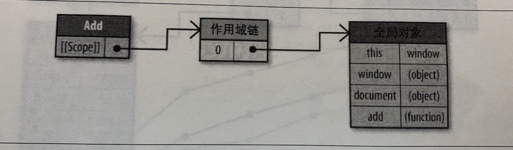
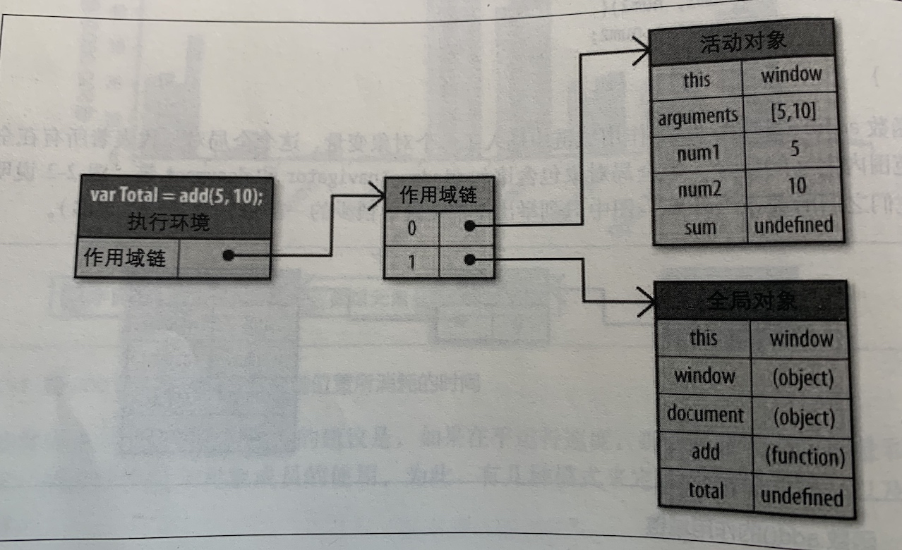
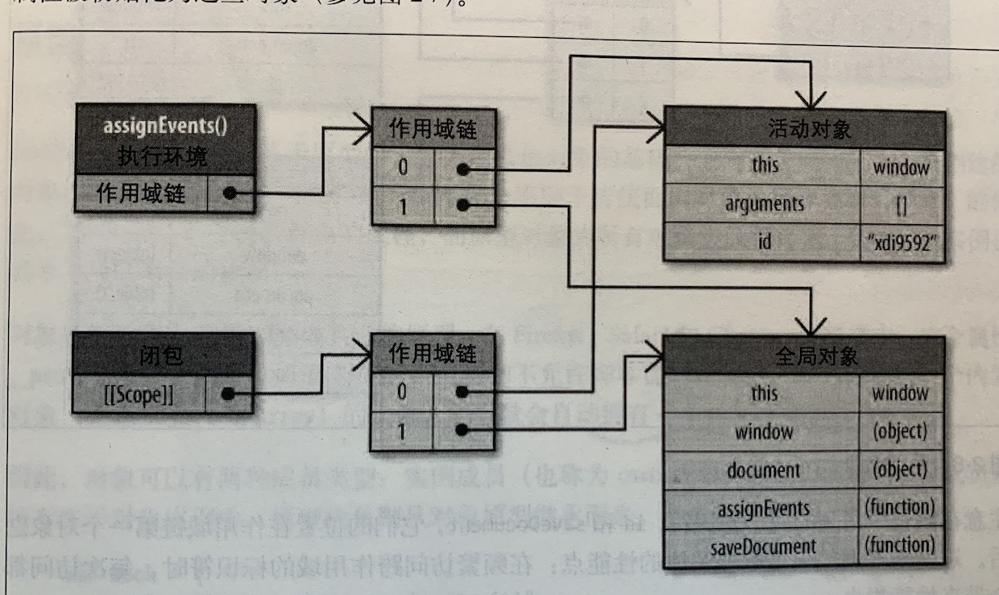
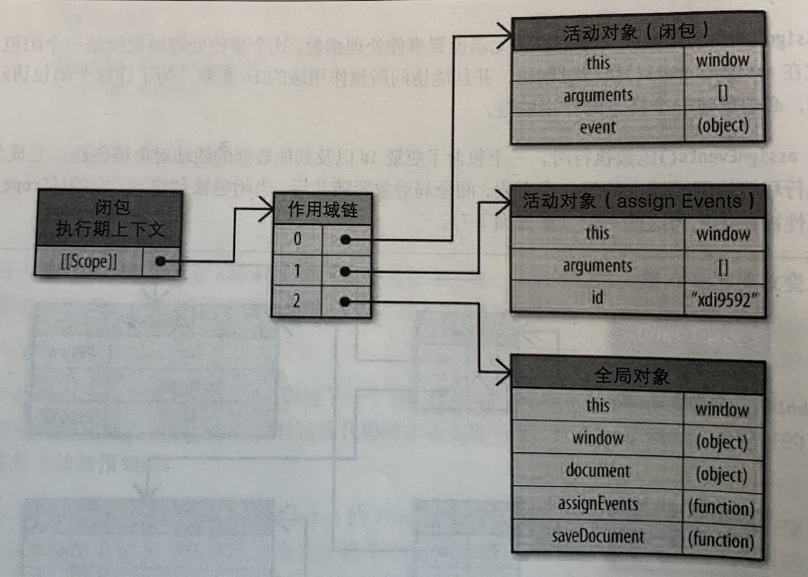

# JS 作用域与闭包解析
1. js是词法作用域，也就是静态作用域
2. 在函数执行时，函数会产生**执行环境**
3. 在js中，函数也是对象
4. 函数拥有仅供js引擎存取的内部属性，比如`[[scope]]`,
它包含了一个函数被创建的作用域中**对象的集合**。这个集合被称为函数的作用域链。他决定哪些数据能被函数访问。
下面用一个例子来描述
对于如下的函数

```js
function add(num1, num2) {
    var sum = num1 + num2;
    return sum;
}
```

1. 当函数创建时（静态阶段）
为该函数对象准备的作用域链会被初始化，向其中推入一个新的全局对象。如图所示

这个对象包括了this的指向，window，document等全局对象，以及函数自身。
1. 当函数执行时（动态阶段）

```JS
var total = add(5,10)
```
作用域链中会被推入当前函数执行时的执行环境活动对象。
包括参数数组，this指向，各个参数的键值对。以及内部执行时创建的临时变量。在这里是num1，num2和sum。
同时全局对象中的出现了total这个变量，也会被更新。
如图所示

## 闭包情况下的作用域变化情况
对如下代码执行片段
```JS
function assignEvents() {
    var id = 'xdi9592';
    document.getElementById('save-btn').onclick = function(event) {
        saveDocument(id);
    }
}
```
1. 闭包创建时
闭包的创建实际来自于外层函数的执行，运行时会生成一个跟外界函数一样的作用域链，然后安放到一个临时的函数变量上。如果这个函数变量被返回了，或者像图中一样被作为事件监听的回调。那么闭包就产生了。

在闭包创建后，assignEvent函数的生命周期已经到头，他的执行环境将被销毁，作用域链被清除，但由于闭包还保留了引用，因此对应的活动对象将不会被清除。
1. 闭包函数执行时 
闭包执行时，像正常函数一样，也会拥有自己的活动对象。同时它拥有前面记录下来的所有活动对象。



## 结论
闭包实际上可以看作是一个匿名的函数对象，他的创建和本质上一般函数无异，有的特点只是
1. 创建时不止会拿到全局对象，还会拿到外层的活动对象
2. 没有名字，只有一个[[closure]] 标识符用来标志它

如果说我们只在一个函数内创建一个函数，但不返回它，那么这个函数实际上就是一个创建到一半然后因为失去引用而被销毁的闭包。

    