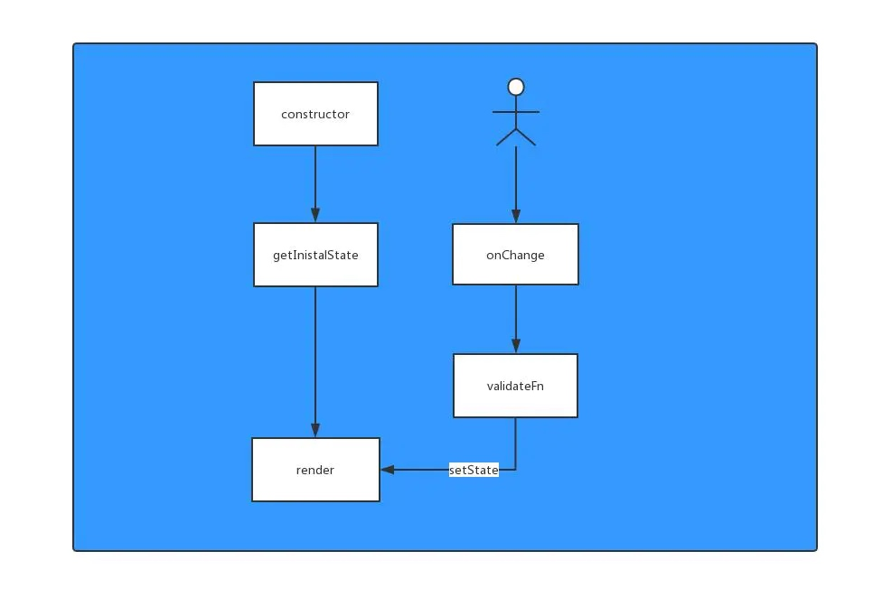
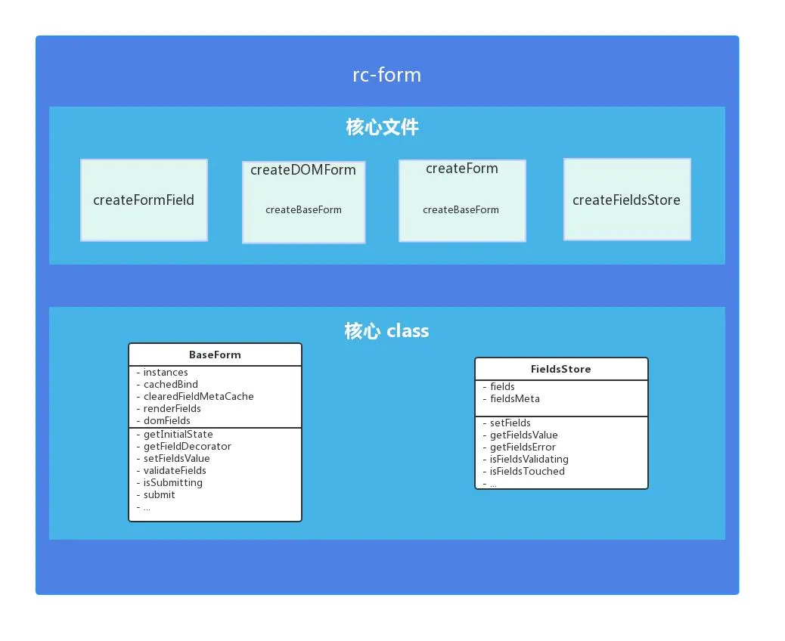
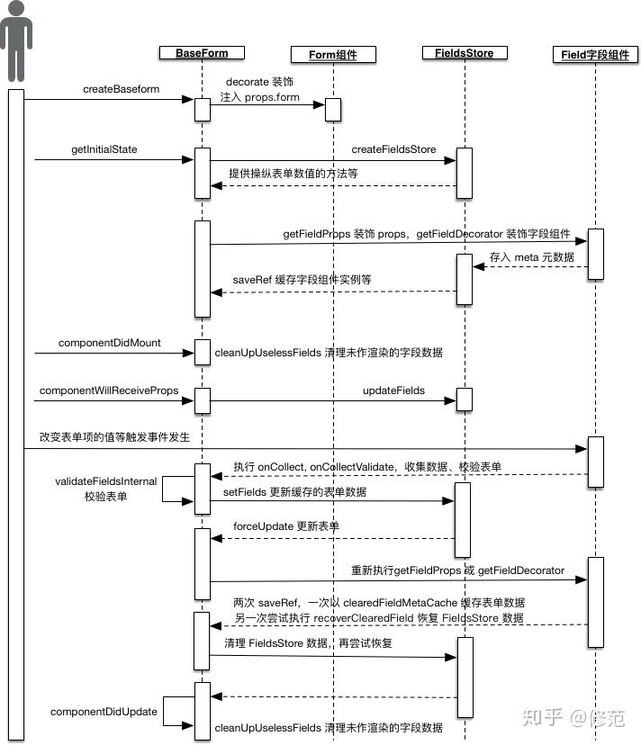
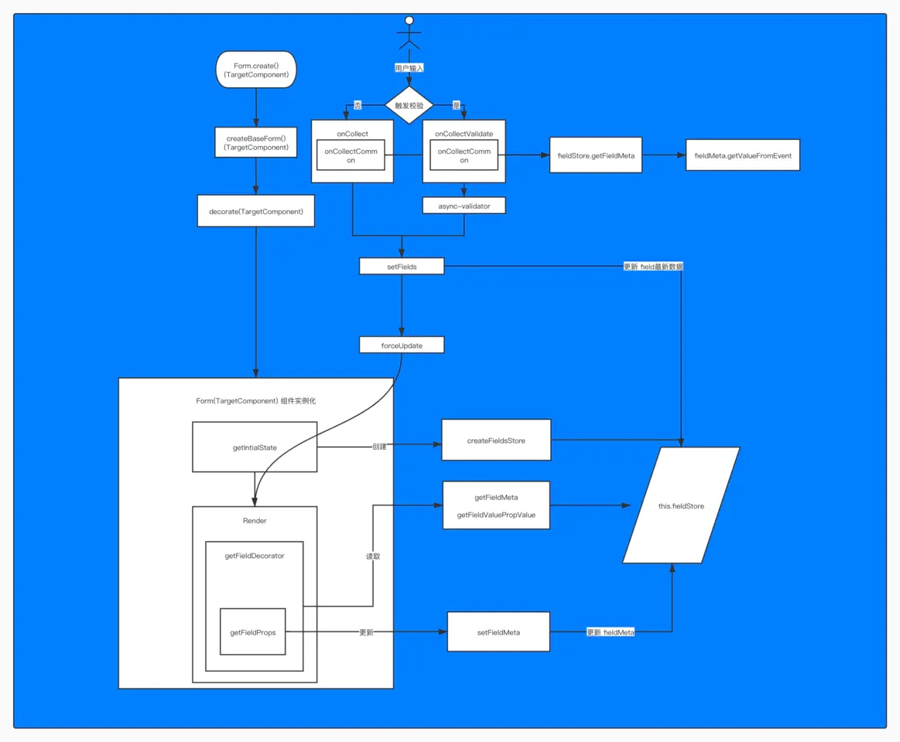

# rc-Form 原理解析
## 参考文献
[政采云团队的解析文章](https://juejin.im/post/5e241aed6fb9a02fe458138c)
## 为什么要有rc-form
### 设想一个简单的支持校验的React表单
```jsx
export default class LoginForm extends React.Component {
   // 用state初始化表单数据模型
  state = {
    username:{
      value: '',
      error: '',
    },
    password:{
      value: '',
      error: '',
    },
  }
  
  // meta并不是用来存储实际的表单数据的状态的
  // 元信息，更多的是一种辅助信息，而不是信息的容器
  // 这里的meta是用来存不同字段的校验规则的
  fieldMeta = {
    username:{
  		rules:[],
  	 },
  	password:{
  		rules:[],
  	},
  }
  
  // 处理空间的数据变化
  onInputChange = (e) => {
  // 拿到form 表单的名字（html5 form的表单字段，基础概念）以及值
   const { value,name } = e.target;
 	// 获取校验结果
   const error = this.doValidate(value, name);
   // 设置表单值和可能出现的错误提示
   this.setState({
     [name]:{
       value,
       error,
     }
   })
  }
  // 校验器，如何校验不是关键，跳过
  validator = (value, rules) => {
  	...
  }
  
  // 进行校验
  doValidate = (value, name) => {
  	// 从meta中读取校验规则并校验
  	const { rules } = this.fieldMeta[name];
  	return validator(value,rules);
  }

  render() {
    const { username, password } = this.state;
    return (<div>
      <div>
        <Input onChange={this.onInputChange} name='username' value={username.value} />
      </div>
      <div style={errorStyle}>
        {username.error}
      </div>
      <div>
        <Input onChange={this.onInputChange} name='password' value={password.value}/>
      </div>
      <div style={errorStyle}>
        {password.error}
      </div>
      	<Button onClick={this.onSubmit}>登录</Button>
    </div>);
  }
}
```

这个表单的流程如上所示
### 这个表单有什么问题？
针对不同的控件类型，比如radio，checkbox，input，upload，自定义表单控件，需要维护很多个不同的onChange，也要针对不同的组件value，校验规则，触发事件做处理。一个个做这些事情很麻烦，因此，要考虑抽象公共部分
- 数据收集
- 进行数据校验
- 更新数据

因此，rc-form就这样出现了

## rc-form 的大致结构

根据这张图以及[rc-form的github 文档](https://github.com/react-component/form#note-use-wrappedcomponentref-instead-of-withref-after-rc-form140)，我们可以看到，主要的API集中在
- createBaseForm
- createFieldStore
- 对baseForm 和 FieldsStore进行的一些操作

全路径时序图



### 创建Form： createForm的基本路径
1. 从options中获取用户自定义选项和一些钩子
2. 返回一个decorate函数，作为一个HOC，并且在其中createReactClass创建一个Form组件
    1. 在getInitialState（constructor）阶段
        1. 调用mapPropsToFields钩子获取fields或者创建一个空fields
        2. 创建一个fieldsStore来管理数据信息（详细信息见下）
    2. 在render阶段
        1. 通过wrappedComponentRef获取ref（若有）
        2. 通过getForm获取formProps，通过传入组件的props获取
    3. 整个decorate函数返回一个`argumentContainer`,通过hoistStatics把wrappedComponent里的其他静态方法，成员移到Form组件里。从而完成HOC组件。
    4. 以及定义了一些内部要用到的方法，以及要被暴露出的接口
        1. getFieldProps
        2. getFieldDecorator, 详情见下
        上面这俩方法其实用法差不多，都是做双向绑定的，
        不过Decorator可以为组件定义自己的props，更好用点。
        3. setFieldsValue
        4. resetFields
        5. ...

### constructor（getInitialState）阶段： createFieldsStore的基本路径
1. 有两个成员变脸，fields和fieldsMeta，正如上面所见，我们大概知道fields对应最简单例子中的state，fieldsMeta代表存rule的那个数据结构。他们实际的数据结构如下：

#### field

> dirty 数据是否已经改变，但未校验
> errors 校验文案
> name 字段名称
> touched 数据是否更新过
> value 字段的值
> validating 校验状态 

#### fieldMeta
> name 字段的名称
> originalProps 被 getFieldDecorator() 装饰的组件的原始 props
> rules 校验的规则
> trigger 触发数据收集的时机  默认 onChange
> validate 校验规则和触发事件
> valuePropName  子节点的值的属性，例如 checkbox 应该设为 checked
> getValueFromEvent  如何从 event 中获取组件的值
> hidden            为 true 时，校验或者收集数据时会忽略这个字段

   
### 组件render阶段：getFieldDecorator的路径
```js
      // 用来将表单字段和store进行双向绑定
      // 实际上起到了类似HOC的效果
      // 不过由于传入的是jsx组件，最后也要直接获得jsx
      // 这里就没有返回新的class了，而是直接克隆，
      // 这样可以保证原来挂在传入的jsx的props和attribute不受影响
      getFieldDecorator(name, fieldOption) {
        // 实际上，getFieldProps也是个对外使用的方法
        //。或者说，其实getFieldDecorator是个语法糖，getFieldProps才是本体
        const props = this.getFieldProps(name, fieldOption);
        return fieldElem => {
          // We should put field in record if it is rendered
          // 由于getFieldDecorator是写在render函数里的
          // 也就是在render阶段被调用的，意味着这个组件肯定要被渲染了
          // 所以将renderFields中对应的当前表单字段名对应的标记设置为true
          this.renderFields[name] = true;
          // 获得当前表单字段名对应的元信息（如果有）
          const fieldMeta = this.fieldsStore.getFieldMeta(name);
          // 直接读取到jsx的属性，接下来会存给fieldMeta对象
          const originalProps = fieldElem.props;
          // 更新元信息，由于是引用，这里实际有副作用，直接修改了fieldsMeta对象
          fieldMeta.originalProps = originalProps;
          fieldMeta.ref = fieldElem.ref;
          return React.cloneElement(fieldElem, {
            ...props,
            ...this.fieldsStore.getFieldValuePropValue(fieldMeta),
          });
        };
      },
```
1. 首先，这个函数肯定在render阶段被触发
2. 经过 getFieldDecorator 包装的组件，表单组件会自动添加 value（或 valuePropName 指定的其他属性） onChange（或 trigger 指定的其他属性）属性，接下来的数据同步将被 Form 接管。
3. 实际上这个步骤是getFieldProps 来做的
4. 最后效果: Form 通过 getFieldDecorator 对组件进行包装，接管组件的 value 和 onChange 属性，当用户输入改变时，触发 onCollect 或 onCollectValidate 来收集组件最新的值。


### 组件render阶段选择2: getFieldProps的路径
使用方法
```jsx
 <input {...getFieldProps('required', {
          onChange(){}, // have to write original onChange here if you need
          rules: [{required: true}],
})}/>
```
getFieldProps 会将组件的 （DEFAULT_TRIGGER = 'onChange'）触发事件指向 HOC的 onCollect 方法，并将配置的 validateTriggers 指向 onCollectValidate。在
这个阶段还会收集组件的元数据，也就是我们调用  getFieldDecorator 中传入的 option 配置，这些配置会存入 fieldStore 的 fieldsMeta 对象中，作为组件的元数据。

### 用户输入阶段： onCollect 或者 onCollectValidate的路径
当用户输入触发组件的 onChange 或者其他的 trigger 事件时，执行 onCollect 或者  onCollectValidate，onCollect 执行组件数据收集，onCollectValidate 除了执行组件数据收集，还会根据配置的校验规则来校验组件，其中校验的流程并不由 rc-form 实现，而且通过引入第三方校验库  async-validator 执行。
其中onCollect和onCollectValidate都会先调用onCollectCommon
在其中会触发onValueChange回调，同时这是个同步触发的


```js
onCollectCommon(name, action, args) {
        const fieldMeta = this.fieldsStore.getFieldMeta(name);
        if (fieldMeta[action]) {
          fieldMeta[action](...args);
        } else if (fieldMeta.originalProps && fieldMeta.originalProps[action]) {
          fieldMeta.originalProps[action](...args);
        }
        // 如果用户自行配置了getValueFromEvent，就使用用户配置的
        const value = fieldMeta.getValueFromEvent
          ? fieldMeta.getValueFromEvent(...args)
          // 否则用默认的
          : getValueFromEvent(...args);
        // TODO onValueChange在这里就触发了，可以发现他是同步的
        if (onValuesChange && value !== this.fieldsStore.getFieldValue(name)) {
          const valuesAll = this.fieldsStore.getAllValues();
          const valuesAllSet = {};
          valuesAll[name] = value;
          Object.keys(valuesAll).forEach(key =>
            set(valuesAllSet, key, valuesAll[key]),
          );
          onValuesChange(
            {
              [formPropName]: this.getForm(),
              ...this.props,
            },
            set({}, name, value),
            valuesAllSet,
          );
        }
        const field = this.fieldsStore.getField(name);
        return { name, field: { ...field, value, touched: true }, fieldMeta };
      },
// 收集数据并校验
      onCollectValidate(name_, action, ...args) {
        const { field, fieldMeta } = this.onCollectCommon(name_, action, args);
        const newField = {
          ...field,
          dirty: true,
        };

        this.fieldsStore.setFieldsAsDirty();

// 这一步就是做了各种校验操作，细节并不重要，跳过
// 不过这里面还做了this.setFields的操作，用于触发组件刷新，一般的onCollect则会直接触发
        this.validateFieldsInternal([newField], {
          action,
          options: {
            firstFields: !!fieldMeta.validateFirst,
          },
        });
      },
```


### 用户输入阶段2: setFields 更新实时数据。
在这其中会触发onFieldChange回调，因此解决了千古之谜
onFieldChange和onValueChange哪个更早：
**onValueChange**更早，因为这个是在数据收集阶段就触发的，同时意味着收集到的数据不一定是符合规范的
而onFieldChange是在数据更新阶段触发的，这里拿到的数据一定是符合检查规范的
```js
/**
       * 实际上触发组件刷新的方法，可以看到最后用了forceupdate，跳过shoudlComponentUpdate
       * 直接刷新组件，因为此时store里的值都已经更新了，且这些value（作为props）都被接管了
       * 更新会直接生效
*/
      setFields(maybeNestedFields, callback) {
        // 手动清除可能嵌套的fields
        const fields = this.fieldsStore.flattenRegisteredFields(
          maybeNestedFields,
        );
        // store更新fields对应数据
        this.fieldsStore.setFields(fields);
        //用户提供的钩子方法
        if (onFieldsChange) {
          // 获得变更了的fields数据
          const changedFields = Object.keys(fields).reduce(
            (acc, name) => set(acc, name, this.fieldsStore.getField(name)),
            {},
          );
          // 触发用户的钩子
          onFieldsChange(
            {
              [formPropName]: this.getForm(),
              ...this.props,
            },
            changedFields,
            this.fieldsStore.getNestedAllFields(),
          );
        }
        // 强制刷新
        this.forceUpdate(callback);
      },
```

### 结语
        实际上，还少了一些内容，比如更新之后，组件还会做什么，这些已经是很细节的部分，对整体理解帮助不大。从顶图一眼也能看明白在作甚。就不细细的讲了。

#### 解释一下为什么要在getFieldsProps里调用saveRef
虽然名字是saveRef，但是不一定真的save了，其实主要目的
1. 对于存在在dom中的组件，恢复组件卸载时被缓存的数据到store中
2. 对于被干掉的组件，清除掉缓存中的数据
3. 然后才是根据是否存在ref来执行用户提供的ref方法，从而暴露组件实例。

```jsx
 /**
       * 指定字段组件的 ref 引用为 BaseForm 组件实例
       * @param name
       * @param _
       * @param component
       */
      saveRef(name, _, component) {
        if (!component) {
          const fieldMeta = this.fieldsStore.getFieldMeta(name);
          if (!fieldMeta.preserve) {
            // after destroy, delete data
            this.clearedFieldMetaCache[name] = {
              field: this.fieldsStore.getField(name),
              meta: fieldMeta,
            };
            this.clearField(name);
          }
          delete this.domFields[name];
          return;
        }
        // 由于调用了saveRef，说明该组件被渲染，domField设置为true
        this.domFields[name] = true;
        // 将组件卸载时的缓存的meta复原到store
        this.recoverClearedField(name);
        // 从store里拿到该拿的meta
        const fieldMeta = this.fieldsStore.getFieldMeta(name);
        if (fieldMeta) {
          // 调用执行挂在组件上的ref函数，来干用户期待做的事情，把该filed实例暴露出去
          const ref = fieldMeta.ref;
          if (ref) {
            if (typeof ref === 'string') {
              throw new Error(`can not set ref string for ${name}`);
            } else if (typeof ref === 'function') {
              ref(component);
            } else if (Object.prototype.hasOwnProperty.call(ref, 'current')) {
              ref.current = component;
            }
          }
        }
        this.instances[name] = component;
      },
```

最后一张图结束大概流程


## 一些特点
1. onValuesChange， onFieldChange钩子不会被mapPropsToFields触发
