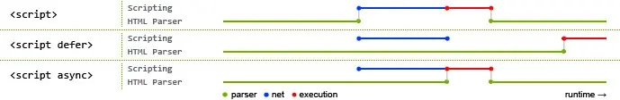

# JS 模块化解析
## 历史：ES5的模块方案
有两种
1. Commonjs，即CJS，Nodejs实现了大部分，但仍有不同
2. AMD 异步模块化定义

## ESM 设计思想
尽量的静态化，使得编译时就能确定模块的依赖关系，以及输入和输出的变量
而CJS和AMD 都需要动态执行才能知道，这样不利于做编译期的静态优化性能，（CommonJS 模块就是对象，输入时必须查找对象属性。）

## Script 模式 和module 模式
script模式显而易见的，是全局变量模式, 其中无法使用import，export
module则是模块模式，默认就是```use script```，支持esm的文件应该可以通过
```html
<script type="module" src='../xxx.js'>
```
来引入
ESM有一些特性
1. 模块的导出为单例，所有import引用的是同一个导出的东西
2. 模块是加载后就要执行一次
3. **整体导出(import *)的模块内容不允许修改(为了做tree shaking)**
4. 代码是在模块作用域之中运行，而不是在全局作用域运行。模块内部的顶层变量，外部不可见。
5. 模块之中，顶层的this关键字返回undefined，而不是指向window。也就是说，在模块顶层使用this关键字，是无意义的。
6. 在页面中为异步加载模式（defer）
    1. defer 和 async 的区别：
        1. defer 直到页面渲染完成才开始执行，加了defer的属性依旧需要按照script的顺序执行。可以使得前后保持依赖关系。
        2. async 下载完成后就开始执行，下载阶段不阻塞，但是顺序不固定，需要保证彼此不依赖。
        3. 通过js动态生成的script标签，其内容的加载和执行都不会阻塞页面其他的进n程 



## ESM 的 导出方式
1. 命名导出 （有利于tree shaking）推荐
2. 整体导出（也可以用与tree shaking）
3. 默认(匿名)导出， 无法treeshaking，只能整体引入，而且似乎有babel解析实现上的坑。

## 对于ESM 的前端支持
1. 浏览器
2. Webpack/rollup等构建工具
3. 

4. ESM 和 CJS 的区别
Esm Es module es模块导出机制
  - 只允许静态同步 import
      - 啥意思：不能使用表达式和变量，这些只有在运行时才能得到结果的语法结构。
      
      ```js
        // 报错
        import { 'f' + 'oo' } from 'my_module';

        // 报错
        let module = 'my_module';
        import { foo } from module;
        
        // 报错，不过该情况在ES2020中可能得到支持，使用import().then()
        // 这里的import 并不作为 标识符，而是函数
        import hello from a + b;

        // 报错
        if (x === 1) {
            import { foo } from 'module1';
        } else {
            import { foo } from 'module2';
        }
      ```
  - 在模块执行之前，导入和导出已经关联
  - 导入和导出是不可变的
  - 编译时执行模块接口导出（内容不执行）
  - ES6 模块输出的是值的引用，对原始值的变化会修改模块内部的值
  
Cjs commonJS nodejs采取的commonJS导出机制，但要记得nodejs超出了commonJS定义的范围

  - 允许动态同步 require()
  - 导出仅在模块执行后才知道
  - 导出可以在模块初始化后添加，替换和删除
  - 没有命名导出
  - 运行时才加载
  - CommonJS 模块输出的是一个值的**拷贝**，对原始值的变化将无法影响模块内部的值
    ```js
        // lib.js
        var counter = 3;
        function incCounter() {
            counter++;
        }
        module.exports = {
            counter: counter,
            incCounter: incCounter,
        };
    ```
    
    ```js
        // main.js
        var mod = require('./lib');
        console.log(mod.counter);  // 3
        mod.incCounter();
        console.log(mod.counter); // 3
        // 如果要获得内部变动的值，只能使用函数闭包来获取引用，比如定义get方法
    ```
  
  - cjs 没有所谓的命名导出
  ```js
    // CJS
    // 注意！这里并不是esm中所谓的命名导出表达式
    // 而是【对象解构语法】
    const { a, b } = require("c");
    // ESM
    // 这里的命名导出是系统支持的表达式
    import { a, b } from "c";
  ```

CJS 在服务端中的执行姿势
```js
const module = {
    exports: {}
};
const require = makeRequireFunction();
const filename = "...";
const dirname = "...";
(function (exports, require, module, __filename, __dirname) {
/* YOUR CODE */
})(module.exports, require, module, filename, dirname);
```

Umd universal module definition AMD + commonJS 的兼容模式

### 融合与兼容
为了使得Nodejs可以执行ESM，并逐渐实现兼容，现在Nodejs再版本13之前，采用如下办法支持ESM
1. ESM 必须是 *.mjs 文件扩展名（为了处理类似于esm中模块作用域内this为undefined等问题）
2. CJS 只能异步导入 ESM import()，从而贴合浏览器的行为
3. CJS 向 ESM 暴露一个不可变的默认导出，是的cjs复合esm语言层面的引入规范
4. 模块范围的变量类似 module，require 以及 __filename 在 ESM 不存在

### 用cjs模拟ESM
```JS
// esm

export const a = "test";

export default function(){

    console.log(123)

}

// cjs实现的esm

Object.defineProperty(exports, "__esModule", {

    value: true

});

exports.default = function () {

    console.log(123);

};

var a = exports.a = "test";
```