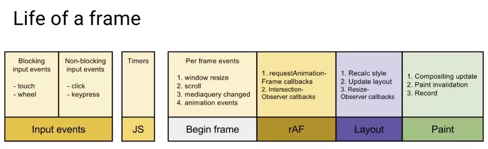
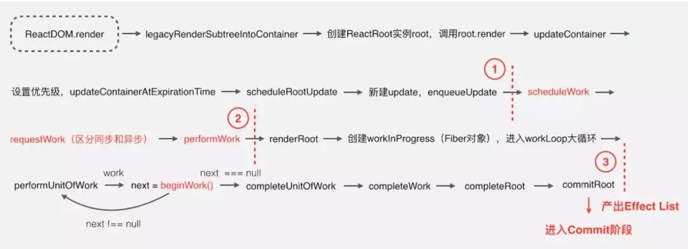

# React Fiber
引用来源：[这篇文章 ](https://mp.weixin.qq.com/s?__biz=MzI1ODk2Mjk0Nw==&mid=2247484469&idx=1&sn=f68d044f1b0e4e2eb981e3878427b75b&scene=21#wechat_redirect)
1. React 的 ReConciliation（调和） 算法
简单来讲，调和算法就是用来在一次新的React render方法被调用后，创建了一颗新的React元素组成的树。如何判断当前这颗树和之前那颗有什么区别。就是调和算法做到的事情。
调和算法主要有以下两个启发式概念
    - 两个不同类型的元素会产生出不同的树；
    - 开发者可以通过 key prop 来暗示哪些子元素在不同的渲染下能保持稳定；
对于执行比较的方法就是Diffing算法过程
    - 当根节点为不同类型的元素时，React 会拆卸原有的树并且建立起新的树
    - 当比对两个相同类型的 React 元素时，React 会保留 DOM 节点，仅比对及更新有改变的属性。
    - 当一个组件更新时，组件实例保持不变，这样 state 在跨越不同的渲染时保持一致。React 将更新该组件实例的 props 以跟最新的元素保持一致，并且调用该实例的 componentWillReceiveProps() 和 componentWillUpdate() 方法。 
1. React 组件渲染的大概过程
    1. 当我们通过render()和 setState() 进行组件渲染和更新的时候，React 主要有两个阶段：
        1. (Reconciler)调和阶段：React 会自顶向下通过递归，遍历新数据生成新的 Virtual DOM，然后通过 Diff 算法，找到需要变更的元素(Patch)，放到更新队列里面去。
        2. Render 阶段：遍历更新队列，通过调用宿主环境的API，实际更新渲染对应元素。宿主环境，比如 DOM、Native、WebGL 等。
2. **React Fiber 实际上是一种新的Concilier（调和）算法**
    1. React Fiber 之前的调和算法使用的是叫做Stack Reconcilie 的调和方式，其特点就是每次更新都得**更新整个VDom**，一旦任务开始进行，就无法中断，那么 js 将一直占用主线程， 一直要等到整棵 Virtual DOM 树计算完成之后，才能把执行权交给渲染引擎。
    2. 而我们知道。浏览器要保证流畅，一帧需要保持在16ms以内完成任务，而留给js执行的时间更少。
    

    
1. React Fiber 是如何工作的

1. 基于push的更新和基于pull的更新
    1. 基于push -> 类似于双向绑定的情况，监听数据的变更，数据变更什么时候转化到view由用户决定
    2. 基于pull -> React 的操作，是手动通知框架变更view，控制权转交框架，控制反转

### 总结
1. React Fiber 处理的是调和过程(diff)而不是渲染过程
2. Fiber 处理的是vDom 而不是实Dom
3. Fiber 不负责生成VDom, 他是VDom 生成之后用来比较两个VDom 的算法。
4. 搞清楚为什么Fiber之前的Stack架构会卡
    1. Stack 难以中断，恢复现场，必须全部同步执行
    2. Stack 容易造成更深的内存调用栈，占用大量内存。