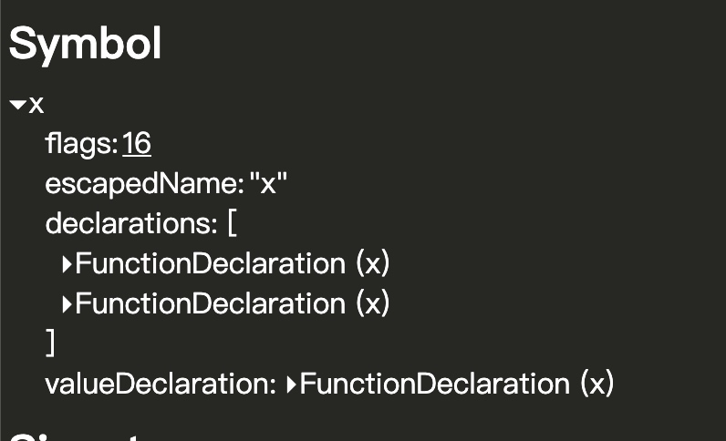
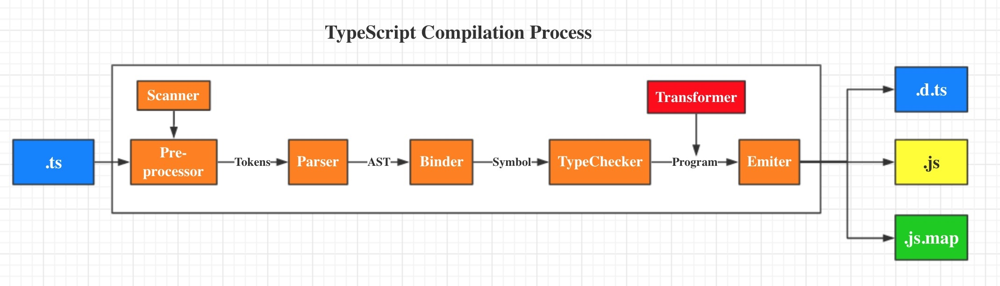

# 理解 TS 的编译过程
ts 的编译 基本可以看 [这篇文章](https://github.com/microsoft/TypeScript/wiki/Architectural-Overview)
大体来说，ts编译过程通过这几个工具形成
Scanner(包含在Pre-processor中)：**词法分析** 从源码生成 Token
Parser：**语法分析** 从 Token 生成 AST
Binder：从 AST 生成 Symbol， 用于协助checker进行类型检查
#### 插入一下
Symbol，即符号，用来将 AST 中的声明节点与其它声明连接到相同的实体上。这个机制能帮助类型系统推导出这些具名声明。符号是语义系统的基本构造块。某些情况下，不同的声明（ast节点）会具有相同的symbol，这可能是因为结构完全一致，或者是同名函数（也就是overload）
下图的两个interface的内部都命名了say： number
这个say：number 就会是相同的symbol

或者，对于重载的函数，也会使用同一个symbol
    
重载的函数就是同一个symbol

一言蔽之，符号的目的：找出ast中涉及声明的节点，并单独包装下，扔到symbol集合中方便后面做别的事情，同时，将声明节点和它实际的实现（ast节点数据）捆绑在一起，方便在查出问题的时候定位实体位置。

Checker：类型检查
Emitter：生成最终的 JS 文件

 实际的运行过程，应该是Scanner -> Parser -> Checker(checker 中调用 binder) —> Emitter -> createProgram -> 
 
 Transformer 在chekcer和emitter中间起作用的代码转换器，因为我们知道ts的类型标注仅仅作用域编译时，转化成js代码之后是不存在这些的。也就是需要在checker和emmiter之间被扔掉，这一步就需要Transformer来执行了。
 
 现在市面上还有各种各样花里胡哨的自定义transformer，可以做一些编译时的代码生成工作。但是tsc是不支持直接使用配置tsconfig来做的，可以考虑用ttsc来引入特殊的transformer，或者在webpack里通过ts-loader引入插件，或者直接在代码中通过ts  compiler API来做这件事，当然最后这个就比较麻烦了..而且那部分就是侵入性代码。所以魔改编译工具可能更好一点。