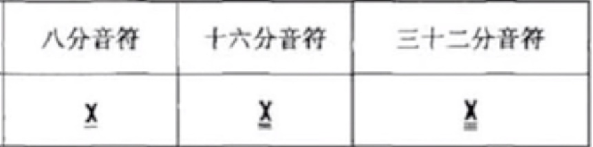
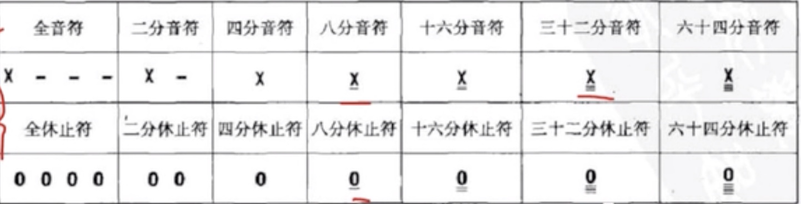
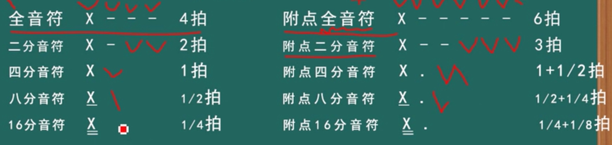
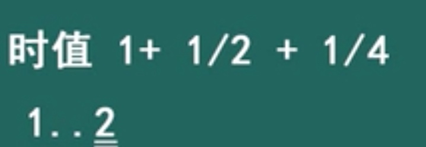
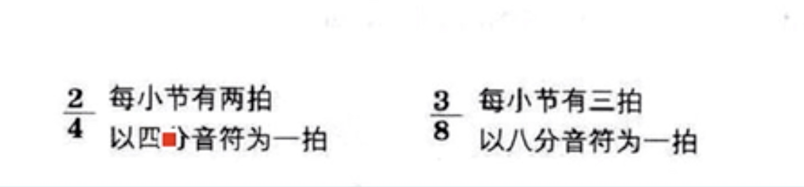

# 基础乐理学习
## 简谱
|  简谱 | 1 |  2 | 3 | 4 | 5 | 6 | 7 |
| --- | --- | --- | --- | --- | --- | ---| --- |
| 唱名 | do | re | mi | fa | sol | la | si |
| 音名 | C| D | E | F | G | A | B |

## 音符和节拍
但是，组成发音的基本单位是1节拍 = 1/4音符，也就是一个数字，
八分音符就是两个组成一节拍，十六分音符就是4个组成一节拍
全音符等于4拍，记住就行了
x - - - 
二分音符2拍
x -
四分音符1拍
x
八分音符、、、

休止符
数字 0，一个单纯的0叫四分休止符

附点音符
在音符的右下方附加下一个黑点，叫做单附点音符，加两个黑点叫复附点音符
附点音符的作用： 增加前面音符时长的一半

复附点音符

拍号

