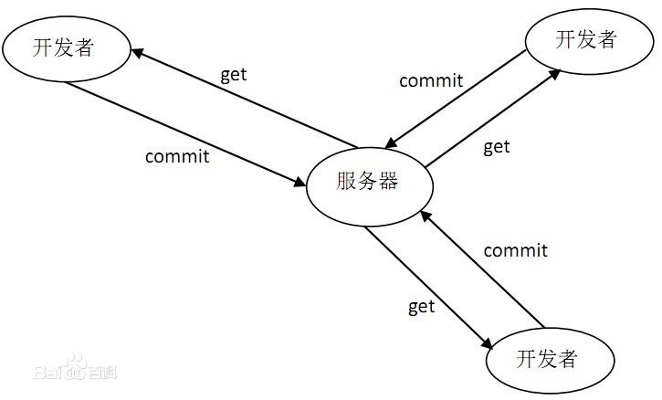
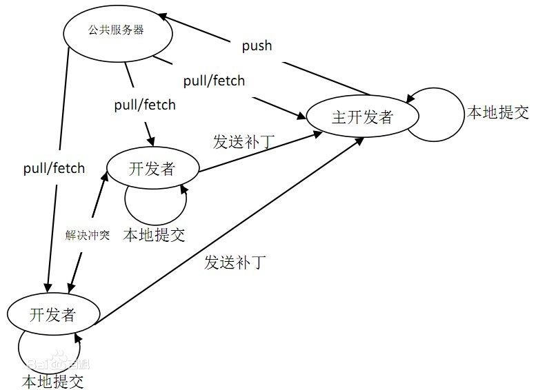

# SVN 和 Git 的区别
## SVN 是集中式的代码版本管理

所有的版本信息都放在服务器上。所有开发者在开始新一天的工作之前必须从服务器获取代码，然后开发，最后解决冲突，提交。

## Git 是分布式的代码版本管理

分布式相比于集中式的最大区别在于开发者可以提交到本地，每个开发者通过克隆（git clone），在本地机器上拷贝一个完整的Git仓库.

具体： https://blog.csdn.net/mine_song/article/details/70770467