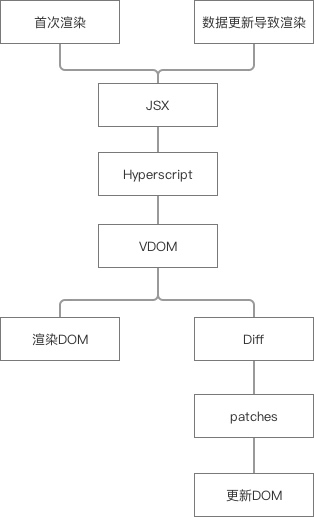

# React 原理之VDOM
VDOM 的作用过程

1. 使用JSX来编写组件；
2. 用Babel将JSX转化为纯js(类似hyperscript)；
3. 将hyperscript转化成我们的VDOM；
4. 将VDOM渲染到页面，形成真实的DOM；
5. 手动更新数据并手动触发更新视图操作(这部分是react做的，跟VDOM的实现无关，所以我们手动模拟一下)；
6. 重复步骤二和步骤三，得到新的VDOM；
7. diff新VDOM和旧VDOM，得到需要修改真实DOM的patches；
8. 把patches一次性打到DOM上，只更新DOM上需要更改的地方。 