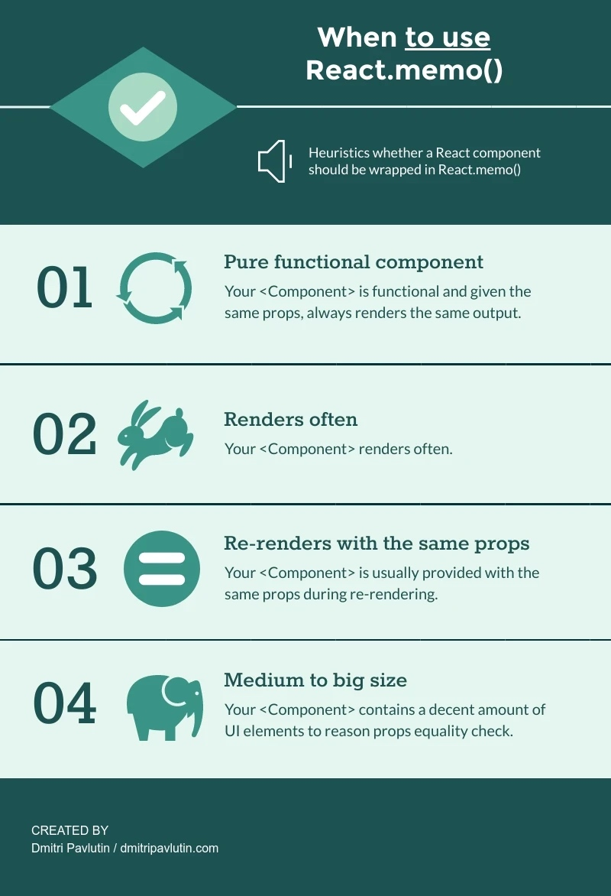

# 何时使用React.memo

React.memo 就是函数式组件的PureComponent
主要就是做到当传入props与上次相同时做一个浅比较
（通常是由于父组件重新render，但是子组件的props没变导致的，不用memo，子组件依然会触发渲染）
一个demo
https://codesandbox.io/s/react-memo-demo-c9dx1

何时使用？看这张图
1. 纯函数
2. 频繁渲染
3. 当重渲染经常碰上相同的props
4. 组件的复杂度比较高

