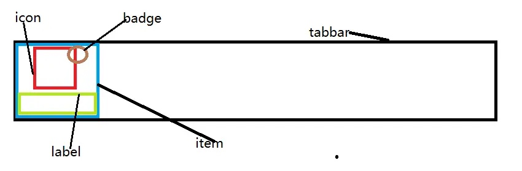
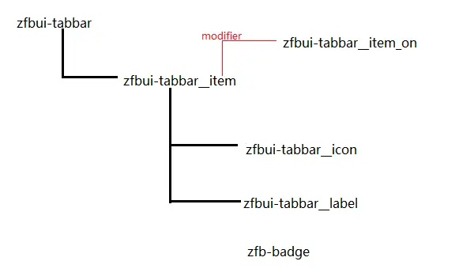

# BEM 规范
BEM 就是CSS 的一种命名规范
他的目的是让杂乱无章的css层级（特别是在预处理器中嵌套的less，sass）等能够变得结构化
他的缺点： 啰嗦
优点： 找目标样式方便

## 基本原则
http://getbem.com/naming/
BEM 分为
- B - Block - 组件，模块
- E - Element - 元素
- M - Modify - 修饰符，状态

一般来说，各个部分如果由多个单词构成，则使用短横线链接，修饰符和元素之间，通常使用双短横线链接。比如一个tabbar组件。

我们可以把它划分为以下部分

根据结构，我们要做出一颗代表结构的树状图

从而我们可以进行命名，上图的下划线不是一定要这么写，也可以写成
zfbui-tabbar__item--on