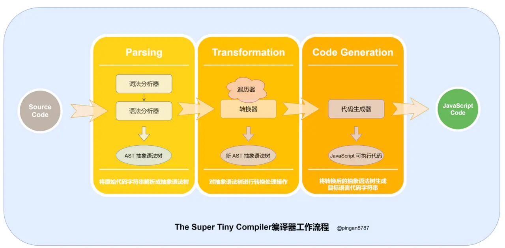
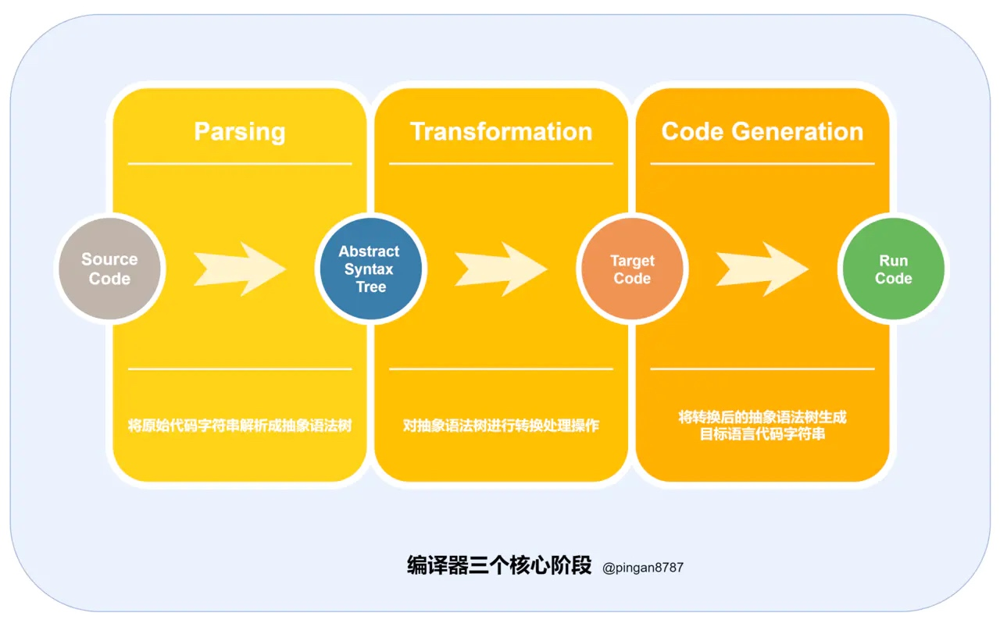

# 写一个Mini Compiler
## 来源
参照掘金的这篇文章 https://juejin.im/post/5e802e41e51d4546b659b31b?utm_source=gold_browser_extension#heading-13
原始代码 
https://the-super-tiny-compiler.glitch.me/
## 背景
在使用Typescript compile API的时候，我们对代码的编译和生成大致有了一个理解，实际上，一个最简单的编译器，无视掉后端部分（代码优化），其实可以直接理解为下图

也就是三个步骤
1. (解析-Parsing) 源代码->词法分析形成token流->语法分析形成抽象语法树
2. (转换-Transformation) 原始抽象语法树->遍历并应用转换Transform过程生成新的抽象语法树
3. (代码生成-Generation) 通过代码生成器将新的抽象语法树转换成目标代码格式

## 目标
实现将下面原始代码字符串（Lisp 风格的函数调用）编译成 C 类型的 可执行的代码
但这并不是一个完整的lisp解释实现

|  | Lisp 风格 | C风格 |
| --- | --- | --- |
| 2 + 2 | (add 2 2) | Add(2, 2) |
| 4 - 2	| (subtract 4 2) |subtract(4, 2) |
| 2 + (4 - 2) | (add 2 (subtract 4 2)) | add(2, subtract(4, 2)) |

## 流程
