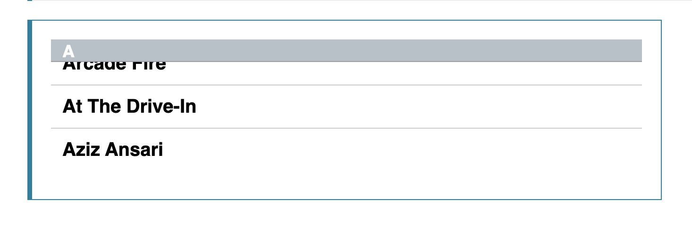
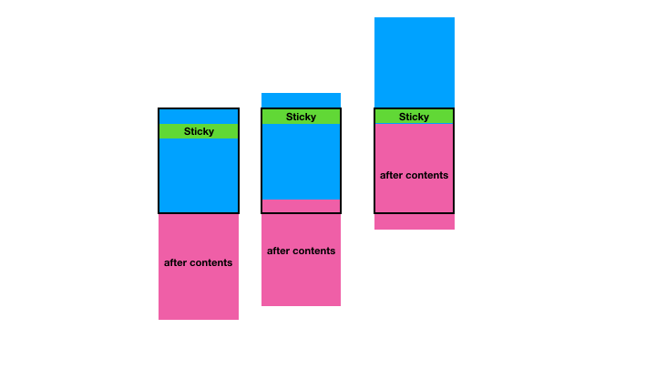

# 实验特性：position: sticky
## 首先明确position 有哪些属性
1. static     无特殊定位, 正常文档流，无top等属性
2. relative   正常文档流，有特殊定位
3. absolute   脱离正常文档流，有特殊定位，z-index决定层叠次序
4. inherit。  继承
5. fixed。     脱离正常文档流，以窗口进行定位
6. **sticky**。 粘滞定位，以上一个具有滚动特性的父框体作为top定位点。但效果范围不能超过其直接父元素在滚动框体中存在的高度。不脱离文档流，不用设置额外padding，牛逼

## sticky 可以干嘛
直接看mdn的例子吧
https://developer.mozilla.org/zh-CN/docs/Web/CSS/position

实现吸顶效果

sticky 有如下几个特性
1. 不能有任何祖先元素设置overflow:hidden，否则没有粘滞效果。因为改变了滚动容器（即使没有出现滚动条）
2. 当sticky元素的父元素已不再完整占据sticky元素的固定区域时，sticky元素不再固定(比如说上面的A其实是dt，和下面的a开头的东西dd同属一个dl元素，但dl元素高度有限，当dl元素随着滚动的可视高度小于sticky元素固定区域时，sticky元素会跟着向上滚动)

因此，
1. 父级元素的height必须超过sticky元素的height，这样在height范围内有粘滞效果。
2. 同一个父容器中的sticky元素，如果定位值相等，则会重叠；如果属于不同父元素，则会随着父元素不再完整占据sticky元素的固定区域以后，再由其他父元素的sticky子元素占据固定位置

