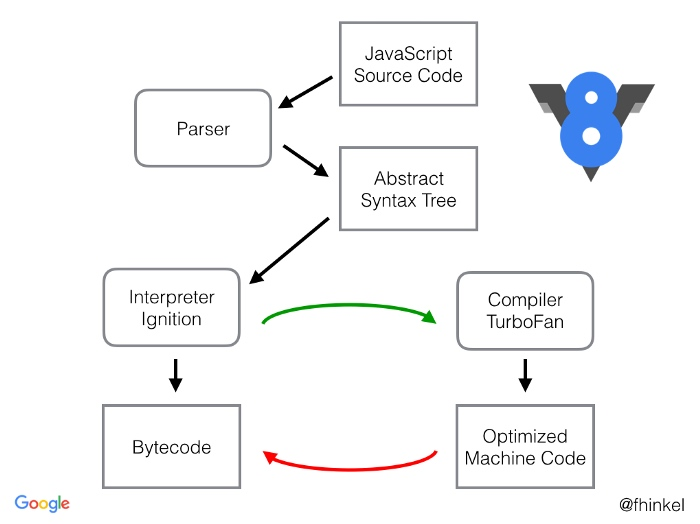

# V8 编译的简单原理
## 简要解释 V8
V8 是一个JIT（just in time）编译器，他执行代码不是通过先编译成二进制文件，系统直接执行（这种叫AOT ahead of time）。而是在运行时才进行编译和执行。
也就是说，我们可以把V8 看作一个 Javac + JVM 的连续联合体，生成的ByteCode 一般是不会留存下来的。而是直接在运行时执行。
## V8 的内部结构
- **Parser**：负责将JavaScript源码转换为Abstract Syntax Tree (AST)
- **Ignition**：interpreter，即解释器，负责将AST转换为Bytecode，解释执行Bytecode；同时收集TurboFan优化编译所需的信息，比如函数参数的类型；
- **TurboFan**：compiler，即编译器，利用Ignitio所收集的类型信息，将Bytecode转换为优化的汇编代码；
- **Orinoco**：garbage collector，垃圾回收模块，负责将程序不再需要的内存空间回收；

## V8 引擎流程图

1. js 源码通过Parser 被解析为AST
2. AST 通过 Ignition 解释器被解释为字节码ByteCode，ByteCode是一个平台无关的中间形式，它形似机器码，但是并不是，应该算作汇编代码。通过汇编代码，按照指令集，转换到不同CPU机器码比起高级语言更加简单。
3. Ignition 会去
    1. 针对只执行一次的代码，直接将其编译成Bytecode，Turbofan不会对这部分代码进行二次编译优化。
    2. 如果有的代码后续再次执行，它有可能会被识别为热点函数，且Ignition收集的类型信息证明可以进行优化编译的话，这时TurboFan则会将Bytecode编译为Optimized Machine Code，以提高代码的执行性能。
    3. 如果后续代码中的类型发生了变化，意味着ignition收集的代码类型有问题，那么这部分optimized machine code又会被反编译回ByteCode。
4. Orinoco 负责进行垃圾清除，垃圾清除分为引用计数和标记清除两种策略，大部分情况下，js都是用标记清除来进行垃圾收集。
    1. 标记清除：当变量进入执行环境的时候标记为"进入环境",离开执行环境的时候标记为"离开环境"，离开环境的变量会被清除。
    2. 引用计数：当声明了一个变量并将一个引用类型值赋值该变量时，则这个值的引用次数就是1.如果同一个值又被赋给另外一个变量，则该值得引用次数加1。相反，如果包含对这个值引用的变量又取 得了另外一个值，则这个值的引用次数减 1。当这个值的引用次数变成 0时，则说明没有办法再访问这个值了，因而就可以将其占用的内存空间回收回来。这样，当垃圾收集器下次再运行时，它就会释放那 些引用次数为零的值所占用的内存。
    3. 在使用闭包时，就会使用引用计数相关的垃圾清除方法，而一般的函数执行作用域，就使用标记清除算法。
    4. 引用计数可能导致的一个问题是循环引用导致标记永远不会为0，导致内存无法被释放。所以才出现了标记清除。
    ```ts
    function problem(){     
        var objectA = new Object();
        var objectB = new Object(); 
 
        objectA.someOtherObject = objectB;
        objectB.anotherObject = objectA; 
    } 
    ```
5. 

## 在node中查看Bytecode和machine Code
查看Ignition 编译后的结果
```bash
node --print-bytecode xxx.js
```
使用node命令的--print-code以及--print-opt-code选项，打印出TurboFan生成的汇编代码：
```bash
node --print-code --print-opt-code xxx.js
```