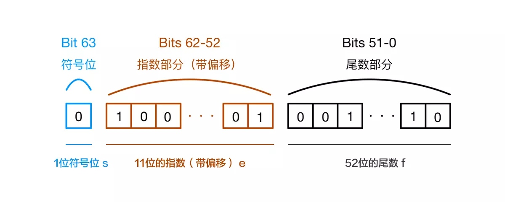

# 从 0.1 + 0.2 === 0.3 ？看js精度问题
1. 浮点数的表示
浮点数在计算机中的表示是基于科学计数法（Scientific Notation）的，我们知道32767这个数用科学计数法可以写成3.2767×10^4 ,3.2767称为尾数（Mantissa，或者叫Significand），4称为指数（Exponent）。
3. IEEE 754 标准
为什么要有规约形式？
每个浮点数的表示都不唯一，例如17=(0.10001)2×2^5 = (0.010001)2×2^6 ，这样给计算机处理增加了复杂性。为了解决这个问题，我们规定尾数部分的最高位必须是1，也就是说尾数必须以0.1开头，对指数做相应的调整，这称为正规化（Normalize） = 规约。由于尾数部分的最高位必须是1，这个1就不必保存了，可以节省出一位来用于提高精度，我们说最高位的1是隐含的（Implied）。这样17就只有一种表示方法了

| 0形式 | 指数 | 小数部分 |
| --- | --- | --- |
| 零 | 0 | 0 |
| 非规约形式 | 0 | 非0 |
| 规约形式 | 1到2^e - 2 | 任意 |
| 无穷| 2^e - 1 | 0 |
| NaN | 2^e - 1 | 非0 |

3. JavaScript使用Number类型表示数字（整数和浮点数），遵循 IEEE 754 标准
通过64位来表示一个数字（下标从0开始）


1. js最大安全数是 
```js
// 因为规约数使得第一个尾数位默认被省略，实际上js隐含可以表示的数长是53位
Number.MAX_SAFE_INTEGER == Math.pow(2,53) - 1
```

### 运算时的问题
计算机无法直接对十进制的数字进行运算，这是硬件物理特性已经决定的。这样运算就分成了两个部分：先按照IEEE 754转成相应的二进制，然后对阶运算
```js
0.1 -> 0.0001100110011001...(无限循环)
0.2 -> 0.0011001100110011...(无限循环)
```
由于IEEE 754尾数位数限制，需要将后面多余的位截掉

#### 那为什么 x=0.1 能得到 0.1？
标准中规定尾数f的固定长度是52位，再加上省略的一位，这53位是JS精度范围。它最大可以表示2^53(9007199254740992), 长度是 16，所以可以使用 toPrecision(16) 来做精度运算，超过的精度会自动做凑整处理
```js
0.10000000000000000555.toPrecision(16)
// 返回 0.1000000000000000，去掉末尾的零后正好为 0.1

// 但来一个更高的精度：
0.1.toPrecision(21) = 0.100000000000000005551
```
于是，我们将两个损失精度的数二进制相加，得到
```js
0.0100110011001100110011001100110011001100110011001100 
```
转换成十进制之后就是0.30000000000000004
**TODO： 实现一个二进制浮点数转十进制浮点数的算法**

#### 如何解决
1. BigNumber库
2. 转整数处理
3. https://github.com/nefe/number-precision 第三方库

#### ps
toFixed 和 toPrecision 的区别
toFixed(n) provides n length after the decimal point; 
toPrecision(x) provides x total length.