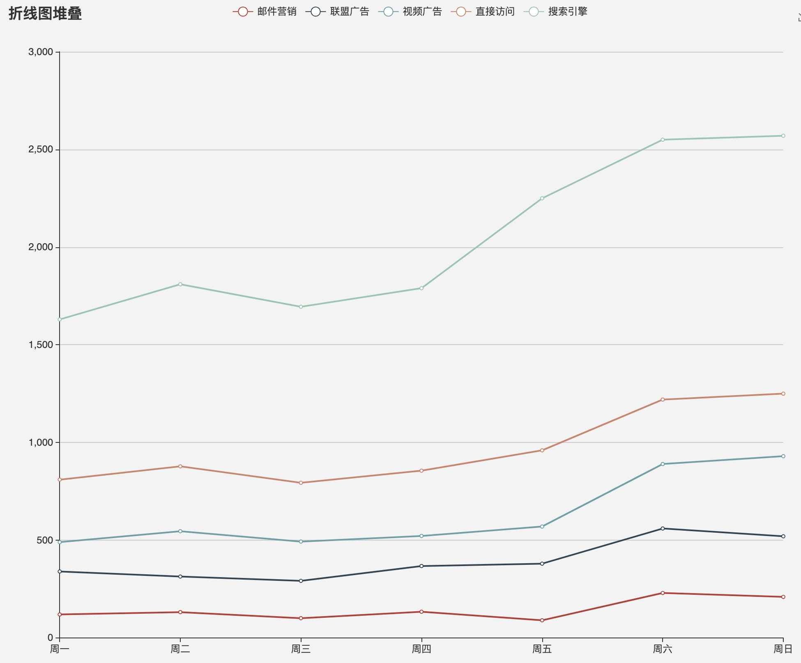

# Echarts dataset 理念
Echarts 在推出 dataSet 概念之后，多出了一些新的名词和概念，理解他们对正确的书写Echarts配置有所帮助
## 绘图的基本概念
### 2维图像正如其名字，是由(x,y)这样的坐标确定的
那么任意一个数据都应该有x坐标和y坐标，
从而描绘任意一张图，都是使用
```ts
[1, 2]
```
来表示画一个数据的的
### 但是，我们在现实中作图时，通常存在特殊需求
1. x轴是非数字
2. x-y 不一定是1对1， 有可能是1对多的，有时候一个分类下可能细分多个维度的数字
    1. 分类柱状图，一个分类对应多个子类别
    2. 多线图，一个时间对应多个数据点，对应多条线上的点
    3. ...


### 因此，每一个数据并不是用2个“数字”就能完全描绘的，我们通常会塞更多东西
比如下面的Echarts
首先看一个基本的Echarts配置
```ts
option = {
    legend: {},
    tooltip: {},
    dataSet: {
        // 默认将第一类作为“分类列”，即Category 
        source: [
            ['product',       '2015', '2016', '2017'],
            ['Matcha Latte',   43.3,   85.8,   93.7 ],
            ['Milk Tea',       83.1,   73.4,   55.1 ],
            ['Cheese Cocoa',   86.4,   65.2,   82.5 ],
            ['Walnut Brownie', 72.4,   53.9,   39.1 ]
        ],
    }
    xAxis: {type: 'category'},
    yAxis: {},
    series: [
        {type: 'bar'},
        {type: 'bar'},
        {type: 'bar'}
    ]
};
```


可以看到，source里实际上存在四个元素，包含四个咖啡店的收入
### 上图的配置是如何作用于图形指令的？
1. dataSet
    1. source
        1. 用户从外界传来的东西，组件数据的来源，
        2. 不管是k-v数组还是二维数组，都可以转化为二维表
2. dimensions
    所有的key，有一个通用称谓，就是“dimension”，在存在分类的情况下，可以把x轴对应的dimension升级成“Category”，这时其余的dimension实际可以理解为 Category.subCategory, 
    比如我们描述第一根柱子，就是 ```Matcha Latte.2015 = 40```
        
2. 除了柱状图，我们还可以再考虑一个例子，多线图


在这个图中，每一个数据实际上可以通过 周一.邮件营销 = 100 这样来描述
Category 就是week，其取值为周一、周二...
Dimension 就是 邮件营销，联盟广告,、、、
4. series 有什么用？
series 用来确定哪个dimension作为Category，或者是哪个dimension作为x轴