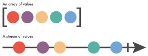
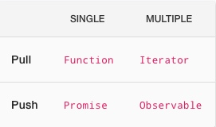

# RX.js 基本概念
## Reactive Programing 反应式编程
> Reactive programming is an event-based paradigm that allows us to run asynchronous sequences of events as soon as data is pushed to a consumer.
> 反应式编程是一个基于事件的范式，它允许我们在数据到达消费者后马上运行异步的事件序列

## Rxjs 基本元素 
1. Observable 一个 observable 就是一个伴随着时间流动的数据集合。

他的特点是采用 Push 方式，同时可以 push 多个数据。

与之相对的
    - 采用pull方式获取单个数据的方式是采用Function，也就是调用某个函数，返回一个值。
    - 调用一个Iteroator多次，返回多个值。
    - 一个Promise被初始化一次，就主动产生一个值
    - 一个Observable 被初始化一次，就产生多个值
2. Observer 观察者
3. Subscriber 订阅
4. 