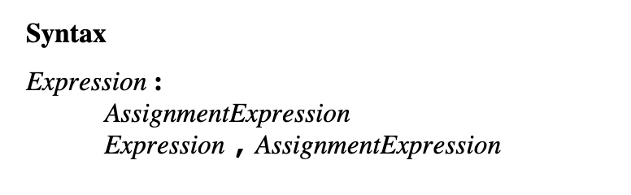

# (1, 2, 3, alert)('amazing!') 为什么会alert出 ‘amazing!’
根据 Ecma 262 对逗号操作符 (comma Operator)的语法定义
以逗号分隔的表达式，本质是一个赋值表达式，它由一系列表达式和最后一个赋值表达式组层。
它的最后一项是执行赋值，也就是说最后一项会作为结果返回


比如，
```js
(1, 2, 3) // 这个运算表达式的结果是3
```

所以，这一段实际的结果是
```js
alert('amazing!');
```

从而提示出‘amazing！’