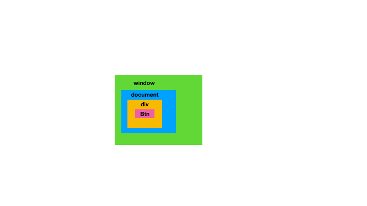

# 冒泡和捕获
冒泡是由内向外的
捕获是由外向内的
事件触发的阶段是
捕获 -> 定位 -> 冒泡

大概的感觉如图，先从最外层直到设置了捕获的内层，定位执行相关操作后，逐步冒泡到外层

addEventListner(event, listener, capture)
中如果不设置capture/capture=false， 则会默认监听捕冒泡, 从内向外。

如果设置capture = true，则会去监听捕获事件，从外向内。

