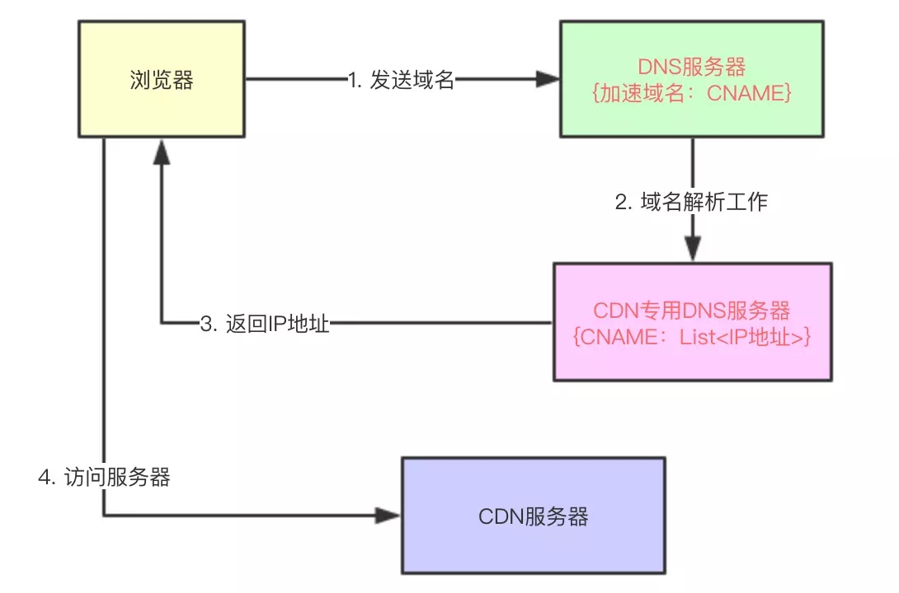

# CDN原理，回源以及动态加速
参考：https://juejin.im/post/5d2d8928f265da1b95708b97
CDN全称叫做“Content Delivery Network”，中文叫**内容分发网络。**

CDN 主要是通过判断用户的位置，自动选择离用户最近的服务器来提供资源。

CDN 不是一台服务器，而是整个系统

## 原理
当我们使用域名访问某一个网站时，实际上就是将请求包（以Http请求为例）通过网络传输给某台服务器，比如访问“www.baidu.com”时：
1. 首先解析出该域名所对应的IP地址(DNS域名解析)
2. 然后将Http请求包通过网络路由到IP地址所对应的服务器

而实际上域名解析不只是可以将域名和ip相关联，还可以将域名与一个别名相关联。这个别名的学名叫**CNAME**。
所以我们明白,CDN实现的，就是将多个实际域名，都通过CNAME转换到统一的别名上。
比如访问一个统一的CDN地址 
`a.cloud.com`
实际上会被DNS 解析为 
`a.cloud.com -> resourceXX.com -> 119.08.1.125`
从而获得实际的资源地址。
没有CNAME的情况：

有CNAME的情况：

但还有一个情况，一般的DNS解析系统是无法判断出用户访问的域名对应哪些ip地址，以及ip地址在哪里，离用户近不近的。
因此，厂商需要提供**CDN专用的DNS解析服务器**

    用户使用某个域名来访问静态资源时（这个域名在阿里CDN服务中叫做“加速域名”），比如这个域名为“image.baidu.com”，它对应一个CNAME，叫做“cdn.ali.com”，那么普通DNS服务器（区别CDN专用DNS服务器）在解析“image.baidu.com”时，会先解析成“cdn.ali.com”
    

    普通DNS服务器发现该域名对应的也是一个DNS服务器，那么会将域名解析工作转交给该DNS服务器，该DNS服务器就是CDN专用DNS服务器。
    

    CDN专用DNS服务器对“cdn.ali.com”进行解析，然后依据服务器上记录的所有CDN服务器地址信息，选出一个离用户最近的一个CDN服务器地址，并返回给用户，用户即可访问离自己最近的一台CDN服务器了。
    

最后，一个常见的CDN系统

## 回源
当 cdn 缓存服务器中没有符合客户端要求的资源的时候，缓存服务器会请求上一级缓存服务器，以此类推，直到获取到。最后如果还是没有，就会回到我们自己的服务器去获取资源。 那都有哪些时候会回源呢？没有资源，资源过期，访问的资源是不缓存资源等都会导致回源。
回源的过程中，可以对经过的逐级缓存刷新资源。避免下一次还遇到回源的情况。

## 资源预热
在CDN启用之前，如果没有预先缓存一些热点静态资源，那么即使启动了CDN，一开始大量的请求还是会到源站，可能打挂机器或者占满带宽。所以需要在启动CDN前就先缓存一些资源。这就叫资源预热。

## 动态加速
动态加速能力也会利用CDN
CDN不是只为静态资源准备的，不然很浪费
动态加速是针对API，网站这种可能频繁变动的业务代码的。客户端通过边缘CDN节点接入，请求多级转发最终到机房内源站，然后逐级返回，这其中会获得一条最好的线路，或者优化中间传输的协议。来提高网络质量。

