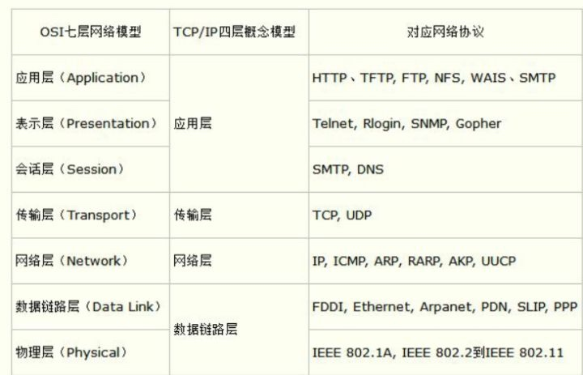
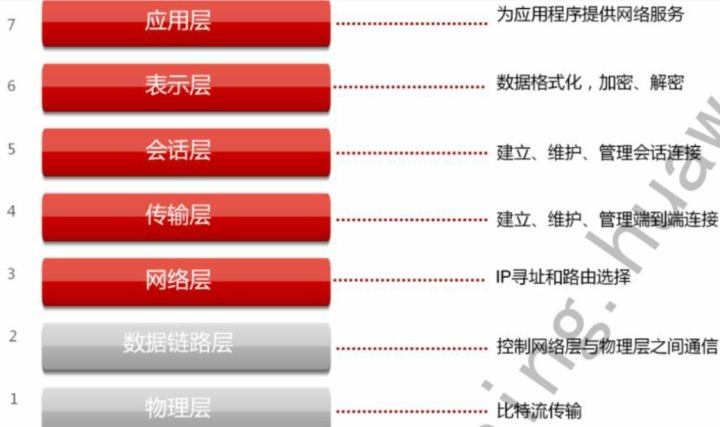

# 什么是L4，L7
L4 全称 L4 Proxy 即为四层负载均衡
L7 全称 L7 Proxy 即为七层负载均衡

### 四层负载均衡( L4 load balancing ):

主要工作于处于OSI模型中间位置的传输层( transport layer )，它主要处理消息的传递，而不管消息的内容。在互联网上，TCP就是HTTP传输方式的四层协议( Layer 4 Protocol )。四层负载均衡只针对由上游服务发送和接收的网络包，而并不检查包内的具体内容是什么。四层负载均衡可以通过检查TCP流中的前几个包，从而决定是否限制路由。

### 七层负载均衡( L7 load balancing ):

主要工作于处于OSI模型顶层位置的应用层( application layer )，它主要处理每条消息中的真正内容。在互联网上，HTTP是网络通讯中占据主导地位的七层协议( Layer 7 Protocol )。七层负载均衡在路由网络传输时比四层负载均衡更加复杂和巧妙，特别适合像HTTP这种基于TCP传输的方式。 一个七层负载均衡器终止网络传输并读取消息中的内容。它可以基于消息中内容( 比如URL或者cookie中的信息 )来做出负载均衡的决定。之后，七层负载均衡器建立一个新的TCP连接来选择上游服务( 或者再利用一个已经存在的TCP连接，通过 HTTP keepalives 的方式，见:https://www.nginx.com/blog/http-keepalives-and-web-performance/ )并向这个服务发出请求。

### 内部代号
XLB， SLB， TTGW-四层；TLB-七层