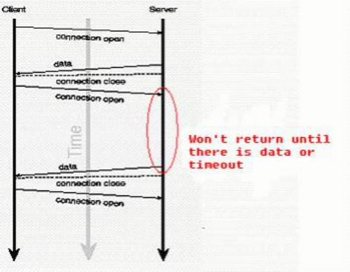

# 长连接 & 长轮询 & websocket
### long polling 长轮询
本质上还是轮询，浏览器只需启动一个HTTP请求，其连接的服务器会“hold”住此次连接，直到有新消息才返回响应信息并关闭连接，客户端处理完响应信息后再向服务器发送新的Http请求,以此类推。

轮询终止条件:
- 有新数据推送 。当服务器向浏览器推送信息后，应该主动结束程序运行从而让连接断开，这样浏览器才能及时收到数据。
- 没有新数据推送 。应该设定一个最长时限，避免WEB服务器超时（Timeout），若一直没有新信息，服务器应主动向浏览器发送本次轮询无新信息的正常响应，并断开连接，这也被称为“心跳”信息。
- 网络故障或异常 。由于网络故障等因素造成的请求超时或出错也可能导致轮询的意外中断，此时浏览器将收到错误信息。

### http长连接
服务端和客户端会维持一条长期通道，
优点：实时性，服务端主动推送
缺点：增加性能开销

