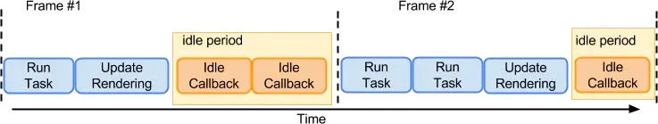

# 浏览器的线程机制，渲染过程
1. UI引擎不是执行JS引擎，而且两者是互斥的
jS运行结果会影响到UI线程的结果，当JS线程运行的时候，UI线程处于冻结状态。（现在浏览器可能对某些事件做了特殊处理，比如监听了scroll事件，在滚动时还是能够流畅的播放动画）

1. 为什么JS不适宜有太多阻塞线程的任务
浏览器渲染一帧是16.6ms，但浏览器的渲染，整理工作需要一些时间，因此只有10ms拿给js运行，如果js阻塞在主线程太久，就会导致这一帧的后续工作无法进行，帧率将下降，并且内容会在屏幕上抖动。 此现象通常称为卡顿，会对用户体验产生负面影响。
    
    
3. 浏览器中还有哪些线程
    - a. 上文说到的UI线程，也就是渲染引擎
    - b. 浏览器事件触发线程
        - 这个线程把事件加入到事件队列中
    - c. 定时触发器线程
        - 这个线程负责计时，看现在是不是已经到了某个触发时间
    - d. 异步 HTTP 请求线程
        - 这个线程负责处理异步请求

1. 一帧的生命周期

1. 一帧的idleCallback 流程

可以看出，raf 在渲染之前执行，idleCallback在之后执行

1. 为什么重绘回流会导致性能下降？
    1. 对于浏览器而言，性能的直观展示就是帧数，响应速度，由上面那张图我们知道，一帧包含五个阶段，但这五个阶段不是一定要执行的。也有可能是

这两种情况，也就是不重绘/不回流，