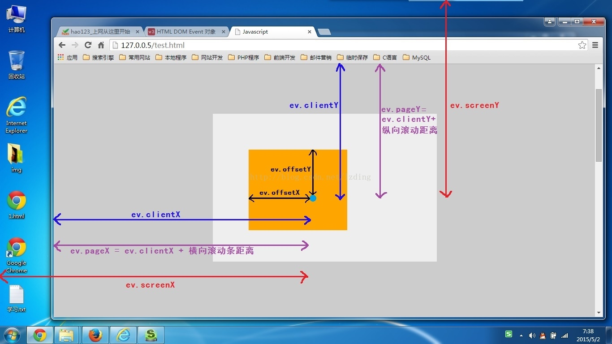
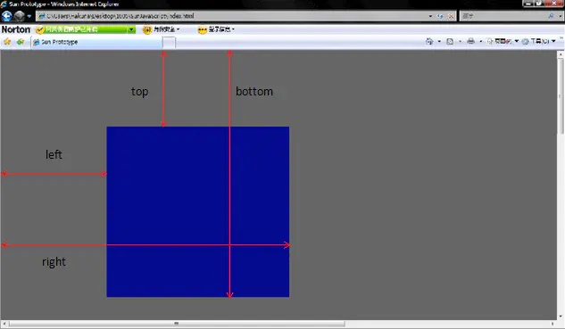

# 图解 offsetX， clientX， pageX， screenX和getBoundingClientRect


getBoundingClientRect用于获得页面中某个元素的左，上，右和下分别相对浏览器视窗的位置。getBoundingClientRect是DOM元素到浏览器可视范围的距离（不包含文档卷起的部分）

该函数返回一个Object对象，该对象有6个属性：top,lef,right,bottom,width,height；

这里的top、left和css中的理解很相似，width、height是元素自身的宽高;

但是right，bottom和css中的理解有点不一样。right是指元素右边界距窗口最左边的距离，bottom是指元素下边界距窗口最上面的距离。



```
```