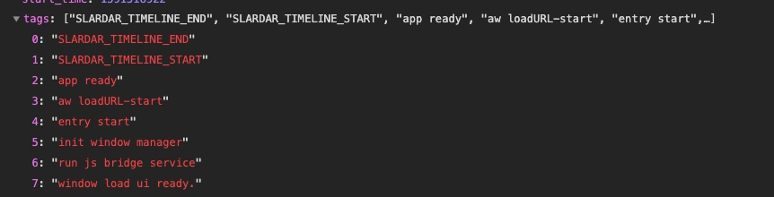
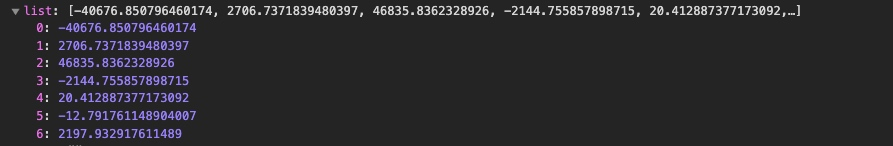

# 计算
run js bridge -> START -> END -> entry start -> init window -> aw loadURL
          -7.6 || 40676 ||  -4748  ||  20  || 2124  
          

 

 0: "SLARDAR_TIMELINE_START"
1: "entry start"
2: "run js bridge service"
3: "init window manager"
4: "aw loadURL-start"
5: "window load ui ready."
6: "app ready"
7: "SLARDAR_TIMELINE_END"

["SLARDAR_TIMELINE_START", "entry start", "run js bridge service", "init window manager", "aw loadURL-start", "window load ui ready.", "app ready", "SLARDAR_TIMELINE_END"]