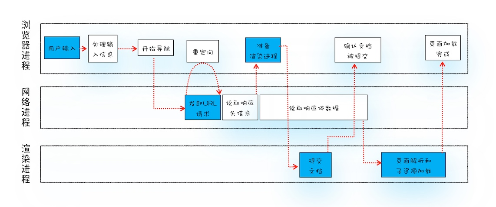
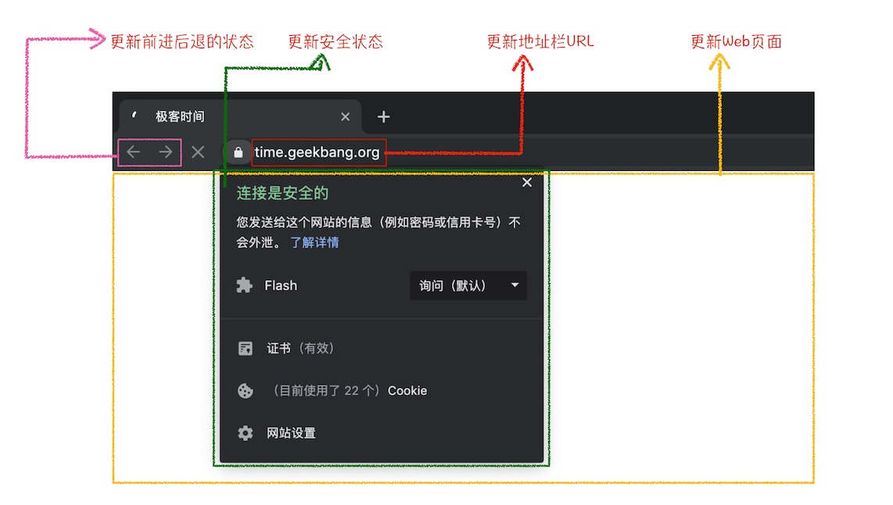

# 浏览器从输入URL 到页面展示，发生了什么？

### 用户输入，
1. 地址栏（输入浏览器进程）判断输入的是搜索内容还是请求url。
    1. 如果是url，则根据规则将内容加上协议和成为完整的url。
        1. 在此时会有beforeunload 钩子会触发
    2. 如果是搜索内容，则使用浏览器默认搜索引擎来合成带搜索关键字url
2. 页面此时并不会切换，还是保留之前的情况，只有等到提交文档阶段才会被替换。

### URL 请求
浏览器进程（地址栏和页面渲染进程无关，属于浏览器进程的控件)通过进程间通信把URl请求发送给网络进程。网络进程发起真正的请求。
1. 检查本地缓存，若有直接将资源返回给浏览器进程
2. 若无缓存，进行网络请求流程
    1. DNS 解析获取IP地址
    2. 若为HTTPS，还需要建立TLS连接
    3. 通过IP地址发起TCP连接
3. 若响应头为302，则发起重定向，回到步骤1
4. 若为其他，则根据Content-Type 解析响应内容
    1. 若是octet-stream 类型，则一般会被作为下载类型处理，流程终止。
    2. 若是html类型，则会继续流程。

### 准备渲染进程
ps: 如果协议相同，根域名相同，被视为同一站点，且一个页面是从另一个页面打开的，两个页面会共用一个渲染进程。叫做process-per-site-instance.

### 提交文档
浏览器进程通知网络进程，将数据传输给渲染进程
1. 浏览器接收到网络进程的响应头数据后，通知渲染进程“提交文档”
2. 渲染进程接收到消息，和网络进程建立起数据传输管道
3. 文档数据传输完成后，渲染进程返回“确认提交”消息给浏览器进程
4. 浏览器进程更新原生控件界面。包括安全状态，地址栏的url, 前进后退的历史状态，并更新web页面。

### 渲染阶段
文档被提交后，渲染进程开始页面解析和自资源加载。
1. 渲染进程创建一个空白页面，等CSS，JS 解析完成，生产CSSOM, DOM, 合成布局树
2. 经过一些其他步骤，准备首次渲染
3. 页面开始绘制
页面生成后，渲染进程发送一个消息给浏览器进程。浏览器接收到消息后，会停止标签图标上的加载动画。