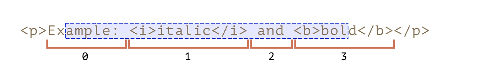

# 实现一个mini-react
### 实现前要知道基本知识
##### Range API
想象我们原来操控DOM 的方式，通过`getElementById`, `querySelector`, 以及`childNodes`，`parent`等方式去定位到某些元素。但如果我们想创建/获取”一段“，”一些“元素。但他并不涉及所有的childNodes, 那我们通常需要这样
```js
let nodes = document.createDocumentFragment();
let childs = document.getElementById("parent").childNodes.slice;
childs.slice.(start, end).forEach(child => {
    nodes.appendChild(child);
});
```

而使用rangeAPI则会变成这样
```js
let range = document.createRange()
range.setStartBefore(startNode);
range.setEndAfter(endNode);
let nodes = range.cloneContent()
```

使用rangeAPI的优势是其更灵活，且更符合直觉。同时还可以通过指定第二个参数`offset`去选中一些[其他DOM API选中不了的东西](https://zh.javascript.info/selection-range)，比如文本内容的其中一段.


```js
let range = document.createRange()
range.setStart(startNode, 2);
range.setEnd(endNode, 3);
let nodes = range.cloneContent()
```

### 实现前要知道基本用法
##### 浏览器并不认识JSX
JSX 的本质是一种自创的模板语言。通过特殊插件可以被翻译成JS语言。而这才是最后浏览器认识的东西。

##### React框架的几大特点
1. JSX模板语法
2. 单向数据流，数据通过props传递
3. 通过Vdom 实现增量更新

##### 一个基本的React实例

```jsx
import React, {Component} from 'react';
import * as ReactDOM from "react-dom";

class MyComponent extends Component {
  constructor(props) {
    super(props);
    this.state = {
      a: 1,
    };
  }

  render() {
    return (
      <div id="a" className="b">
        <h2>hello Mini-React</h2>
        <button
          onclick={() => {
            this.setState({
              a: this.state.a + 1,
            });
          }}
        >
          add
        </button>
        <div>{this.state.a.toString()}</div>
        {this.children}
      </div>
    );
  }
}

ReactDOM.render(
  <MyComponent>
    <div>abc</div>
    <div>def</div>
  </MyComponent>,
  document.getElementById('app')
);
```

##### 从实例中总结几个基本要点
1. React元素 是由三种类型组成的
        - 继承了Component的**自定义组件**，这个是唯一需要用户来实现的东西。
        - 看起来像是原生标签的`<div>````<span>`等
        - 纯文本
2. 一个React组件不只是渲染元素，还存储状态，具有生命周期和更新能力。体现为**state 和 setState**
3. React组件可以接受props，并且能响应props的变化。
4. React整体是组件套组件的结构，很明显可以看做**一棵树**。
5. 触发React最终渲染的操作来自于ReactDOM.render，加上我们的自定义组件也写了render方法，可以**合理猜想这是一个树形递归调用render的过程**。
6. render 中看似返回了jsx，实际上会被转译成js代码。类似下图:

    ```JSX
        <div className="hello">
            <span>123<span>
        </div>
    ```
被转化为
    ```js
        // 第一个参数为当前组件类型
        // 第二个参数为属性
        // 第三个参数为子元素
        createElement(Hello, 
        {className: "hello"}, 
        createElement("div", null, createElement("span", null, "123")));
        ```
        
### 一步一步实现MiniReact
##### createElement实现的首次尝试
> 我们关于React 的实现不是一蹴而就的，途中会有返工和思路转换的情况

通过对jsx的了解。我们知道jsx转化为js不可能在运行时处理，都是在编译时通过babel插件做的。通过合适的babel插件，可以将jsx翻译成js代码，而代码结构是固定的
```js
createElement([tag/组件名]，[props kv]，[...[children?]])
```

因此，实现createElement就是转化dom元素的关键一步。他需要做到
    1. 生成需要被渲染的实际节点。我们称之为实Dom
    2. 将jsx的props对应转化到节点的attribute上
    3. 检查其有没有children，如果有，就把它们挨个`appendChild`到当前节点上
    4. 返回当前元素，这个元素可能会被父元素用到(这里导致一个问题，就是基于堆栈的渲染可能因为堆栈过深使得dom比对变得麻烦)

对于原生节点，这两部分都很简单，使用`document.createElement(type)`, 以及`node.setArrtibute` 都可以直接完成，对于文本来说就更简单了，文本节点不会经过`createElement`包装，连`setAttribute`都不需要了。
    
##### 引入自定义组件
除了原生节点，我们其实大多数React内容都是自定义组件。像这样
```jsx
let a = <MyComponent><div>123 {2+4}</div><MyComponent>
```
它实际上是由其他自定义组件+看起来是原生的元素+文本+JS表达式构成的。其中js表达式在运行时作为参数送入createElement前就会完成计算，结果肯定是作为元素/文本/自定义组件之一。通过babel得到其编译效果为
```js
    createElement(MyComponent, null, createElement('div', null, "123 ", 2+4))
```
可以看出MyComponent被识别为了一个变量，那么问题来了。针对自定义组件，我们又应该怎么设计createElement来完成dom转化呢。
我们有如下考量
1. 常规React的组件具有可复用性，这意味着我们通常需要的是实例而不是唯一变量
2. React组件不是真正的DOM元素，意味着它没有一切DOM的内置方法，比如setAttribute， 但在常规的JSX可以像写正常元素一样书写它。意味着他也应该有类似的能力。
3. React组件的标签本身不参与渲染， 同样的，写在React组件内的嵌套元素本质上也不参与渲染。但React组件本身还有个render函数，render函数中可以存在原始元素，同时，在React中还有一个Children的概念，通过使用children可以将React组件内嵌套的元素也渲染出来。因此，我们依然在createElement阶段，就把组件的嵌套内容收集起来，并且收集的api尽量和原生组件保持一致，也叫appendChild. 
 ```jsx
 let a = <MyComponent>
    <div>abc</div>
    <div>def</div>
  </MyComponent>
  
  // React 组件
  class MyComponent {
    render () {
        return (
        <div>
            <span>hello<span/>
            // 这里应该可以用上上面的 abc, def
            {this.children}
        </div>);
    }
  }
  
  // 期望的渲染结果
 <div>
    <span>hello<span/>
    <div>abc</div>
    <div>def</div>
 </div>
 ```
 
1. 如何实现？在这里我们顺其自然的会把它构造成一个class。通过构造一个虚拟的props属性，我们用它来替代真实dom的attibute存储信息。而通过root来存储render最终返回的根节点(React是一棵树)。通过children来存储React组件的嵌套内容。这样就基本对齐了React组件和原生组件的表面api能力。

```ts
export abstract class Component {
  protected props;
  protected children;
  protected root;
  protected render?():any;

  protected constructor() {
    this.props = Object.create({});
    this.children = [];
    this.root = null;
  }

  public setAttribute(name, value) {
    this.props[name] = value;
  }
  public appendChild(component) {
    this.children.push(component);
  }
}
```

##### 包装原生元素和文本节点
4. 前面说了，想要让整个组件都能够递归渲染，原生标签和文本都是没有render的，很明显，**这些组件都需要被包装重写**。

#### 把React组件转化为html
1. 观察之前的react实例，将React组件翻译到页面上一共分两步
    1. 指定一个实DOM，将来要把整个React组件树的根挂载在实DOM上。
    2. 通过调用render来触发子组件递归渲染。即触发
2. 加上之前我们可以看见jsx被转译成了一个树结构，通过一个createElement函数，那么也可以猜到这一步应该交给createElement来处理了。最终代码会经过一个统一的render方法挂载到某个实dom上。

#### 理解Vdom

#### 实现setState更新

## Part II 函数式支持
#### 实现无状态函数式组件
#### 实现更Vdom 的方式做vdom
#### 实现fiber + Hooks
#### 参照
