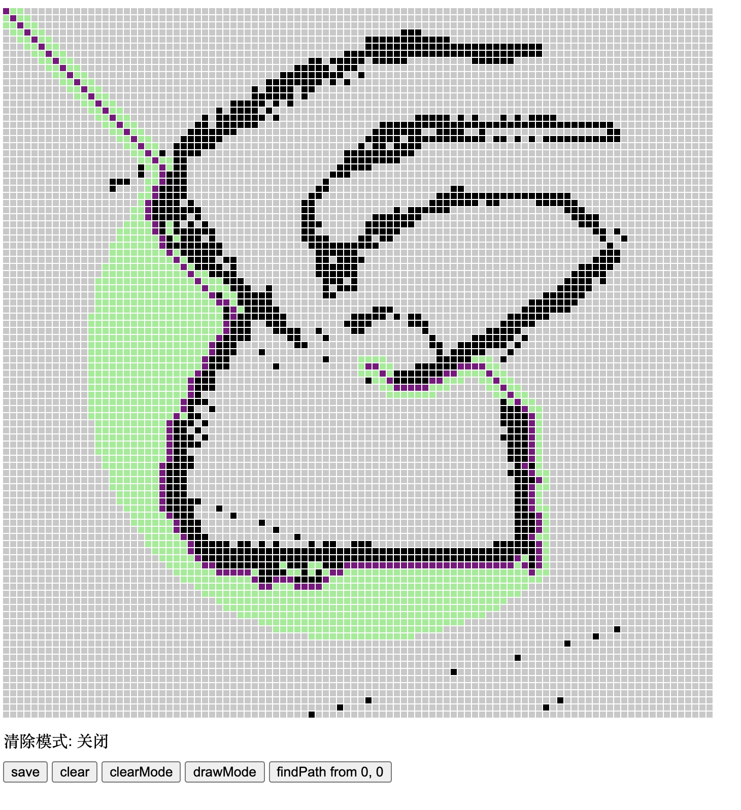
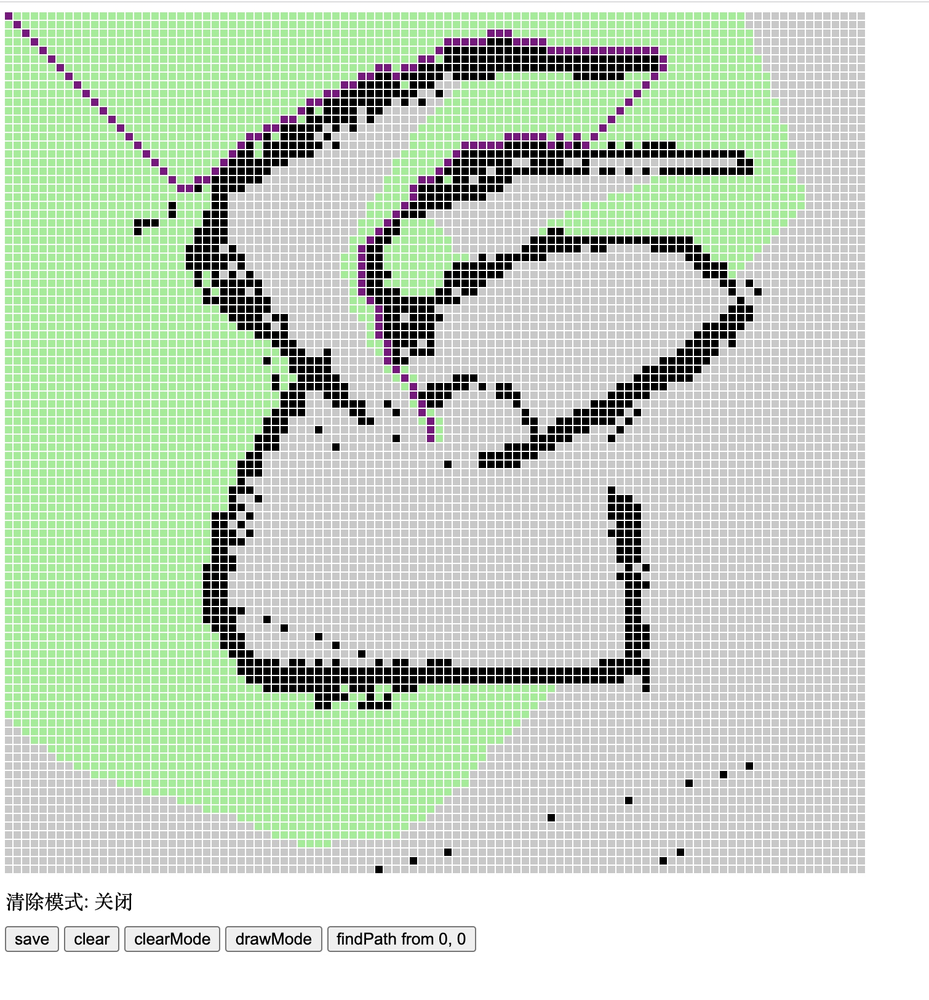

# A*寻路算法解迷宫寻路最优解问题
### 1. 视觉问题数据化
找到一条最优路径的问题其实就可以转化为，将各个点彼此的距离均设置为1.而障碍的路径长度相当于无穷。求一条单源最短路。
### 2. A*算法如何提高效率？
#### BFS是怎么做的?
通常求迷宫合法路径我们可以使用BFS，但BFS的路径判断完全是随机的，以四方格为例，上下左右斜角八个方向，在BFS遍历时，改变他们的顺序都有可能造成最后寻路的结果不同，而且没有任何约束使得这个路径很难是最短路径。甚至可能需要统计出全部的可行路径再进行比较。但这样的效率自然是可想而知的低。
#### Dijkstra算法是怎么做的？
Djikstra算法是非常经典的求最短路的算法，它的特点是一定能保证找出最优解。因为它会进行非常详尽的遍历手段。
要想理解Djikstra算法，我有个比较easy的方式，利用数学归纳 + 倒推来分析。
1. 首先明白单元最短路径是求一个从起点到终点最短的路径(废话
2. 假设我们已经求出了这条最短路径。以正方形格子路径为例。那么我们的终点肯定是从其上下左右斜角八个方向中，到终点距离 + 到起点距离最近的那一个。（如果是6边形这种地图就更简单了，6个方向的长度都可以视为1，只需要判断到起点距离即可。）
3. 找到那个点之后，我们假装这个点为终点，自然可以继续前推。最终推到起点。再把上述过程倒过来走一遍。
4. 最终我们就明白了djikstra是如何执行的：
    1. 从起点开始，找到其周围所有点v，并更新到起点的距离为dist[v]
    2. 对周围的各个点v，遍历周围的周围o，更新其到起点的距离为dist[0] = dist[v] + dist[v-o].
    3. 在遍历过程中，如果遇到了曾经遍历过的点，并且当前的到原点距离小于曾经设置的，就更新它。并记录它的上一个点为当前起点。
    4. 依次类推，知道找到终点f，这时候的dist[f] 自然就是最短f，将找到最短f的上一个点依次回溯，就找到了这条最短路径。
简单说来可以用下面的代码理解

```c
typedef struct Graph {
    int n;
    int visited[MAX_N], dist[MAX_N];
    int mat[MAX_N][MAX_N];
}Graph;

void dijkstra(Graph *g, int v) {
    for(int i=0;i<g->n;i++)
    {
      g->visited[i] = 0;
      g->dist[i] = INF;
    }
    g->dist[v] = 0;
    for(int i=0;i<g->n;i++){
        int min_dist=INF,min_vertex;
        for(int j=0;j<g->n;j++){
            if(!g->visited[j] && g->dist[j] < min_dist){
                min_dist = g->dist[j];
                min_vertex = j;
            }
        }
        g->visited[min_vertex]=1;
        for(int j=0;j<g->n;j++){
            if(!g->visited[j] && min_dist + g->mat[min_vertex][j] < g->dist[j]){
                g->dist[j] = min_dist+g->mat[min_vertex][j];
            }
        }
    }
   
}
```

djikstra 的问题在于其时间复杂度相当高。为$O(V^2 + E)$, $V$为顶点总个数，$E$为总边数，对于复杂迷宫，V和E的数量都是相当高的。这会导致求最短路的时间耗费相当高，即使把寻找最短路的步骤交给堆，时间复杂度也需要$O(VlogV + E)$。如果我们需要的迷宫路径解法希望能够尽快得出结论。则djikstra算法就不太实用了。

#### A\*算法是怎么做的?
A\*算法是一种启发式算法。启发式的意思可以简单理解为，并没有严格的步骤指导你如何去得到最后结果，而是给予一些指导性方针。类似贪心策略。这样可以减少很多复杂度，但同时也会遇到一些边界条件下效果不好或者是求出的并非是最优解的问题。

A*算法可以看作是部分利用了djikstra的策略，不同于djikstra始终只以存粹的到起点距离为唯一条件。且需要遍历可能的连通分量内所有节点的操作。A\*在寻路上更具倾向性。
1. 通常的A\*寻路除了参照到起点的距离以外，还要引入一个到终点的距离作为第二个判断分量。分别称为H和G分量，引入G分量来使得在遍历各个点时，离终点更近的点具有一定的优势。但同时也保留H分量使得路径长度也是很重要的判断条件
2. A\* 不要求遍历所有可能的连通分量中的可达点。而是通过贪心策略，只要找到一条路径，就将这条路径视作解。从而比起BFS，多了一些指向性。但比起djisktra，在搜索上牺牲可能的准确度减少了大量的计算。

#### 示例1 
使用只以到终点的欧式距离的寻路方式，找到的路径如下图，虽然时间短，搜索范围小，但显然由于终点分量过分重要，导致绕了很多路。

#### 示例2
比较完善的F = H + G 的AStar算法的寻路方式，寻路范围较大（但比djikstra和bfs小），但路径明显更优。


