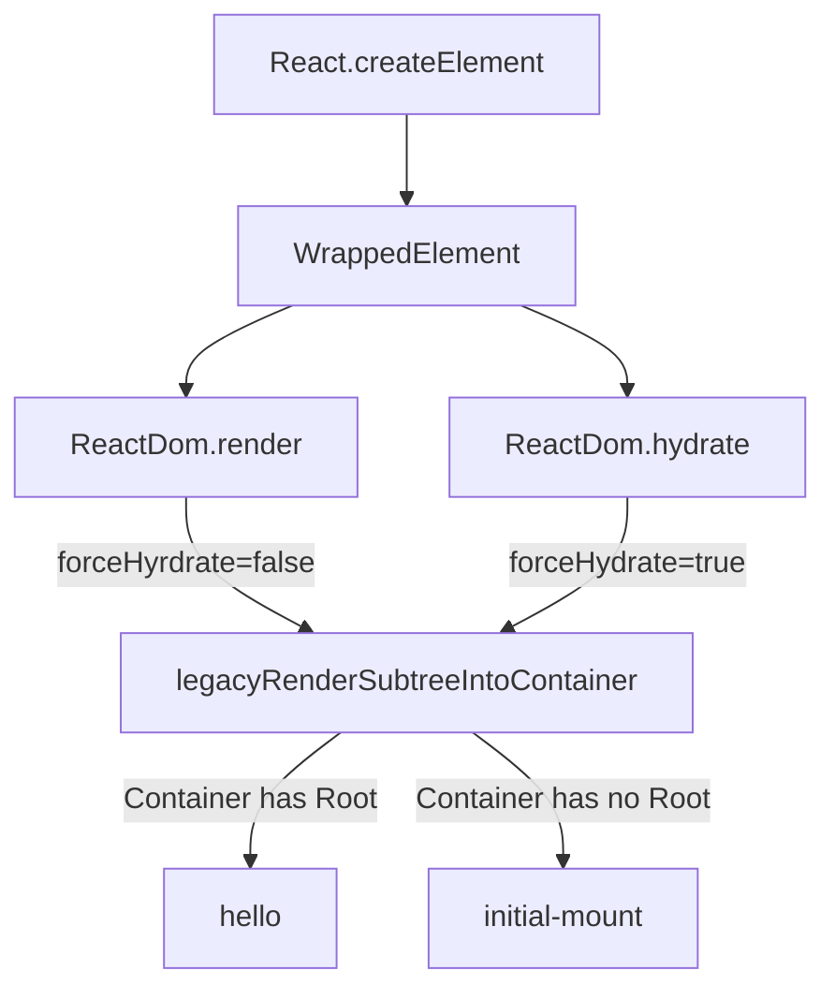
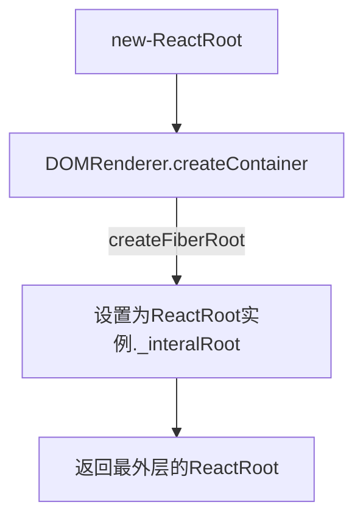
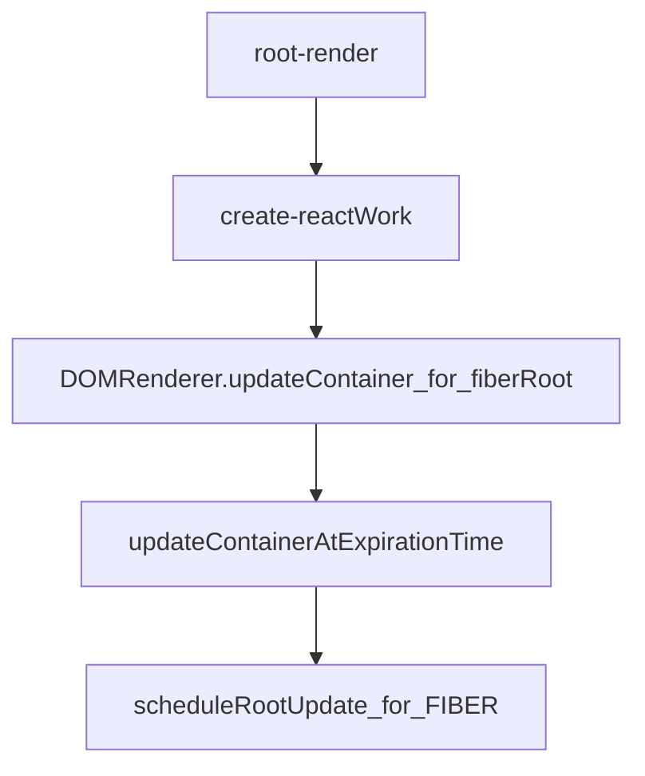

# ReactDom.Render
## 总体结构


### init-mount: 首次mount
```mermaid
graph TD;
initial-mount-->legacyCrateRootFromDOMContainer;
    legacyCrateRootFromDOMContainer-->root=get-Root;
    root=get-Root-->Set-Container-HasRoot
    Set-Container-HasRoot-->execute-Callback
    execute-Callback-->DOMRenderer.unbatchedUpdates
    DOMRenderer.unbatchedUpdates-->root.render
```

#### legacyCrateRootFromDOMContainer: 创建root
```mermaid
graph TD;
 legacyCrateRootFromDOMContainer--if forceHydrate=true-->hydrate=true
    legacyCrateRootFromDOMContainer--if forceHydrate=false-->hydrate=shouldHydrateDueToLegacyHeuristic
    hydrate=shouldHydrateDueToLegacyHeuristic-->const_Root=getReactRootElementIncontainer' ;
    const_Root=getReactRootElementIncontainer'--root.nodeType=DOCUMENT_NODE-->return:container.documentElement;
    const_Root=getReactRootElementIncontainer'--root.nodeType=else-->return:container.firstChild;
    return:container.documentElement--if_hasNode_and_has_'dataReactid'_attr-->hydrate=true;
    return:container.documentElement--else-->hydrate=false;
    return:container.firstChild--if_hasNode_and_has_'dataReactid'_attr-->hydrate=true;
    return:container.firstChild--else-->hydrate=false;
    hydrate=false--deleteAllChildNodeOfContainer-->new-ReactRoot
    hydrate=true-->new-ReactRoot
```

##### new-ReactRoot: 实际的创建 ReactRoot 的操作


#### root.render: ReactRoot.prototype.render 的操作


