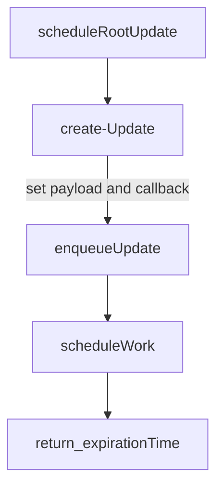

# Update & UpdateQueue
什么是update?
1. 记录组件状态的改变
2. 存放于updateQueue中,UpdateQueue是fiber的属性，标记当前的状态变动
3. 多个update可以并存，最后会合并计算出一个最终状态更新。
4. UpdateQueue内部是个链表



### enqueueUpdate 过程
```mermaid
graph TD;
enqueueUpdate-->获取fiber的alternate属性_也是个fiber

获取fiber的alternate属性_也是个fiber-->alternate不存在说明首次执行更新+Update入队

alternate不存在说明首次执行更新+Update入队-->只利用当前fiber的上一次渲染的state来初始化UpdateQueue&不创建alternate的另一个queue

获取fiber的alternate属性_也是个fiber-->alternate存在
alternate存在--检查两个fiber是否都有UpdateQueue-->是
alternate存在--检查两个fiber是否都有UpdateQueue-->否
否-->有一个存在为另一个克隆
否-->都不存在则各自利用上次的状态创建UpdateQUeue

只利用当前fiber的上一次渲染的state来初始化UpdateQueue&不创建alternate的另一个queue-->根据情况将Update更新到现有的队列中的lastUpdate属性_若首次创建还需要更新firstUpdate=lastUpdate

是-->根据情况将Update更新到现有的队列中的lastUpdate属性_若首次创建还需要更新firstUpdate=lastUpdate
有一个存在为另一个克隆-->根据情况将Update更新到现有的队列中的lastUpdate属性_若首次创建还需要更新firstUpdate=lastUpdate
都不存在则各自利用上次的状态创建UpdateQUeue-->根据情况将Update更新到现有的队列中的lastUpdate属性_若首次创建还需要更新firstUpdate=lastUpdate
```