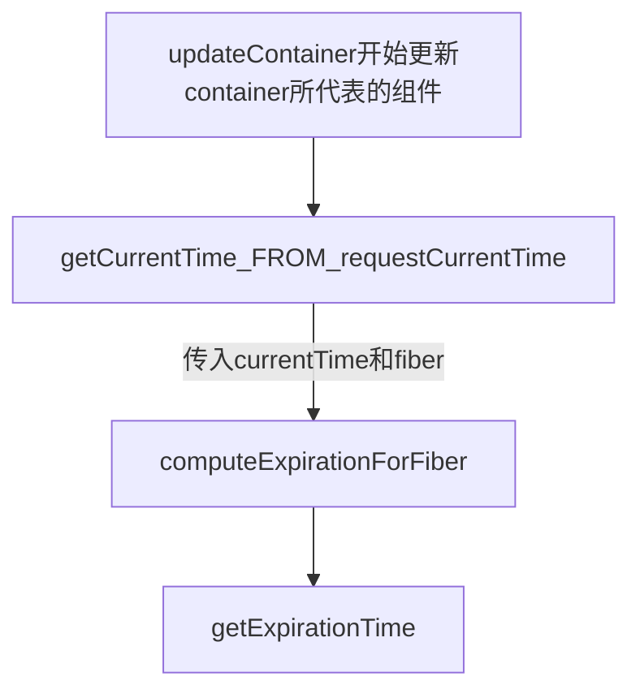

# ExpirationTime 的计算
expirationTime 是在updateContainer时调用获得的，主要目的是为Fiber

```mermaid
graph TD;
updateContainer开始更新container所代表的组件-->getCurrentTime_FROM_requestCurrentTime
getCurrentTime_FROM_requestCurrentTime--传入currentTime和fiber-->computeExpirationForFiber
computeExpirationForFiber--> getExpirationTime
```

### requestCurrentTime
