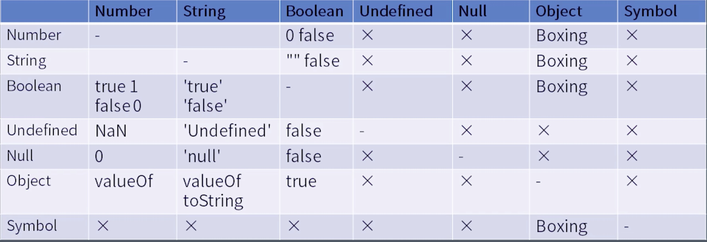
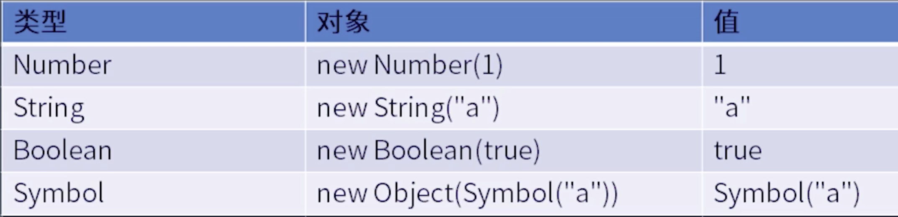

# JS 类型转换： 拆箱与装箱


### Unboxing 拆箱转换
拆箱转化用于把对象类型转化为其他基本类型，实际会调用ToPremitive 过程，具体表现为如下三个方法。
- toString 作为属性名时就会优先使用这个
- valueof 加法就会优先使用这个
- Symbol.toPrimitive 优先级最高

```js
var o = {
    toString() {return "2"},
    valueOf() {return 1},
    [Symbol.toPrimitive]() {return 3}
}
var x = {}
x[o] = 1

console.log("x" + o)
```

### Boxing 装箱转换

