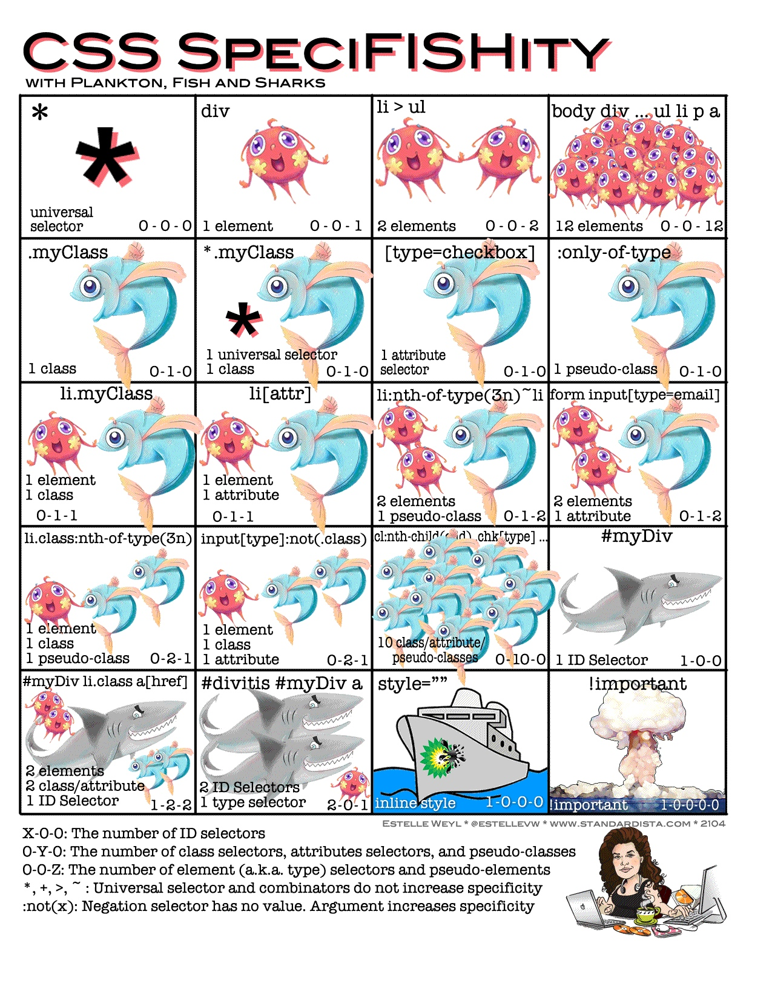

# CSS 总体结构
- @charset
- @import
- rules
    - @media
    - @page
    - rule

## @规则的研究
@charset
声明css的字符集
@import
声明css的级联样式表
@media
声明css的条件标准
@page
跟打印有关的属性
@counter-style
list 列表前面的小点样式
@keyframes
动画相关的样式
@fontface
定义字体相关的样式
https://www.w3.org/TR/css-fonts-3/
@supports
检查属性可不可用
@namespace
处理html/svg/mathML 这样的命名空间

## CSS 规则
- 选择器
- 声明
    - key
    - value

### 选择器语法
复合选择器
- <简单选择器><简单选择器><简单选择器>
- *或div必须写在最前面
复杂选择器
- <复合选择器><sp><复合选择器> --> 空格分隔，子代选择器
- <复合选择器>">"<复合选择器> --> 直接后代选择器
- 复合选择器”~“<复合选择器> --> 一般同辈选择器
- <复合选择器>”+“<复合选择器> --> 相邻同辈选择器 
- <复合选择器>”||“<复合选择器> --> 列组合选择器，选择属于某个表格行的节点。

### CSS Specificity
