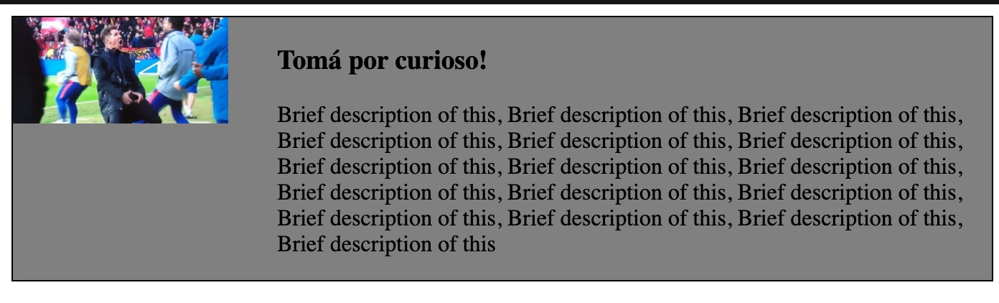

# CSS 盒与布局

关于BFC 的一篇好文章
https://xie.infoq.cn/article/1d343e72a49ed641566b4ac5d
HTML代码中可以书写开始标签，结束标签 ，和自封闭标签。

一对起止标签，表示一个元素。

DOM树中存储的是元素(Element)和其它类型的节点（Node）。

CSS选择器选中的是元素(或伪元素)。

CSS选择器选中的元素，在排版时可能产生多个盒。

排版和渲染的基本单位是盒。

## 一个盒


## 正常流
### 排版方式
- 收集盒进‘行’
- 计算盒子在行中的排布
- 计算行的排布


行内盒和会被收进‘行’，作为一个行盒子 line-box
行盒子和块级盒(Block-level-box) 在垂直方向上排布。


行内排布规则的上下文就称为 IFC inline-format-context
<span id='bfc-defination' style='color:red;'>行盒子和块级盒垂直方向排布的上下文称为 BFC Block-Format-Context</p>

### 正常流的行级排布

本身的line-top/bottom 基于 line-height
行内盒子的高度可能撑大line-top和line-bottom


#### IFC 行内格式化上下文
- 行盒子可以只包含文本，也可以包含行内盒子，行盒子 !== 行内盒子
- 几条规则
    1. 行内盒子的高度不受内部行内盒子垂直方向的内边距，外边距，边框影响
    2. 唯一能调整行内盒子高度的方法是修改行高。

### 正常流的块级排布
#### float元素
float 元素会影响行盒子的位置和大小
同时会根据其高度影响多行
float 元素会脱离文本流

clear 属性
让浮动元素在排布时，不允许其指定的方位上有浮动元素。故命名为“清除浮动”，本质上不是清除这个元素自身的浮动，而是他周围的浮动元素。

margin折叠
太简单了，这里不说了

### Block 块
- Block Container（块容器） 里面有BFC的
    - 能容纳正常流的盒，里面就有BFC
    - display: block
    - display: inline-block
    - display: table-cell
    - flex item（flex 不是，但里面的块默认情况下是）
    - gird cell
    - table-caption（表格的标题）
- Block level Box（块级盒）: 外面有[BFC](#bef-defination)的，或者说，这种盒子可以进入BFC，遵守BFC的规矩。
    - display: block
    - display: flex
    - display: table
    - display: grid
- Block Box（块盒子） 内外都有BFC的
    -  = Blcok Container + Block   level Box
    -  **如果其 overflow 的 值被设置为 visible，则会和父 BFC 合并**这条非常重要. 相当于父子间的BFC屏障消失了。

### BFC
1. 如何触发BFC
    1. float 元素的内部
    2. 绝对定位元素的内部
    3. block container 的内部
    4. overflow不是visible的 Block Box
2. 聊一个清除浮动的问题
如果一个块中只包含了float元素，那么这些浮动元素会脱离文档流，从而其包含块将没有高度。
        
为了避免这个情况，我们可以新增一个div，并为其指定清除浮动```clear: both```. 因为它的左右都不允许有浮动元素。则会为其创建一个足够高的垂直边距，并将包含块撑开。并显得包裹住了浮动元素。

当然，除了硬加一个空div，我们也可以用伪元素来替代。

```css
.xxx::after {
    content: " ";
    display: block;
    clear: both;
}
```
1. 从清除浮动到BFC的规则
其实,BFC有一条重要规则，可以使得我们不适用清除浮动就可以愉快的使用包含块包含浮动元素。
这条规则是：

```
页面必须自动包含突出的浮动元素
```

除此之外。BFC还有类似
```
所有块级盒子的左边界默认与包含块的边界对齐
如果dom结构上挨着一个浮动元素，则会忽略自己的边界必须接触包含块边界的原则，并收缩的适当大小
```
的其他规则
对于这三条规则的综合应用如下
```CSS
    .media-block {
        background-color: gray;
        border: solid 1px black;
        overflow: auto;
      }
      .media-fig {
        float: left;
        margin-right: 5%;
      }
      img {
        width: 150px;
      }
      .media-body {
        overflow: auto;
      }
```

```html
<div class="media-block">
      
      <div class="media-body">
        <h3>Tomá por curioso!</h3>
        <p>
          Brief description of this, Brief description of this, Brief
          description of this, Brief description of this, Brief description of
          this, Brief description of this, Brief description of this, Brief
          description of this, Brief description of this, Brief description of
          this, Brief description of this, Brief description of this, Brief
          description of this, Brief description of this, Brief description of
          this, Brief description of this
        </p>
      </div>
    </div>
```

外层的overflow：hidden使得外层块内部触发了BFC，从而自动包含了浮动元素
内层的overflow：hidden使得文本容器产生BFC，不去贴包含块边缘，出现环绕效果，而是进行收缩，造成了清除浮动的效果。



    