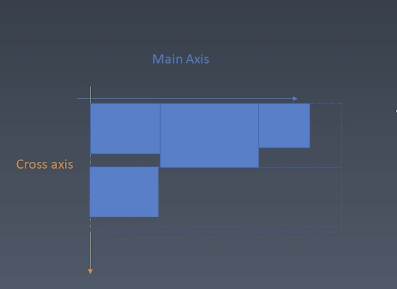
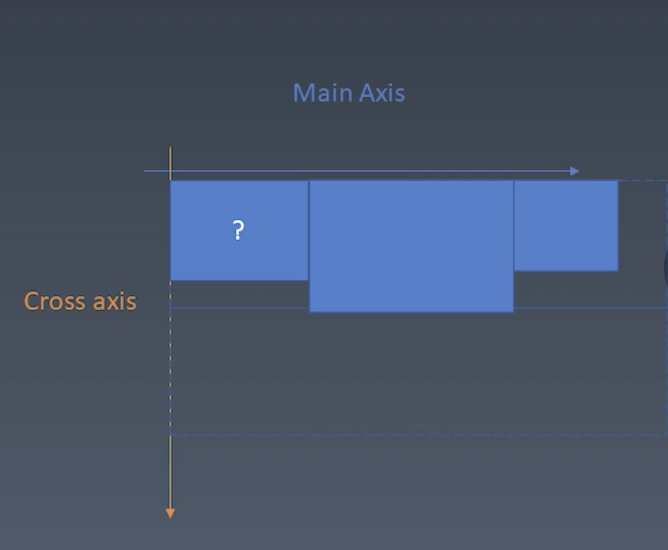
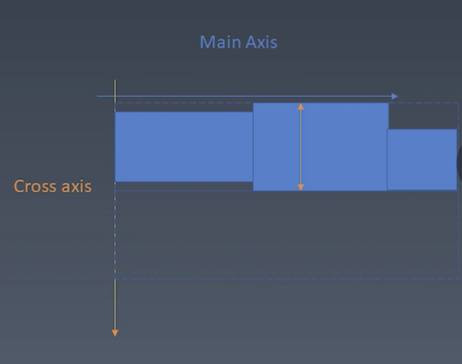

# CSS Flex 布局
#### flex 排版基本规则
1. 收集盒进'行'
2. 计算盒在主轴方向排布
3. 计算盒在交叉轴方向排布

##### 收集元素进行

- 根据主轴尺寸把元素分进行
- 如果设置了no-wrap 则强制分配进第一行

##### 计算主轴方向

1. 找出所有flex元素
2. 把主轴方向的剩余尺寸按比例分配给这些元素
3. 若剩余空间为负数，所有flex为0，则等比亚索剩余元素

##### 计算交叉轴方向

1. 根据每一行中最大元素尺寸计算行高
2. 根据行高flex-align 和 item-align 确定元素的具体位置