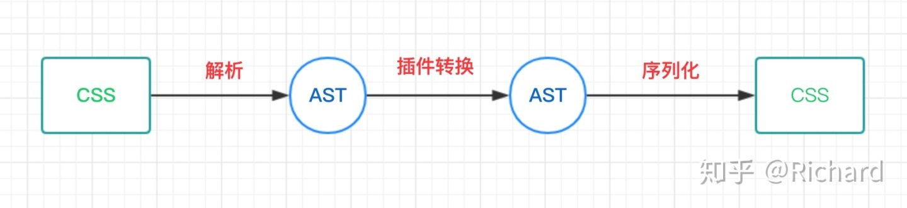

# PostCSS
PostCSS是一个使用JS插件来转换样式的工具。PostCSS跟CSS预处理器的定位不同
作用主要有lint css，支持CSS Next语法，自动添加前缀等等功能

通过PostCSS将CSS转换成AST(抽象语法树)，对应的是JavaScript对象；然后通过插件遍历AST，进行增加，删除，修改；最后再生成CSS文件，这就是整个流程，跟babel的架构非常相似。

其中的CSS解析成AST及AST序列化生成CSS，PostCSS都帮我们做好了，我们只需要关注在插件开发，及如何操作AST。