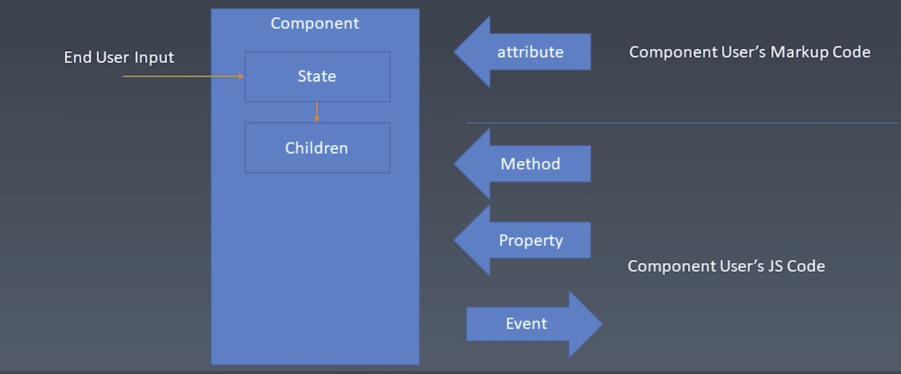
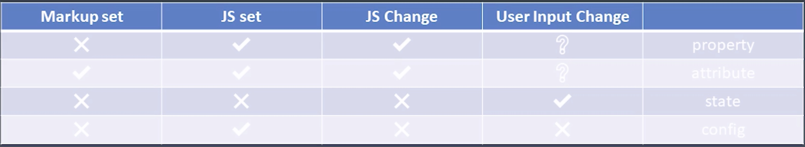

# 组件化
### 对象与组件
- 对象
    - Properties
    - Methods
    - Inherit
- 组件
    - Properties
    - Methods
    - Inherit
    - **Attribute**
    - **Config & State**
    - **Event**
    - **Lifecycle**
    - **Children**

### Attribute
- Attribute VS Property

